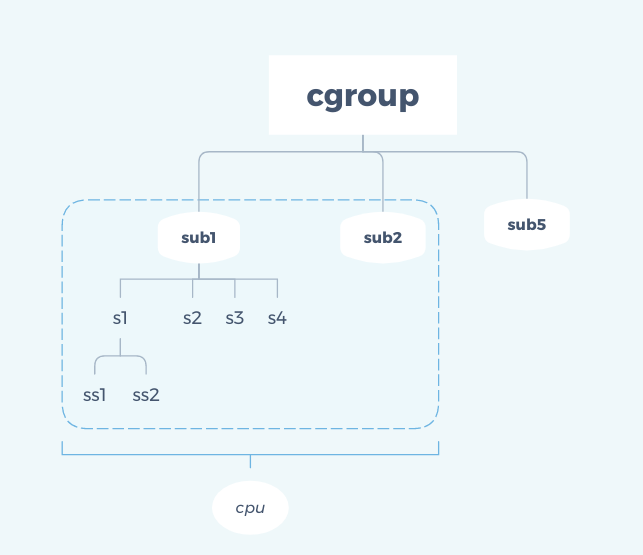

# cgroup
control groups ，控制组，它提供了一套机制用于控制一组特定进程对资源的使用。cgroup绑定一个进程集合到一个或多个子系统上

cgroup有v1和v2两个版本，一般不会将两个版本混用，docker目前使用v1，所以这里主要介绍v1

cgroup可以通过挂载到任何文件夹下使用

发行版已经默认挂载到 /sys/fs/cgroup，并且挂载了所有的subsystem。如果没有挂载，可以通过下面的命令手动挂载

    //挂载一颗和所有subsystem相关的cgroup树
    mount -t cgroup 起个名 /sys/fs/cgroup   

    //挂载cpuset subsystem到/sys/fs/cgroup/cpuset
    mount -t cgroup -o cpu,cpuset /sys/fs/cgroup/cpuset 

    //挂载一棵cgroup树，但不关联任何subsystem，下面就是systemd所用到的方式
    mount -t cgroup -o none,name=systemd xxx /sys/fs/cgroup/systemd

    //卸载一个cgroup或subsystem可以用 umount


每个资源限制目录是子系统，在目录中创建文件夹代表task group

- cpu: 限制进程的 cpu 使用率
- cpuacct 子系统，可以统计 cgroups 中的进程的 cpu 使用报告
- cpuset: 为cgroups中的进程分配单独的cpu节点或者内存节点
- memory: 限制进程的memory使用量。blkio: 限制进程的块设备io
- devices: 控制进程能够访问某些设备
- net_cls: 标记cgroups中进程的网络数据包，然后可以使用tc模块（traffic control）对数据包进行控制
- net_prio: 限制进程网络流量的优先级
- huge_tlb: 限制HugeTLB的使用
- freezer:挂起或者恢复cgroups中的进程
- ns: 控制cgroups中的进程使用不同的namespace
- pids: 限制进程总数


# 通用文件
- cgroup.procs 记录进程pid，1号进程创建的子进程也会被记录
- tasks 当前cgroup中的所有taskID（进程和线程），系统不保证ID是顺序排列的

- cgroup.clone_children 这个文件只对cpuset（subsystem）有影响，当该文件的内容为1时，新创建的cgroup将会继承父cgroup的配置，即从父cgroup里面拷贝配置文件来初始化新cgroup，默认0
- cgroup.sane_behavior 具体功能不详
- notify_on_release 该文件的内容为1时，当cgroup退出时（不再包含任何进程和子cgroup），将调用release_agent里面配置的命令。新cgroup被创建时将默认继承父cgroup的这项配置。
- release_agent 里面包含了cgroup退出时将会执行的命令，系统调用该命令时会将相应cgroup的相对路径当作参数传进去。 注意：这个文件只会存在于root cgroup下面，其他cgroup里面不会有这个文件。


一个进程可以存在于多个子系统中，但在一个子系统中只能被加入一个cgroup里，如果加入到新的cgroup，就会自动从原来的cgroup中清除，进程的子进程也会被默认加到新的cgroup中



cgroup.procs是用来放入进程，而tasks用来放入线程，但实际线程在v2中已经弃用了，以后把进程放到cgroup.procs中就好

当cgroup中最后一个进程离去，并且没没有子cgroup，就会执行 notify_on_release 中记录的脚本


# pids
pids可以限制进程总数

在pids下面创建文件夹并进入，多了两个特殊文件

- pids.current：用来限制cgroup及其所有子孙cgroup当前运行的进程总数，在向cgroup内移入进程时检查该文件
- pids.max：跟上面一样，但是只有在fork时才会检查pids.max，current可能大于max


子cgroup会受祖先cgroup的current和max限制，取min(c1,c2,c3)

# cpu
- cpu.cfs_period_us CFS算法的一个调度周期，一般值是100000，us为单位，即100ms
- cpu.cfs_quota_us 在一个调度周期内这个控制组被允许的时长，cfs_period_us/cfs_quota_us 代表多少核，子层级的cfs_quota_us值不能大于父层级的
- cpu.shares 当前层级所有子层级对父层级cpu资源的分配，子层级把父层级的资源用满后才会用shares做分配调控，shares的基数单位是1024

```
mkdir /sys/fs/cgroup/cpu/group1
mkdir /sys/fs/cgroup/cpu/group1/group2
mkdir /sys/fs/cgroup/cpu/group1/group3
#父层级group1和两个子层级group2、group3

echo 300000 > /sys/fs/cgroup/cpu/group1/cpu.cfs_quota_us
echo 200000 > /sys/fs/cgroup/cpu/group1/group2/cpu.cfs_quota_us
echo 200000 > /sys/fs/cgroup/cpu/group1/group3/cpu.cfs_quota_us
#子层级quota值的和可以大于父层级，但是真正使用不会超过父层级的限制

echo 2048 > /sys/fs/cgroup/cpu/group1/group2/cpu.shares
echo 1024 > /sys/fs/cgroup/cpu/group1/group3/cpu.shares
#父层级资源被耗尽之前，只会根据子层级的quota做限制，即group3的进程也能跑2核
#当父层级资源限制不够用时，才会用share对子层级做分配
```

k8s会把limit设置为quota，把request设置为share，当资源不够用时，会逐渐回归到share的限制

- cpu.stat 统计值
    - nr_periods 进入周期的次数
    - nr_throttled 运行时间被调整的次数
    - throttled_time 用于调整的时间

# memory
RSS，resident set size，包括栈、堆内存、共享内存，不包括进入swap的内存

与之对应的是VSZ，虚拟内存页，进程申请的虚拟内存必须访问才分配物理内存

- memory.limit_in_bytes 限制的内存，这里限制的是RSS和cache
- memory.usage_in_bytes 已经使用的内存，当usage_in_bytes超过了limit_in_bytes就会触发内存回收
- memory.swappiness 控制swap使用和cache回收的权重，和/proc/sys/vm/swappiness不同的是，如果memory.swappiness=0，则当前层级的进程不能使用swap，默认60

```
    其他的一些文件

    cgroup.event_control       #用于eventfd的接口
    memory.usage_in_bytes      #显示当前已用的内存
    memory.limit_in_bytes      #设置/显示当前限制的内存额度
    memory.failcnt             #显示内存使用量达到限制值的次数
    memory.max_usage_in_bytes  #历史内存最大使用量
    memory.soft_limit_in_bytes #设置/显示当前限制的内存软额度
    memory.stat                #显示当前cgroup的内存使用情况
    memory.use_hierarchy       #设置/显示是否将子cgroup的内存使用情况统计到当前cgroup里面
    memory.force_empty         #触发系统立即尽可能的回收当前cgroup中可以回收的内存
    memory.pressure_level      #设置内存压力的通知事件，配合cgroup.event_control一起使用
    memory.swappiness          #设置和显示当前的swappiness
    memory.move_charge_at_immigrate #设置当进程移动到其他cgroup中时，它所占用的内存是否也随着移动过去
    memory.oom_control         #设置/显示oom controls相关的配置
    memory.numa_stat           #显示numa相关的内存
```