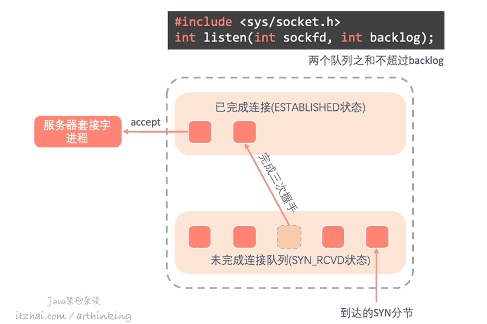
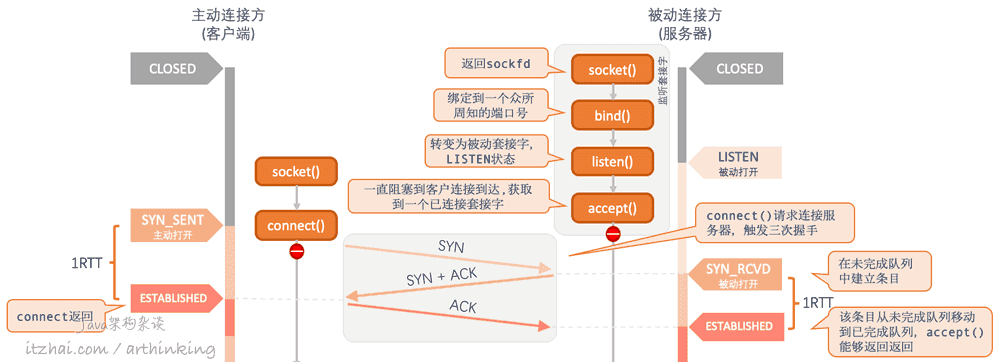
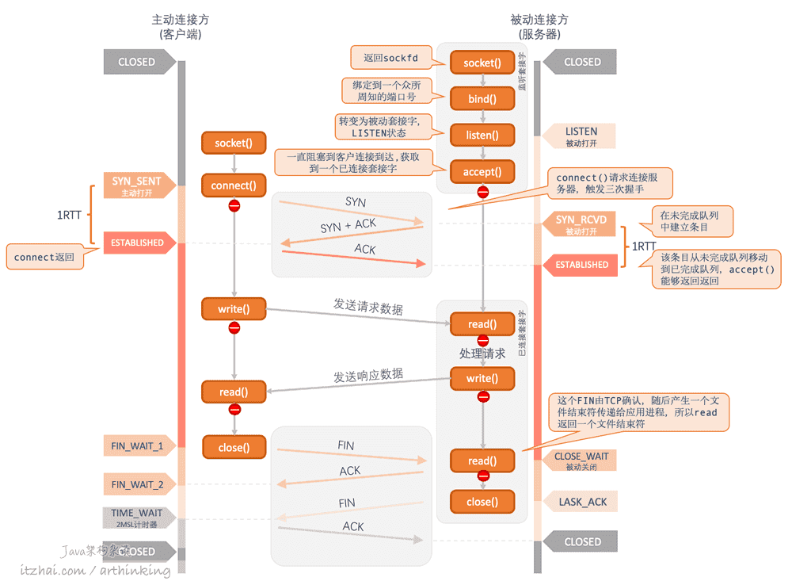

# socket
为了执行网络I/O，我们要做的第一件事情就是调用socket函数，指定期望的协议类型。该函数会创建一个通信的端点，并返回引用该端点的文件描述符，该文件描述符也称为套接字描述符(socket descriptor)，简称sockfd

```
int socket(int domain, int type, int protocol);  // 返回：若成功则为非负描述符，若出错则为-1
```

# bind
把一个本地协议地址赋予一个套接字

```
int bind(int sockfd, const struct sockaddr *addr, socklen_t addrlen);  // 返回：若成功则为0，若出错则为-1
```

# listen
通过socket()函数创建了套接字之后，再执行listen()函数，会把套接字转换为一个被动套接字，指示内核应该接收指向该套接字的连接请求，并导致套接字从CLOSED状态转换到LISTEN状态

```
int listen(int sockfd, int backlog); // backlog指定内核应该为相应套接字排队的最大连接个数
```



服务器接收到客户端SYN请求后，于是请求套接字进入未完成连接队列，等到服务端响应了ACK和SYN完成三次握手后，于是，套接字进入已完成连接队列。已完成连接队列中的套接字可以被服务器进程执行accept函数获取到

## backlog满了
当服务器队列满了，有新的客户端connect请求的SYN到达时怎么办？

这个时候，TCP会忽略这个SYN分节，也不会向客户端发送RST，好让客户TCP有机会重发SYN，以便在不久之后可以在这些队列中找到可用的空间。

如果直接响应RST，客户的connect()调用会立刻返回错误，导致应用进程必须要处理这种情况。

因为从服务端的角度来看，经理一个RTT之后，TCP条目就会从未完成队列移动到已完成连接队列。所以，未完成连接队列中的任何一项的存留时间是一个RTT。

一旦connect()成功之后，客户端和服务器就可以通过数据交换相关函数进行数据交换了。

# accept
当进程调用accept()时，已完成连接队列中的队头将返回给进程，或者如果队列为空，那么进程将被投入睡眠，直到TCP在该队列中放入一项才唤醒它

```
int accept(int sockfd, struct sockaddr *addr, socklen_t *addrlen);
```

关于监听套接字和已连接套接字

注意，这里要区分好服务端的监听套接字和已连接套接字，服务端调用socket()返回的是监听套接字，bind()和listen()函数入参也是监听套接字。

一旦有客户端请求过来了于是产生了一个已连接套接字，后续和客户端的交互是通过这个已连接套接字进行的，内核会将网络包放到已连接套接字中。监听套接字只负责监听客户端请求并获取和客户端的已连接套接字

# connect
```
int connect(int sockfd, const struct sockaddr *addr, socklen_t addrlen);
```

connect()函数由客户端调用，请求与服务端建立连接，这个函数会触发三次握手。大致流程如下：



- 客户端
    - connect调用是的当前套接字从CLOSED状态进入SYN_SENT状态，如果节而受到了服务器的SYN+ACK响应，则转移到ESTABLISHED状态；
    - 如果connect失败，则表示套接字不在可用，必须关闭，不能再次尝试调用connect函数；
- 服务端
    - 每当接收到SYN时，TCP在未完成连接队列中创建一个新的条目，然后响应TCP三次握手的第二个分节
    - 每当收到三次握手的第三个分节的时候，就把条目从未完成队列移到已完成连接队列的队尾。此时，服务端accept调用将被唤醒并得到一个已连接套接字

注意：客户在调用connect函数之前，不是一定要调用bind函数，这个时候内核会确定源IP地址，并选择一个临时端口号作为源端口号

所以大家在监控TCP连接的时候，可以发现请求客户端的端口都是没有什么规律的。因为这个端口号是临时端口号


# close
当需要关闭连接的时候，**主动发起关闭的一方先调用close函数**，被动关闭一方接收到对方close产生的文件结束符之后，也发起一个close调用，最终双方都关闭了连接，这个过程涉及到连接关闭的四次挥手



- 主动发起关闭方首先执行close()函数，协议层发出FIN请求，进入了FIN_WAIT_1状态；
- 被动关闭方协议层接收到FIN请求后，响应一个ACK，并产生一个文件结束符传递个应用进程，应用进程read()读取到文件结束符，就要开始处理关闭连接了，随后被动关闭方确认没有数据需要再发送给对方之后，也发起一个close()调用，触发协议层向主动关闭方发出FIN请求；
- 主动关闭方接收到ACK之后，进入了FIN_WAIT_2状态；
- 主动关闭方接收到FIN之后，进入TIME_WAIT状态，开启2MSL计时器，并发送ACK给被动关闭方；
- 被动关闭方接收到自己发出的FIN的ACK之后，于是套接字进入CLOSED状态。

