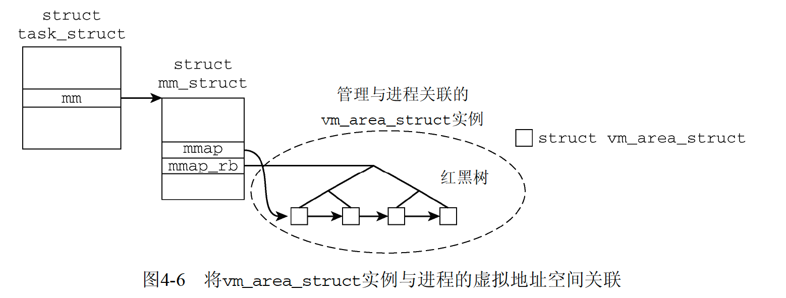

# 内存布局
```
struct mm_struct {
	unsigned long (*get_unmapped_area) (struct file *filp,
				unsigned long addr, unsigned long len,
				unsigned long pgoff, unsigned long flags);
	unsigned long mmap_base;		/* base of mmap area */
	unsigned long task_size;		/* size of task vm space */

    ...

	unsigned long total_vm, locked_vm, shared_vm, exec_vm;
	unsigned long stack_vm, reserved_vm, def_flags, nr_ptes;
	unsigned long start_code, end_code, start_data, end_data; //代码和静态变量开始和结束区域
	unsigned long start_brk, brk, start_stack; //堆、栈地址
	unsigned long arg_start, arg_end, env_start, env_end; //参数列表和环境变量地址
};


struct mm_struct {
	struct vm_area_struct * mmap;		/* list of VMAs */
	struct rb_root mm_rb;
	struct vm_area_struct * mmap_cache;	/* last find_vma result */
	unsigned long (*get_unmapped_area) (struct file *filp,
				unsigned long addr, unsigned long len,
				unsigned long pgoff, unsigned long flags);
	void (*unmap_area) (struct mm_struct *mm, unsigned long addr);
	unsigned long mmap_base;		/* base of mmap area */
	unsigned long task_size;		/* size of task vm space */
	unsigned long cached_hole_size; 	/* if non-zero, the largest hole below free_area_cache */
	unsigned long free_area_cache;		/* first hole of size cached_hole_size or larger */
	pgd_t * pgd;
	atomic_t mm_users;			/* How many users with user space? */
	atomic_t mm_count;			/* How many references to "struct mm_struct" (users count as 1) */
	int map_count;				/* number of VMAs */
	struct rw_semaphore mmap_sem;
	spinlock_t page_table_lock;		/* Protects page tables and some counters */

	struct list_head mmlist;		/* List of maybe swapped mm's.	These are globally strung
						 * together off init_mm.mmlist, and are protected
						 * by mmlist_lock
						 */

	/* Special counters, in some configurations protected by the
	 * page_table_lock, in other configurations by being atomic.
	 */
	mm_counter_t _file_rss;
	mm_counter_t _anon_rss;

	unsigned long hiwater_rss;	/* High-watermark of RSS usage */
	unsigned long hiwater_vm;	/* High-water virtual memory usage */

	unsigned long total_vm, locked_vm, shared_vm, exec_vm;
	unsigned long stack_vm, reserved_vm, def_flags, nr_ptes;
	unsigned long start_code, end_code, start_data, end_data;
	unsigned long start_brk, brk, start_stack;
	unsigned long arg_start, arg_end, env_start, env_end;

	unsigned long saved_auxv[AT_VECTOR_SIZE]; /* for /proc/PID/auxv */

	cpumask_t cpu_vm_mask;

	/* Architecture-specific MM context */
	mm_context_t context;

	/* Swap token stuff */
	/*
	 * Last value of global fault stamp as seen by this process.
	 * In other words, this value gives an indication of how long
	 * it has been since this task got the token.
	 * Look at mm/thrash.c
	 */
	unsigned int faultstamp;
	unsigned int token_priority;
	unsigned int last_interval;

	unsigned long flags; /* Must use atomic bitops to access the bits */

	/* coredumping support */
	int core_waiters;
	struct completion *core_startup_done, core_done;

	/* aio bits */
	rwlock_t		ioctx_list_lock;
	struct kioctx		*ioctx_list;
};
```

进程的虚拟内存开始于0，延伸到TASK_SIZE-1，其上是内核空间

# 内存映射
虚拟内存太大，不会全部映射物理内存，如text段，按需加载

- 进程访问用户地址空间的一个地址，使用页表无法确定物理地址，触发缺页中断
- 内核检查缺页进程地址空间数据结构，找到存储器对应位置，或者判定访问异常
- 分配物理内存页，用存储器数据填充
- 通过页表将页帧和虚拟页关联，应用程序恢复执行

## 区域表示
```
struct mm_struct {
	struct vm_area_struct * mmap;		/* 虚拟内存列表 */
	struct rb_root mm_rb;
	struct vm_area_struct * mmap_cache;	/* last find_vma result */
};
```



