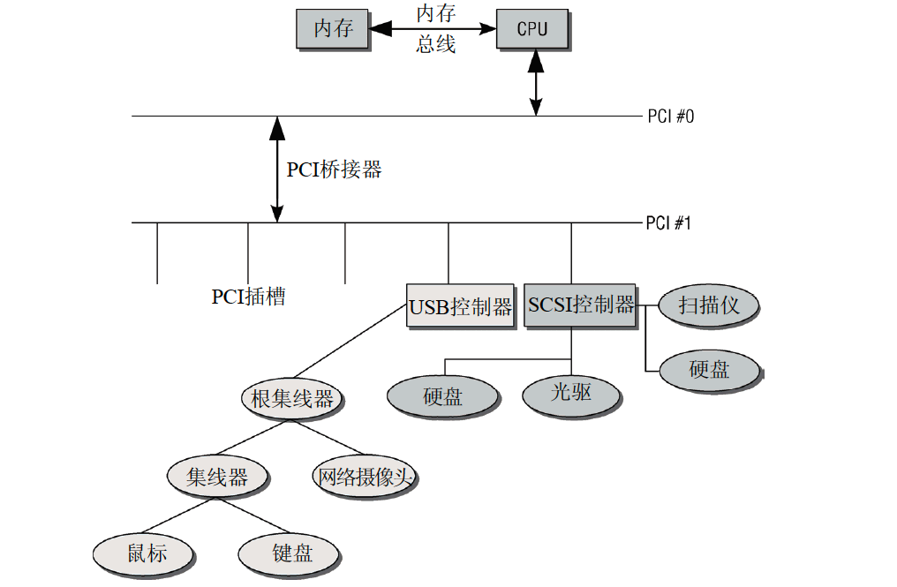
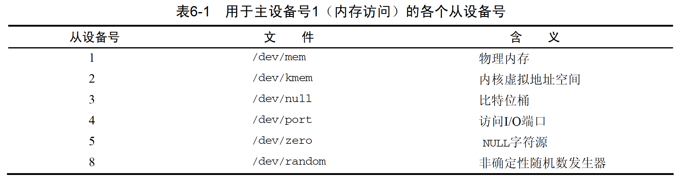
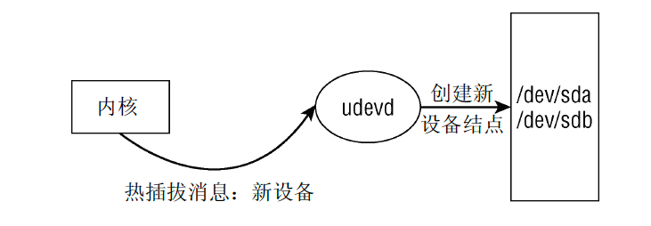
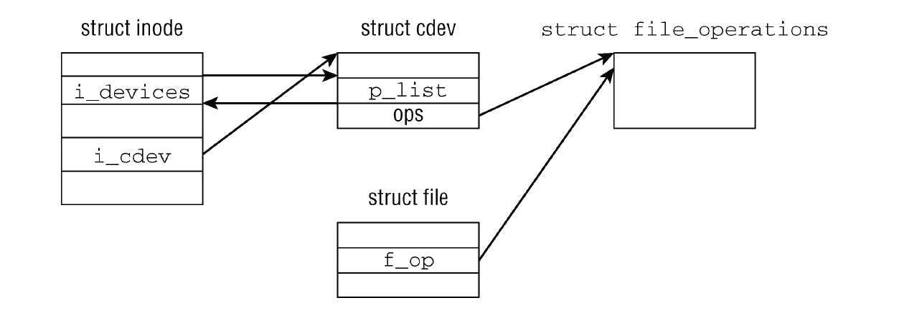
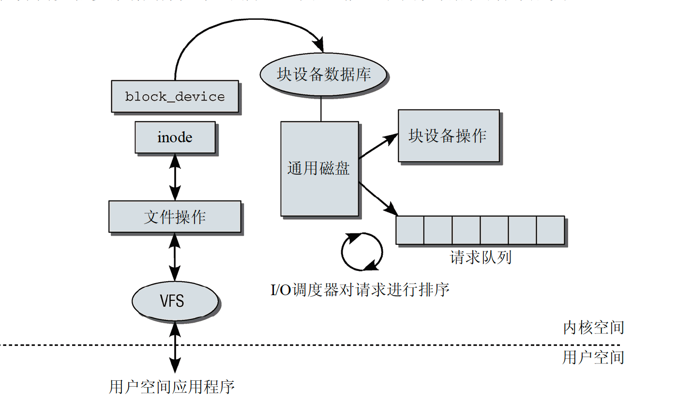

# 硬件结构
```
cpu <- 内存总线 -> 内存

cpu <- 设备总线 -> 其他IO设备
```

通常使用PCI或SCSI总线，设备也并不一定直接接入总线，因为接口的差异可能需要其他中间层



# 设备管理
```
// 字符设备用 
struct cdev {
	struct kobject kobj; // 对象
	struct module *owner; //所属模块
	const struct file_operations *ops; // 要实现的vfs接口
	struct list_head list;
	dev_t dev; // 设备号
	unsigned int count;
};

```

## 设备注册

1. 扫描到设备，申请唯一设备号
```
// b为块设备，c是字符设备
// disk代笔磁盘类型设备
// 252 是主设备号，0 是次设备号，主次确定唯一的驱动
// 一般磁盘挂载以 sd[a-z]，虚拟盘 vd[a-z]
brw-rw---- 1 root disk 252,  0 1月  16 18:57 /dev/vda
brw-rw---- 1 root disk 252,  1 1月  16 18:57 /dev/vda1
brw-rw---- 1 root disk 252, 16 1月  16 18:57 /dev/vdb
brw-rw---- 1 root disk 252, 17 1月  16 18:57 /dev/vdb1
```

2. 创建设备结构体，关联操作实现函数，将设备注册到hashmap中，便于设备的管理

3. 为设备创建inode，实现对应vfs函数，将inode关联到 /dev 下，实现设备文件化操作

对于字符设备只有一个操作可用，即使用设备自定义的操作
```
const struct file_operations def_chr_fops = {
	.open = chrdev_open,
};
```

块设备有众多操作可用
```
const struct file_operations def_blk_fops = {
	.open		= blkdev_open,
	.release	= blkdev_close,
	.llseek		= block_llseek,
	.read		= do_sync_read,
	.write		= do_sync_write,
  	.aio_read	= generic_file_aio_read,
  	.aio_write	= generic_file_aio_write_nolock,
	.mmap		= generic_file_mmap,
	.fsync		= block_fsync,
	.unlocked_ioctl	= block_ioctl,
#ifdef CONFIG_COMPAT
	.compat_ioctl	= compat_blkdev_ioctl,
#endif
	.splice_read	= generic_file_splice_read,
	.splice_write	= generic_file_splice_write,
};
```

除了挂载硬件设备，系统也通过创建inode的方式挂载了些虚拟设备，并为其实现了vfs函数




## 动态管理设备
linux允许热拔插设备，当内核扫描总线发现新设备，会给 udevd 进程发信号，创建新的结点挂载到 /dev 下



除此外 udevd 还有很多其他功能


# 设备交互
内核扫描并创建注册设备后，为其创建了inode，就可以通过vfs操作设备



## 字符设备
字符设备通常是鼠标、键盘等，读写操作严重依赖于设备驱动的实现，且文件系统意义不大

## 块设备
块设备通常较为完整的实现了vfs接口，且严重依赖文件系统，如缓存机制等，整体操作流程如下



```
// 块设备
struct block_device {
	dev_t			bd_dev; // 设备号
	struct inode *		bd_inode; // 设备的inode
	int			bd_openers; //用do_open打开的次数
	struct mutex		bd_mutex;	/* open/close mutex */
	struct semaphore	bd_mount_sem; 
	struct list_head	bd_inodes; //表示该块设备的设备特殊文件的所有inode
	void *			bd_holder; 
	int			bd_holders;
	struct list_head	bd_holder_list;
	struct block_device *	bd_contains;
	unsigned		bd_block_size; 
	struct hd_struct *	bd_part; //设备所有分区
	int			bd_invalidated;
	struct gendisk *	bd_disk; // 另一个抽象层，划分硬盘
	struct list_head	bd_list; // 记录所有可用的block_device
};

// 块磁盘
struct gendisk {
	int major;			/* major number of driver */
	int first_minor;
	int minors;                     /* maximum number of minors, =1 for
                                         * disks that can't be partitioned. */
	char disk_name[32];		/* name of major driver */
	struct hd_struct **part;	/* [indexed by minor] 磁盘分区*/
	int part_uevent_suppress;
	struct block_device_operations *fops; // 指向特定设备，执行底层任务的各个函数
	struct request_queue *queue; // 管理请求队列
	void *private_data; // 指向私有的程序指针数据
	sector_t capacity; // 制定了容量，单位是扇区

	int flags;
	struct device *driverfs_dev; //该磁盘所属的硬件设备
	struct kobject kobj;
	...
	struct work_struct async_notify;
};

// 分区
struct hd_struct {
	sector_t start_sect; // 起始扇区
	sector_t nr_sects; // 长度
	struct kobject kobj;
	...
};
```


## 裸块设备
裸设备是一种特殊的块设备文件，直接对磁盘操作不经过文件系统

```
struct bdev_inode {
	struct block_device bdev;
	struct inode vfs_inode;
};
```


# 块设备操作
## io调度
每个块设备或者块设备的分区，都对应有自身的请求队列(request_queue),而每个请求队列都可以选择一个I/O调度器来协调所递交的request。I/O调度器的基本目的是将请求按照它们对应在块设备上的扇区号进行排列，以减少磁头的移动，提高效率。每个设备的请求队列里的请求将按顺序被响应。实际上，除了这个队列，每个调度器自身都维护有不同数量的队列，用来对递交上来的request进行处理，而排在队列最前面的request将适时被移动到请求队列中等待响应。