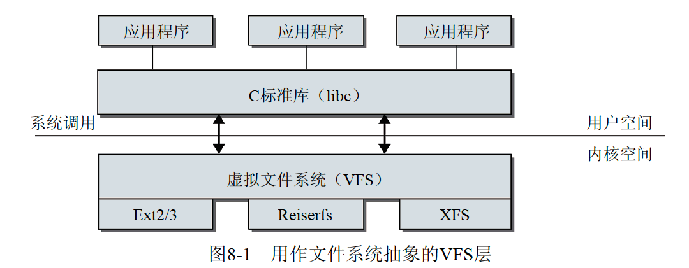

# vfs


内核中文件系统分类

- 基于磁盘，如ext234
- 虚拟文件系统，如proc
- 网络文件系统，socket，ceph

## 编程接口
每个进程创建后有文件描述符表，已经分配了

- 0 程序输入
- 1 程序输出
- 2 程序错误输出

进程打开文件后会给inode分配进程内唯一的文件描述符，inode自己有全局唯一的标示符

# inode
包含了文件(目录)的元信息

在linux/fs.h中，inode定义了结构，inode_operations定义了所有可执行操作
```
struct inode {
	struct hlist_node	i_hash;
	struct list_head	i_list;
	struct list_head	i_sb_list;
	struct list_head	i_dentry;
	unsigned long		i_ino; // 唯一标示
	atomic_t		i_count; // 被引用次数
	unsigned int		i_nlink;
	uid_t			i_uid;
	gid_t			i_gid;
	dev_t			i_rdev;  // 与哪个设备通讯
	unsigned long		i_version;
	loff_t			i_size;  // 文件长度
#ifdef __NEED_I_SIZE_ORDERED
	seqcount_t		i_size_seqcount;
#endif
	struct timespec		i_atime;
	struct timespec		i_mtime;
	struct timespec		i_ctime; // 最后访问修改存储时间
	unsigned int		i_blkbits;
	blkcnt_t		i_blocks; // 按块计算的长度
	unsigned short          i_bytes;
	umode_t			i_mode; // 访问权限
	spinlock_t		i_lock;	/* i_blocks, i_bytes, maybe i_size */
	struct mutex		i_mutex;
	struct rw_semaphore	i_alloc_sem;
	const struct inode_operations	*i_op;   // 定义对文件属性操作
	const struct file_operations	*i_fop;	/* former ->i_op->default_file_ops 定义文件内容操作 */ 
	struct super_block	*i_sb;
	struct file_lock	*i_flock;
	struct address_space	*i_mapping;
	struct address_space	i_data;
#ifdef CONFIG_QUOTA
	struct dquot		*i_dquot[MAXQUOTAS];
#endif
	struct list_head	i_devices;
	union {
		struct pipe_inode_info	*i_pipe;
		struct block_device	*i_bdev;
		struct cdev		*i_cdev;
	};
	int			i_cindex;

	__u32			i_generation;

#ifdef CONFIG_DNOTIFY
	unsigned long		i_dnotify_mask; /* Directory notify events */
	struct dnotify_struct	*i_dnotify; /* for directory notifications */
#endif

#ifdef CONFIG_INOTIFY
	struct list_head	inotify_watches; /* watches on this inode */
	struct mutex		inotify_mutex;	/* protects the watches list */
#endif

	unsigned long		i_state;
	unsigned long		dirtied_when;	/* jiffies of first dirtying */

	unsigned int		i_flags;

	atomic_t		i_writecount;
#ifdef CONFIG_SECURITY
	void			*i_security;
#endif
	void			*i_private; /* fs or device private pointer */
};
```

在task_struct中也有关于文件的属性

```
    int link_count, total_link_count;
/* filesystem information */
	struct fs_struct *fs;
/* open file information */
	struct files_struct *files;
/* namespaces */
	struct nsproxy *nsproxy;

```

进程通过复杂的管控最终持有inode，通过inode对文件做操作