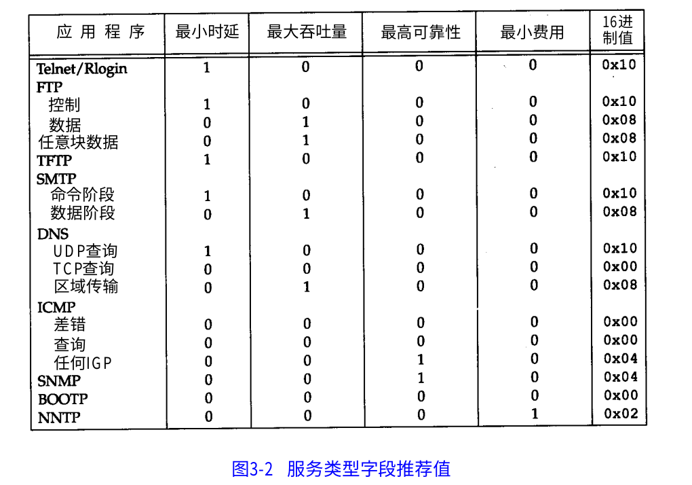

从版本开始记作 0~4bit，4~8bit，等，即big endian大端法，tcp/ip协议中要求所有二进制必须按照大端法传输，也称作网络字节序，小段法在传输之前要转为大端法

# 报文结构
## 版本

决定使用的版本号，v4或v6

保留版本号字段未来可以很好的向上扩展，协议有不兼容的更新时更换大版本号，设备根据版本号做不同处理

## 首部长度

因为ip报文具有可选字段，所以首部长度不固定，需要计算

大多数情况下可选字段不会使用，首部长度是20字节

## 服务类型
ip代表了坐标和路由，在传输过程中起指引作用，应该赋予他更多灵活的特性

无论怎样的网络严苛的服务，也只是依赖网络几个基本特性的组合

TOS包括共8位，包括3 bit的优先权字段（取值可以从000-111所有值），4 bit的TOS子字段和1 bit未用位但必须置0。

3bit的8个优先级的定义如下：

111--Network Control（网络控制）；

110--Internetwork Control（网间控制）；

101--Critic（关键）；

100--Flash Override（疾速）；

011--Flash（闪速）；

010--Immediate（快速）；

001--Priority（优先）；

000--Routine（普通）。

优先级6和7一般保留给网络控制数据使用，如路由。

优先级5推荐给语音数据使用。

优先级4由视频会议和视频流使用。

优先级3给语音控制数据使用。

优先级1和2给数据业务使用。

优先级0为默认标记值。

在标记数据时，既可以使用数值，也可以使用名称（英文名称）。

4 bit的TOS分别代表：最小时延、最大吞吐量、最高可靠性和最小费用。4 bit中只能置其中1 bit。如果所有4 bit均为0，那么就意味着是一般服务。

Telnet、Rlogin这两个交互应用要求最小的传输时延，FTP文件传输要求最大吞吐量，最高可靠性是指网络管理（SNMP）和路由选择协议。用户网络新闻要求最小费用

  
## 标识、标志、片偏移

和传输和分片有关
  
## 生存时间

TTL每当经过一个路由器，该值会被减1，若TTL变为0，则被丢弃。侧面说明了路由器是三层应用，需要拆解分析IP结构

包在路由器的指引下可能出现迷失现象，永远找不到出路，一直在各个路由器之间打转，这样的包积累过多网络就会重复传输无意义的包，造成拥塞，有了ttl就能在一定程度上避免此现场

## 协议
一般是tcp或udp，表明交给上层哪个应用

指定协议，这是个偷懒的工作，减少了对上层协议的识别工作

## 首部校验和
由于每经过一个路由器，TTL都会改变，所以校验和会随之改变


### 首部长度
为什么说首部长度最大是60个字节？

首部长度是4bit，而2^4是16，所以它的取值范围是0-15(也可理解为4bit即是4个1，转换成十进制就是15)，图中每行是4个字节(32bits)，所以最大长度就是15*4=60字节。从中也就得知首部长度最小数字是5，即1001（因为IP首部最小是20字节）。

也有理解说，首部长度就是固定以4个字节为单位。所以总是长度乘4，当然结果是一样的

### TOS
TOS包括一个3bit的优先权字段(现在已经被忽略)，4bitTOS字段，最后一个bit被置为0，



但是现在大多数TCP/IP实现都不支持TOS特性...


### IP数据报分片
IP数据最终要经过数据链路层传递，而不同的物理链路可承受的最大物理帧不同

即使ip总长度字段16位，理论上可以承受65536字节，但大多以太网能够承载不超过1500字节数据，某些广域网帧承载不超过576字节数据，一个链路层帧能够承载最大数据量叫做**最大传输单元MTU**

IP报文无法预计到会经过哪些链路层，必要时会将一个IP报文分为更小的，即**分片**，分片会用到标识、标志、片偏移，且再交付之前会重新组装

由于分片和组装会浪费路由器性能，在ipv6中禁止了这一行为

16位标识则是区分不同的ip包，在一些系统中的实现每发一个包就将计数值+1，如果一个ip包被切片，则可以通过标识再组装恢复

### 选项字段
最后一个字段是任意选项，很多TCP/IP应用都不支持这个字段

选项字段一直都是以 32 bit 作为界限,在必要的时候插入值为 0的填充字节。这样就保证
I P首部始终是 32 bit 的整数倍(这是首部长度字段所要求的)。

## ipv4

最早在制定IP协议考虑较少，使用32位，每8位用 . 分隔，史称ipv4

他被分为五类，每类又分为网络号和主机号


- D类地址用于组播
- 127.x.x.x段地址空间是被保留的回环地址，主机发送此类地址的数据，而是转向主机内部网络
- 特殊广播地址：255.255.255.255，尽管他是一个全网广播的地址，但是路由器并不向全网转播，只在该路由器下广播

这个网络号一般用于路由器，主机用于路由器下每个主机，但是分配的非常扯淡，大的大小的小，所以就有新的解决方案

## 无类型域间选路CIDR
它打破了固定的五类，将 32 位的 IP 地址一分为二，前面是网络号，后面是主机号，以/作为分隔

    10.100.122.2/24 表示，32位中前24位是网络号，后8位是主机号

伴随CIDR的是广播地址和子网掩码

我们知道网络号是 10.100.122 那么 10.100.122.255 (即主机号的最大值)则是该网络下的广播地址，所有在该网络下的主机都能收到

子网掩码是 255.255.255.0 将ip地址和子网掩码做AND运算，可以得到网络地址

### 公有ip和私有ip
前面表格中的五类都有对应的私有ip，例如我们的路由器被分配了一个公有ip 192.6.6.6，即在c类网络中，那么路由器下的所有主机访问192.168.0.0-192.168.255.255都会被路由器拦截，作为内网ip访问，而不会向外转播

即公网ip用于全球访问或路由器访问，私网ip是路由器下局域网内的访问，只会被路由器转接到内网主机，不会被发送出去

一般192.168.0.x是最常用的局域网内访问地址，很少有家庭局域网超过255个主机，所以家庭路由器内网ip通常是192.168.0.1/24，那么广播地址就是192.168.0.255


## 配置ip地址
```

    sudo ifconfig eth1 10.0.0.1/24 //配置网卡的ip地址
    sudo ifconfig eth1 up //重启网卡

```

ip的确可以随意配置，但是配置了能否生效呢，假设我们配置完成之后ping 192.168.1.6(旁边的电脑)

首先linux会看要访问的地址和本机地址是否再一个网段，如果在一个网段下，发送ARP请求，向网关请求对方的MAC地址，然后就可以发送包了

linux默认的逻辑是：如果这是一个跨网段的传输，他就不会把包发到网络上(而且还没有MAC地址，没法发送)，而是企图交给网关处理

这时候就要在本机查询网关地址，如果没配置网关，那么包压根就发不出去，如果想要配置网关为192.168.1.6，linux根本不会让你配置成功的，因为你的ip和网关不在一个网段下

## DHCP动态主机配置协议

既然配置IP这么麻烦，而我们经常要换地方，每次配置一次要累死，这时就用到了DHCP

当一个机器加入网络并没有IP地址，它会使用0.0.0.0地址(因为他现在还没有IP地址)发送一个广播包，目的地址为255.255.255.255(它也不知道DHCP Server的地址)，本机端口号68，目的端口号67，并使用自己的MAC地址，目的MAC地址为FFFF.FFFF.FFFF

可以发现，区域广播有两种方式，第一种是本网段下的主机最大值，第二种是255.255.255.255，它会被发送到局域网下所有主机，但是网关不会将它发送到外部网络。广播只能用UDP包

区域网中有一个或多个主机是用来做HDCP Server，它接受到这个UDP包后，解析其MAC地址，就知道来了个新人，这时就体会到了MAC地址唯一的重要性了。HDCP会给它分配一个IP地址，并附带子网掩码、网关、IP租用信息等广播出去

幸运的话，这个机器能收到多个响应，它会选择一个HDCP offer，并回复一个广播，携带客户端的MAC和接受的HDCP服务器的地址，告诉他我接收了这个IP，并谢谢其他HDCP，HDCP回复一个ACK表示把这个IP分给他了，拢共四个报文

当租期超过50%时，主机会向HDCP服务器发一个续约的报文

有一个有意思的细节是：网络管理员不仅能自动分配IP地址，还能帮你安装操作系统！

## NAT转换技术
ipv4不够用，就有人想到用一个有公网ip的主机，代理一个局域网

该局域网下都分配内网地址，发送的数据经过NAT主机转换为公网IP并记录，实现了代理

## 默认网关

ip数据报必须借助网关的路由才能发送给其他主机，每个主机都有自己的默认网关，网关也可以配置。如果该主机的TCP/IP设置中没有配置默认网关地址，或指定了错误的默认网关地址，则远端网络消息无法被送达

# ifconfig
ifconfig 或 ip addr 用来查看本机网络地址，推荐使用ip系列命令

```
    ip addr //打印所有网络信息
    1: lo: <LOOPBACK,UP,LOWER_UP> mtu 65536 qdisc noqueue state UNKNOWN group default qlen 1000
    link/loopback 00:00:00:00:00:00 brd 00:00:00:00:00:00
    inet 127.0.0.1/8 scope host lo
       valid_lft forever preferred_lft forever
    inet6 ::1/128 scope host 
       valid_lft forever preferred_lft forever
    2: enp3s0: <NO-CARRIER,BROADCAST,MULTICAST,UP> mtu 1500 qdisc pfifo_fast state DOWN group default qlen 1000
        link/ether 8c:16:45:4a:0b:a3 brd ff:ff:ff:ff:ff:ff
    3: wlp5s0: <BROADCAST,MULTICAST,UP,LOWER_UP> mtu 1500 qdisc mq state UP group default qlen 1000
        link/ether 70:c9:4e:dd:11:c1 brd ff:ff:ff:ff:ff:ff
        inet 192.168.1.107/24 brd 192.168.1.255 scope global dynamic noprefixroute wlp5s0
        valid_lft 6522sec preferred_lft 6522sec
        inet6 fe80::413f:f12c:b7a2:a95/64 scope link noprefixroute 
        valid_lft forever preferred_lft forever
    4: docker0: <NO-CARRIER,BROADCAST,MULTICAST,UP> mtu 1500 qdisc noqueue state DOWN group default 
        link/ether 02:42:bd:17:57:17 brd ff:ff:ff:ff:ff:ff
        inet 172.17.0.1/16 brd 172.17.255.255 scope global docker0
        valid_lft forever preferred_lft forever
```

- lo/enp3s0：网络名称
- mtu：物理链路层最大传输单元
- state：网络状态,UP打开，DOWN关闭
- link/：网络类型
- sope：范围，host对内，只能在本机使用，global对外，可以接受来自任意地方的包
- link/ether：mac地址
- inet：网络地址、brd：广播地址

每个主机都有一个回环网络接口lo用来连接自身，用来测试网络程序。固定的IP地址是127.0.0.1(localhost)

严格来说127.0.0.1只是环回地址之一。所有127.x.x.x都是环回地址。从127.0.0.0 到 127.255.255.255 均予以保留。此地址块中的任何地址都将环回到本地主机中。此地址块中的任何地址都绝不会出现在任何网络中。

0.0.0.0 不能ping通。0.0.0.0就是任何地址IP_ADDR_ANY，任何地址的意思就是包括环回地址。

任何地址IP_ADDR_ANY的意思也就是，不管主机有多少个网口，多少个IP，如果监听本机的0.0.0.0上的端口，就等于监听机器上的所有IP端口。数据报的目的地址只要是机器上的一个IP地址，就能被接受

## 状态标识
```
    enp3s0: <NO-CARRIER,BROADCAST,MULTICAST,UP> mtu 1500 qdisc pfifo_fast state DOWN group default qlen 1000
            link/ether 8c:16:45:4a:0b:a3 brd ff:ff:ff:ff:ff:ff
```
<BROADCAST,MULTICAST,UP,LOWER_UP>UP 表示网卡处于启动的状态；BROADCAST 表示这个网卡有广播地址，可以发送广播包；MULTICAST 表示网卡可可以发送多播包；UP 表示它是启动的，也即连上网了

MTU表示链路层的最大传输单元，他是第二层MAC层的概念。以太网规定连带MAC头加正文最大传输数据长度不能超过1500字节。这里面有MAC头，IP头，TCP头、HTTP头、HTTP体，如果传输不下，就需要分片传输，一般tcp会提前获取MTU的最大长度，将报文段长度控制在MTU之内

qdisc pfifo_fast 是什么意思呢？qdisc 全称是queueing discipline，即排队规则。内核如果要通过某个网络接口发送数据包，他都需要按照为这个接口配置的排队规则把数据包加入队列。

最简单的qdisc是pfifo，它不对数据包做任何处理，采用先进先出的方式，pfifo_fast略复杂，它分为三个波段(band)，每个波段都是先进先出但优先级不同，band0>band1>band2。数据包按照IP报里TOS字段被分配高优先级还是低优先级