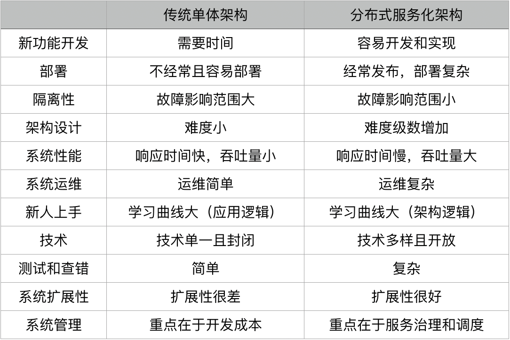

使用分布式的根本目的是提高可用性、吞吐量

- 通过冗余避免任何单节点可能出现的问题
- 通过多机器写协作，提升吞吐量，可水平扩展

基础服务必须要用分布式提高可用性和吞吐量，而微服务还有精简模块，改善开发部署流程等好处

带来好处的同时，分布式也有难度大，治理复杂的问题

整体来看降低了开发成本，提高了运维难度，所以需要链路追踪等基础服务降低运维成本

# 核心指标
## 可用性
- 可用性：服务可用时间/总时间、请求成功数/请求总数，通常只是部分不可用
- 可靠性：故障导致服务整体不可用

## 性能
- 吞吐量
- qps、tps、bps
- 响应时间

## 资源利用
- 相同性能和吞吐量下，越少的资源占用越好
- 资源利用率越高越好，比如说raft选主至少要3 master，有两个master闲置

## 扩展性
分布式系统下水平扩展

- 扩展后吞吐量增长比