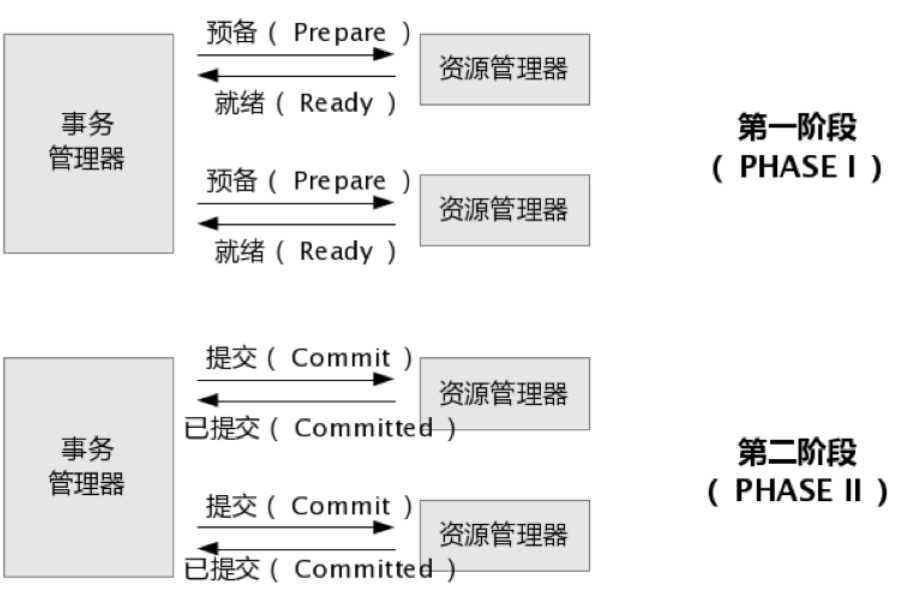
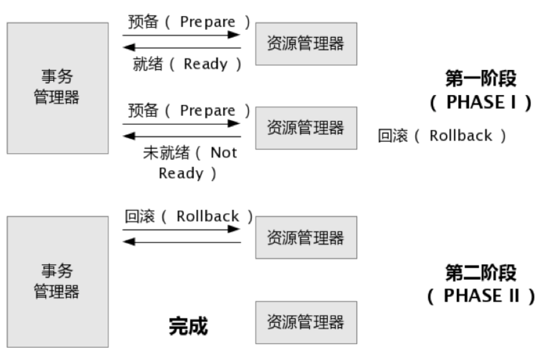

# 事务
事务的ACID特性

1. 原子性 Atomicity：1 or 0，即 nothing or all，不会停留在中间状态
2. 一致性 Consistency：是指事务操作前和操作后，数据满足完整性约束，数据库保持一致性状态，即操作成功才提交数据
3. 隔离性 Isolation：多个事务间相互不影响
4. 持久性 Durability：事务最终的状态都被持久的保存下来

分布式中单个事务可能跨多个service或cluster，太多的因素影响，且流程长，因此很难满足强一致性，有的是最终一致性

# XA
xa是分布式事务协议，分为两部分，事务管理器和本地资源管理器，通常本地资源管理器由数据库实现

- 事务管理器负责事务协调
- 本地资源管理器实现XA接口

# 两阶段提交 2pc
the two-phase commit protocol

在提交之前没有异常，则代表就绪可提交，由管理器统一发布提交

提交前发生异常，则由管理器统一回滚

存在以下问题
1. 两阶段耗费更长的事务时间
2. 管理器单点异常会导致系统阻塞
3. 提交阶段如果发生网络异常，导致部分参与者收到了提交请求，会出现数据不一致

# 3pc
分为三个阶段
 
 - CanCommit 并不执行操作，只预判断是否能执行成功
 - PreCommit 执行操作但不提交
 - DoCommit 提交操作

 依然有数据一致性问题

 # BASE理论
BASE 是 Basically Available(基本可用)、Soft-state(软状态) 和 Eventually Consistent(最终一致性) 三个短语的缩写。

- 基本可用：在分布式系统出现故障，允许损失部分可用性（服务降级、页面降级）。

- 软状态：允许分布式系统出现中间状态。而且中间状态不影响系统的可用性。这里的中间状态是指不同的 data replication（数据备份节点）之间的数据更新可以出现延时的最终一致性。

- 最终一致性：data replications 经过一段时间达到一致性。

BASE 理论是对 CAP 中的一致性和可用性进行一个权衡的结果，理论的核心思想就是：我们无法做到强一致，但每个应用都可以根据自身的业务特点，采用适当的方式来使系统达到最终一致性。

