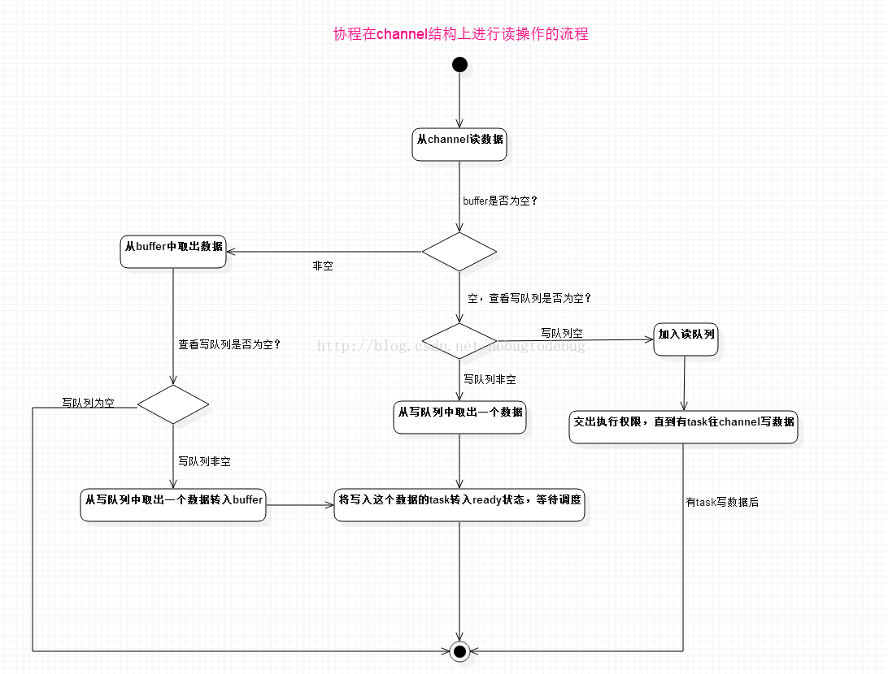

channel的本质还是通过共享内存实现数据传输
```
type hchan struct {
    // channel中元素个数
	qcount   uint
    // 循环队列长度
	dataqsiz uint
    // 内存地址
	buf      unsafe.Pointer
    // 元素大小
	elemsize uint16
    // 是否关闭
	closed   uint32
    // 元素类型
	elemtype *_type
    // Channel 的发送操作处理到的位置
	sendx    uint
    // Channel 的接收操作处理到的位置
	recvx    uint
    // 当前 Channel 由于缓冲区空间不足而阻塞的 Goroutine 列表，双向链表
	recvq    waitq
	sendq    waitq

	lock mutex
}
```

他的底层主要有四个数据结构，buffer、send、receive、lock

buffer就是共享的内存缓存区域，在make时设置，如果为0，则buffer为空，结构体中保存了元素size，所以可以把buf看作链表

sendx和recvx是两个指针，代表当前链表消费情况

当goroutine向channel发送数据时，先查看buffer是否为空

1. 不为空，查看buffer是否已满，如果未满，将数据存入buffer，继续执行。如果满了，将自己放入send，goroutine挂起
2. 为空，查看receive，将自己的数据传给receive




# 执行过程
- 在发送数据的逻辑执行之前会先为当前 Channel 加锁，防止多个线程并发修改数据。如果 Channel 已经关闭，那么向该 Channel 发送数据时会报 “send on closed channel” 错误并中止程序

- 当存在等待的接收者时，通过 runtime.send 直接将数据发送给阻塞的接收者；
- 当缓冲区存在空余空间时，将发送的数据写入 Channel 的缓冲区；
- 当不存在缓冲区或者缓冲区已满时，等待其他 Goroutine 从 Channel 接收数据；

