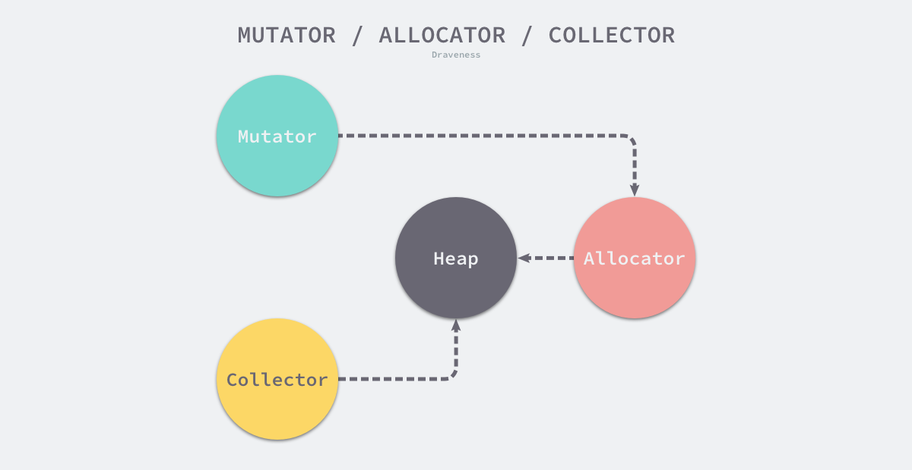
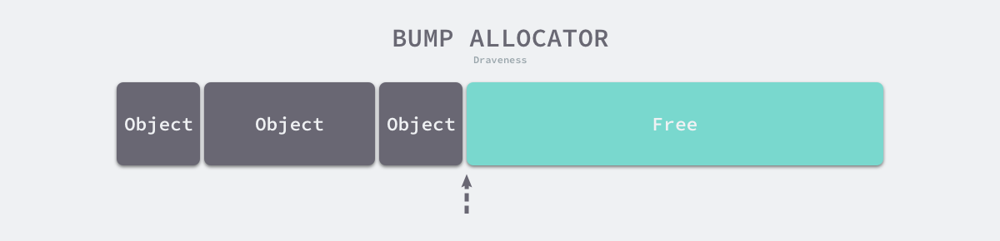
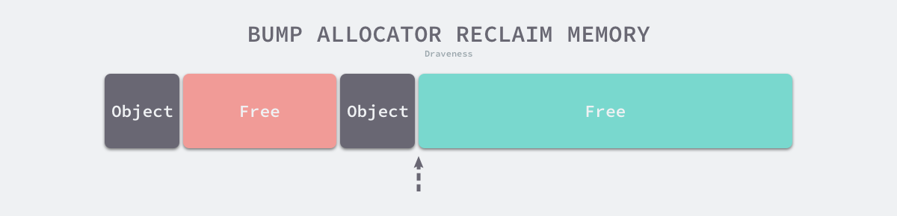
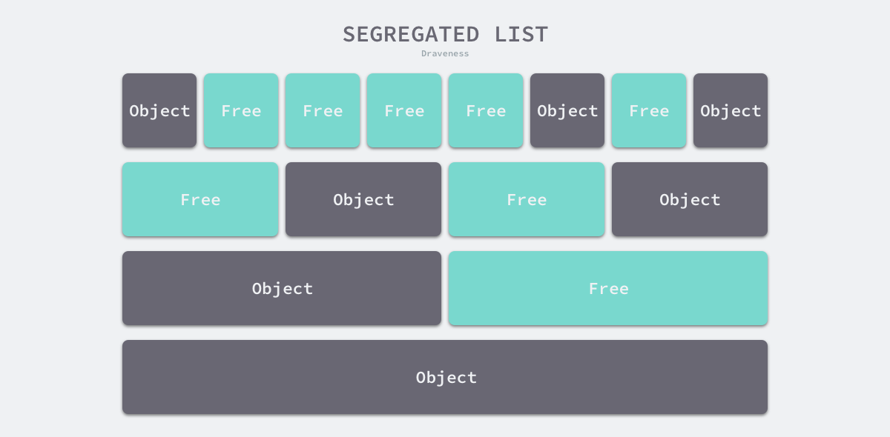
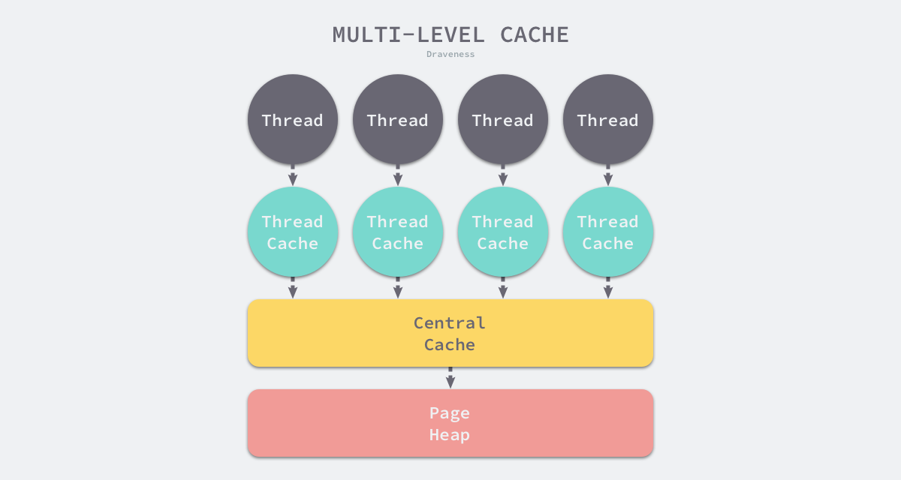

go与c内存管理差异在，c手动申请和释放内存，而go交给程序自动申请，gc释放，所以需要有个大的内存池管理

go在启动时就会申请巨大内存，linux中虚拟内存只有被第一次使用时才出发中断，申请对应物理内存

# 整体设计

- 程序执行中调用allocator申请内存
- allocator从heap中申请内存
- 内存使用后会被collector释放

# 分级分配
heap掌管巨大的内存池，如何组织和分配内存

## 线性分配

- 维护heap当前的位置，每次分配只需要检查剩余内存、移动并返回指针
- 虽然很简单，但是free内存不容易被重新利用，需要建立复杂的内存回收机制，还容易造成内存碎片

## 分级池
将内存分割成多个链表，每个链表中的内存块大小相同，申请内存时先找到满足条件的链表，再从链表中选择合适的内存块

## 对象大小
- 微对象	(0, 16B)
- 小对象	[16B, 32KB]
- 大对象	(32KB, +∞)

## 多级缓存
内存分配器不仅会区别对待大小不同的对象，还会将内存分成不同的级别分别管理，Go 运行时分配器都会引入线程缓存（Thread Cache）、中心缓存（Central Cache）和页堆（Page Heap）三个组件分级管理内存

- 线程缓存用于独立线程，没有多线程竞争，减少锁损耗
- 当线程缓存不能满足需求时，运行时会使用中心缓存作为补充解决小对象的内存分配，在遇到 32KB 以上的对象时，内存分配器会选择页堆直接分配大内存

