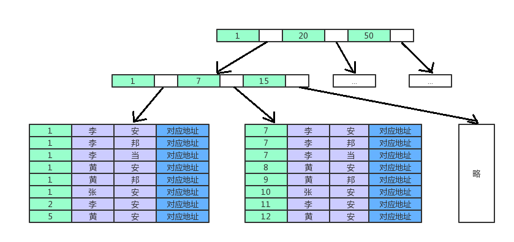

索引是为了提高查找效率，就像书的目录一样

# 索引原理
InnerDB支持两种索引模式，一种是hash，另一种是下面要讲的B树

hash就如同hashmap理论上每次查找的性能是O(1)，实际上当太多hash冲突(大数据下一定会有很多索引)，查找性能也会退化

最关键的是不支持范围查找，只能对索引所以些基本判断==或in操作，所以一般都是用的B+树

## B树、B+树
数据库查找真正性能的瓶颈在于磁盘读写，其中大部分时间浪费在磁盘寻道上，如果能减少磁盘读写就能提高性能

内存以分页的形式组织，所以希望做一次磁盘IO刚好分配并读取一也内存，N的大小会根据内存页的大小而定

由于磁盘扇区大小固定，机械臂每运动一次只能读取一个扇区，所以我们希望在一个扇区内尽可能存下一个节点，这样就减少了磁盘IO操作。如果用B树，则IO操作次数可能多可能少，不稳定，使用B+树则保证了稳定的IO（次数较少），且一个扇区能存下的节点信息更多、

B树是一个多路平衡树，B+树也是多路平衡树，但B+树有着和其他树不同的特征

- 所有的叶子节点位于同一层，且是最深那一层
- 非叶子节点不存储指向数据的指针，所有的叶子节点存储指向数据的指针且包含父节点
- 叶子节点之间有关联，方便区间查询

# InnerDB索引
下面以InnerDB为例

如果你没有创建主键索引，引擎也会默认创建一个你看不到的主键索引

**非主键索引的叶子节点内容是主键的值，非主键索引也被称为二级索引**，select * form T where k=5，如果k是索引，需要先搜索k索引树，得到ID值，再到ID索引树搜索一次，因此应该尽量使用主键索引

B+树为了维护索引的有序性，在插入新值和删除时需要做必要的维护。如果插入新值数据页已满，就需要申请新的数据页，分裂，或者删除时要合并。但使用自增主键，每次插入都是追加操作，所以不会有叶子节点的分裂

- 一般都要有主键
- 主键最好使用自增int，索引类型尽可能小，这样一个节点能存更多的键
- 尽可能使用主键查询

## 聚簇索引

**主键索引也被称为聚簇索引**，即数据的物理存放顺序与索引顺序是一致的，只要索引是相邻的那么数据一定也是相邻的存放在磁盘上，减少了页分裂和合并，因此聚簇索引比非聚簇索引效率要高很多

一般情况下主键会默认创建为聚簇索引，一张表只能有一个聚簇索引

## 联合索引

create index(myindex) on table(age,prefix,name)

为年龄，姓，名创建复合索引

创建联合索引后实际是以最左边的列作为索引，而后遍历查找后面的索引值

- where age=1 and prefix = '李'，可以用到索引
- where prefix = '李' 不能用到索引

使用时必须带上最左边的列，否则无法利用索引

- where age=1 and name='安'

这样会扫描第二列，即第二个索引没有用上

- where name='安' and age=1

交换位置没有影响，照样可以用上索引

**最左原则**

在创建索引时，几个索引从左到右的顺序应当是你使用的顺序呢，例如a,b,c，如果你where中有a，ab，abc，都可以用到索引，即使用右边的索引时应当带着左边的索引，使用左边索引时可以不带右边索引

# 索引操作

添加索引

    CREATE [UNIQUE|FULLTEXT] INDEX index_name ON table_name(col_name)
    CREATE [] INDEX index_name ON table_name(col1,col2)
    CREATE [] INDEX index_name ON table_name(username(6))

删除索引

    ALTER TABLE table_name DROP INDEX index_name

查看索引

    SHOW INDEX FROM table_name|db_name

## UNIQUE
unique是唯一索引，他和主键的却别是，两者都是唯一的，但unique可以为null且为null时不唯一，但主键不能为null

## FULLTEXT
FULLTEXT是全文索引，用于关键字的匹配进行查询过滤，类似 WHERE name LIKE %

他用于大量的文本检索，性能远远优于like，使用全文索引，sql中要用match和against

不常用

## 前缀索引
如果要对字符串做检索，我们可以建立前缀索引

    ALTER TABLE table_name ADD KEY(colum_name(prefix_length))

会为字符串的前缀长度建立索引，但是不能用于order by和gorup by中

## 覆盖索引

    SELECT * FROM t WHERE k BETWEEN 3 AND 5

执行这个语句会首先k索引树查找k=3、4、5每个对应的ID，再回表从ID树中查找对应行

    SELECT id FROM t WHERE k BETWEEN 3 AND 5

如果直接查找id就不用回表了，这种索引结果覆盖了查询需求就是覆盖索引，能显著提升性能

## 联合索引与最左索引
在创建索引是可以创建多个字段在一起为一个索引。如果我们在(a，b，c)上创建索引，其实是按照a组织B+树，找到a之后再去查找b，再查找c等，a一定是要有序的，这是最左前缀原理

    where a=1
    where a=1 and b=2
    where a=1 and b=2 and c=3

上面的都可以用到索引

    where a=1 and c=3 //只能用到a索引
    where b=2 and c=3 //用不到索引

可以联合上面覆盖索引一起做性能优化，例如：居民的身份证是唯一的，我们常常要用身份证号查姓名，偶尔也要用身份证号查地址，该怎么建立索引

    CREATE INDEX uid_name ON t_name(uid,name)

如果我们通过身份证号查姓名，不用回表，如果用身份证号查地址，需要回表一次，但可以接收

## 索引下推
如果建立联合索引 (name,age)

    select * from tuser where name like '张%' and age=10 and ismale=1;

这种情况下就只能用到name索引

在mysql5.6之前会逐个回表，如下

mysql5.6之后会再做一次筛选(我觉得这样才属于正常的)

# 索引原则
索引可以优化查找性能，但是索引的创建也需要消耗磁盘空间，且对数据增删改时同时需要修改索引树，如果索引建的太多也会损耗性能，一张表的索引应当不超过6个，要根据使用情况创建或修改索引

1. 主键自动建立唯一递增索引
2. 频繁操作的应当建立索引
3. 外键要建立索引
4. 尽可能使用类型较小的数据建立索引，这样每个节点能存更多的值，树的层级更浅，内存中能装更多的索引
5. 尽可能建立组合索引或覆盖索引
6. 查询中排序的字段，排序字段若通过索引访问将大大提高排序速度
7. 如果数据在几个值内反复重复，则没必要建立索引

## 索引的使用
1. 最左前缀
4. 对like查询，尽量不要把%放在前面，否则无法使用索引
5. 应当使用独立的列查找索引 select name from tab where id +1 = 5，应该始终将索引放在比较符号的一侧，便于引擎解析

# sql优化
1. 对于where，on，order by中使用索引的列，索引优化看前面写的
2. 避免在where中判断null，这样会让引擎放弃索引而进行全表扫描
3. 接上条，避免null，将所有字段设置not null，提供默认值
4. 避免在where中使用 != 或 <> 这样会让引擎放弃索引而做全表扫描
5. 如果在where中使用or，且a or b，如果a有索引，b没有索引，则会让引擎放弃索引扫描全表
6. 如果update语句只需要更改1,2个字段，不要update所有字段，这样会浪费大量性能
7. 尽可能使用数字类型的字段，因为数字查询比较都快，字符串比较太慢，且尽可能使用varchar
8. 不要滥用select *，返回用不到的字段只会浪费性能
9. 避免大事务操作，容易造成死锁，降低并发性