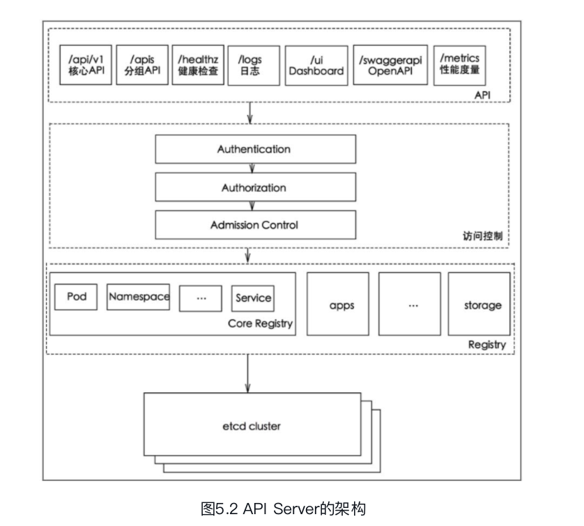
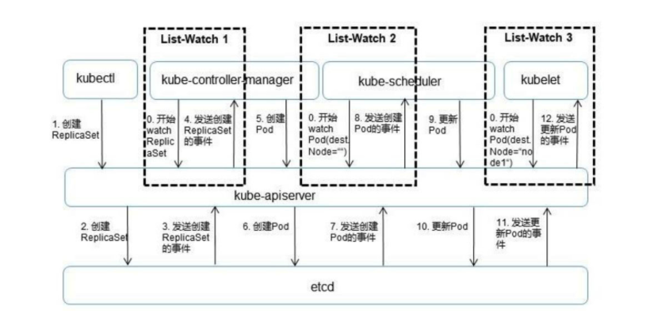

api-server是所有模块交流的总线

# API层
以REST方式提供各种服务

- 资源对象的CRUD和watch
- 健康检查、性能指标、UI等运维相关API

## proxy
把REST请求转发到kubelet，收敛流量入口在api-server

# 访问控制层
做权限控制

# 资源表注册
资源序列/反序列、资源版本转换

- 引入internal版本作为资源版本的中转

## 资源结构
- 

# etcd交互
通过etcd watch方式和组件通讯

- 所有资源操作在API层变为event，register + wath+ event 方式和组件通讯
- 相较于定义模块接口，event方式具有更好的扩展性，以性能为代价换取其他模块的灵活性

# list-watch

把所有操作资源的模块看作operator
- operator应该向api-server注册要监听的资源类型
- api-server接收到外部事件后，信息同步到etcd，触发etcd watch 从而触发 operator
- 通过watch方式异步处理而非主动调用

