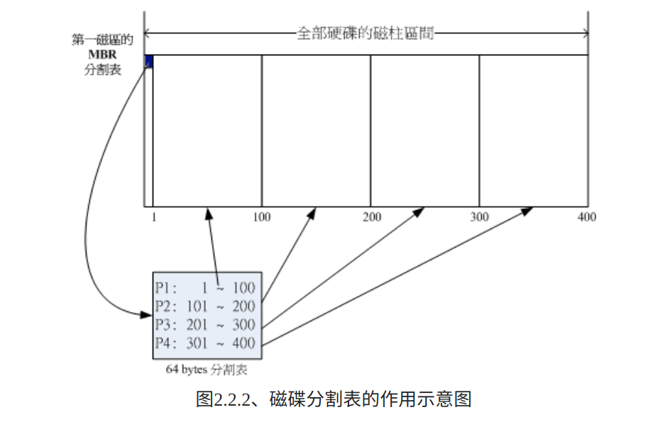
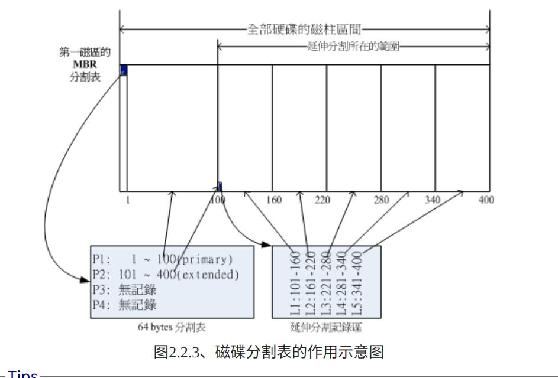
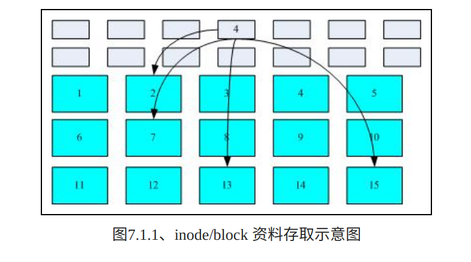
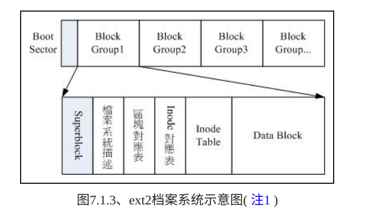
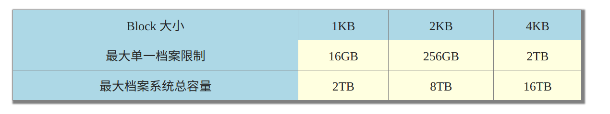
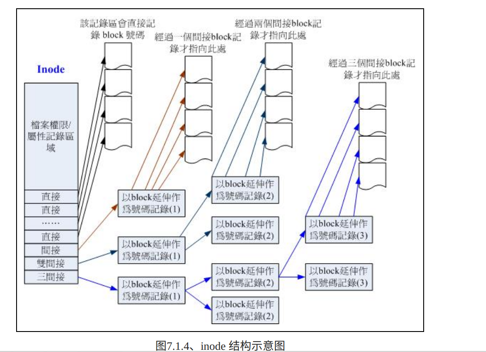

# 文件目录
- /bin 放置常用 shell 命令运行文件
- /boot　放置启动linux时使用的核心文件，包括一些链接文件以及镜像文件
- /dev device的缩写，存放linux的外部设备，以文件的方式管理设备（开机时就已存在的设备）
- /etc 存放程序所需的整个文件系统的配置文件，除了系统外还有软件的配置文件
- /home 所有的用户目录和文件
- /lib library存放系统最基本的动态连接共享库，几乎所有的应用程序都需要用到这些共享库
- /lost+found　系统非法关机后，这里就会存放一些文件，关于异常关机的
- /media linux系统自动识别的一些设备，例如挂载光驱、U盘（临时挂载且系统能自动识别的设备）
- /mnt　也是挂载设备，但是系统不能识别，就放在这里，让我们手动挂载
- /opt　自己安装的软件
- /proc 对内存的虚拟映射,内存进程文件信息
- /root 超级用户的目录
- /sbin 管理员使用的程序
- /usr user software resource　系统安装的软件
    - /usr/share 系统安装的软件，类似于操作界面等
    - /usr/local 系统管理员安装的软件，权限比较高
- /var 系统运行时产生的数据
- /swap 交换分区，用于和内存做数据交换，缓存内存数据，即虚拟内存

# 磁盘
磁盘有机械和固态，现在存储设置的变化很快，所以就不说内部原理了，只说说一直没有变化的和常用的

## MSDOS (MBR) 分割表格式与限制
早期的Linux 系统为了相容于Windows 的磁碟，因此使用的是支援Windows 的MBR(Master Boot Record, 主要开机纪录区）的方式来处理开机管理程式与分割表！而开机管理程式纪录区与分割表则通通放在磁碟的第一个磁区， 这个磁区通常是512bytes 的大小(旧的磁碟磁区都是512bytes 喔！)，所以说，第一个磁区512bytes 会有这两个资料：

- 主要开机记录区(Master Boot Record, MBR)：可以安装开机管理程式的地方，有446 bytes
- 分割表(partition table)：记录整颗硬碟分割的状态，有64 bytes

由于分割表所在区块仅有64 bytes容量，因此最多仅能有四组记录区，每组记录区记录了该区段的启始与结束的磁柱号码。若将硬碟以长条形来看，然后将磁柱以直条图来看，那么那64 bytes的记录区段有点像底下的图示：

假设上面的硬碟装置档名为/dev/sda时，那么这四个分割槽在Linux系统中的装置档名如下所示， 重点在于档名后面会再接一个数字，这个数字与该分割槽所在的位置有关喔！

- P1:/dev/sda1
- P2:/dev/sda2
- P3:/dev/sda3
- P4:/dev/sda4

这是存储在分割表中的分区数据，实际我们也可以利用分区中一部分位置记录其他的分区，即逻辑分区

同样的，上述的分割槽在Linux系统中的装置档名分别如下：

- P1:/dev/sda1
- P2:/dev/sda2
- L1:/dev/sda5
- L2:/dev/sda6
- L3:/dev/sda7
- L4:/dev/sda8
- L5:/dev/sda9

使用云虚拟存储时，可能模拟出的磁盘是 sdp

仔细看看，怎么装置档名没有/dev/sda3与/dev/sda4呢？因为前面四个号码都是保留给Primary或Extended用的嘛！所以逻辑分割槽的装置名称号码就由5号开始了！这在MBR方式的分割表中是个很重要的特性，不能忘记喔！

其实分割时可以直接全部怼逻辑分区

总结：
- 旧的磁盘区大小是512b，现在主流是4k
- 开机记录区446b，分割表64b
- 分割表最多可记录4个分区，主分区和逻辑分区相互隔离，逻辑分区只能有一个
- 逻辑分区下可切分无数分区

## GPT磁盘分割
- 现在主流扇区4k，但为了兼容划分为512b的逻辑扇区LBA

LBA0 (MBR 相容区块)

与MBR模式相似的，这个相容区块也分为两个部份，一个就是跟之前446 bytes相似的区块，储存了第一阶段的开机管理程式！而在原本的分割表的纪录区内，这个相容模式仅放入一个特殊标志的分割，用来表示此磁碟为GPT格式之意。而不懂GPT分割表的磁碟管理程式，就不会认识这颗磁碟，除非用户有特别要求要处理这颗磁碟，否则该管理软体不能修改此分割资讯，进一步保护了此磁碟喔！

LBA1 (GPT 表头纪录)

这个部份纪录了分割表本身的位置与大小，同时纪录了备份用的GPT 分割(就是前面谈到的在最后34 个LBA 区块) 放置的位置， 同时放置了分割表的检验机制码(CRC32 )，作业系统可以根据这个检验码来判断GPT 是否正确。若有错误，还可以透过这个纪录区来取得备份的GPT(磁碟最后的那个备份区块) 来恢复GPT 的正常运作！

LBA2-33 (实际纪录分割资讯处)

从LBA2区块开始，每个LBA都可以纪录4笔分割纪录，所以在预设的情况下，总共可以有4*32 = 128笔分割纪录喔！因为每个LBA有512bytes，因此每笔纪录用到128 bytes的空间，除了每笔纪录所需要的识别码与相关的纪录之外，GPT在每笔纪录中分别提供了64bits来记载开始/结束的磁区号码，因此，GPT分割表对于单一分割槽来说，他的最大容量限制就会在『 2 64 * 512bytes = 2 63 * 1Kbytes = 2 33 *TB = 8 ZB 』，要注意1ZB = 2 30 TB啦！你说有没有够大了？

原来的开机流程是BIOS找到MBR，选择要加载的系统，系统自举，然后ok

现在用UEFI+GPT类似的过程取代了上面的加载

# 档案系统
档案系统是如何运作的呢？这与作业系统的档案资料有关。较新的作业系统的档案资料除了档案实际内容外，通常含有非常多的属性，例如Linux作业系统的档案权限(rwx)与档案属性(拥有者、群组、时间参数等)。 档案系统通常会将这两部份的资料分别存放在不同的区块，权限与属性放置到inode中，至于实际资料则放置到data block区块中。另外，还有一个超级区块(superblock)会记录整个档案系统的整体资讯，包括inode与block的总量、使用量、剩余量等。

每个inode 与block 都有编号，至于这三个资料的意义可以简略说明如下：

- superblock：记录此filesystem 的整体资讯，包括inode/block的总量、使用量、剩余量， 以及档案系统的格式与相关资讯等；
- inode：记录档案的属性，一个档案占用一个inode，同时记录此档案的资料所在的block 号码；
- block：实际记录档案的内容，若档案太大时，会占用多个block 。

## block

我们将inode 与block 区块用图解来说明一下，如下图所示，档案系统先格式化出inode 与block 的区块，假设某一个档案的属性与权限资料是放置到inode 4 号(下图较小方格内)，而这个inode 记录了档案资料的实际放置点为2, 7, 13, 15 这四个block 号码，此时我们的作业系统就能够据此来排列磁碟的读取顺序，可以一口气将四个block 内容读出来！那么资料的读取就如同下图中的箭头所指定的模样了。

在Ext2档案系统下，block大小只有三种

每个档案至少占用一个block，如果分区时block太小，就限制了最大单一档案，如果太大，小的文件占用了过多空间

- 原则上，block 的大小与数量在格式化完就不能够再改变了(除非重新格式化)；
- 每个block 内最多只能够放置一个档案的资料；
- 承上，如果档案大于block 的大小，则一个档案会占用多个block 数量；
- 承上，若档案小于block ，则该block 的剩余容量就不能够再被使用了(磁碟空间会浪费)。

## inode

inode存储文件的属性信息，如存取模式、权限、最近改变时间等。系统读取档案会先找到inode，查看是否满足条件

node 要记录的资料非常多，但偏偏又只有128bytes 而已，所以在记录文件索引时可以通过间接索引

inode和block的数量和大小在分区后就确定了

## superblock
Superblock 是记录整个filesystem 相关资讯的地方， 没有Superblock ，就没有这个filesystem 了。他记录的资讯主要有：

- block 与inode 的总量；
- 未使用与已使用的inode / block 数量；
- block 与inode 的大小(block 为1, 2, 4K，inode 为128bytes 或256bytes)；
- filesystem 的挂载时间、最近一次写入资料的时间、最近一次检验磁碟(fsck) 的时间等档案系统的相关资讯；
- 一个valid bit 数值，若此档案系统已被挂载，则valid bit 为0 ，若未被挂载，则valid bit 为1 

整个档案系统从一个根目录 / 开始，呈树状结构，虽然看似他们好像是一体的，实际树中的目录都可以有自己的挂载点，挂载到磁盘的具体分区

    df：列出档案系统的整体磁碟使用量；
    df [-ahikHTm] [目录或档名] 
    -h ：以人们较易阅读的GBytes, MBytes, KBytes 等格式自行显示；
    -i ：不用磁碟容量，而以inode 的数量来显示

# 档案系统操作

## 链接

    ln [-sf]来源档目标档
    -s ：如果不加任何参数就进行连结，那就是hard link硬链接，至于-s就是symbolic link软链接 
    -f ：如果目标档存在时，就主动的将目标档直接移除后再建立！

我们上面介绍了，一个真正的文件是由 inode 和 block 两部分组成的，硬连接就是复制出一份新的inode，除了连接到相同的data，新旧inode之间没有任何关系

硬连接虽然用着很爽，但是有两个限制
- 不能跨filesystem
- 不能link目录

软链接等同于windows的快捷方式

### link数量
/tmp/testing与/tmp/testing/.其实是一样的！都代表该目录啊～而/tmp/testing/..则代表/tmp这个目录，所以说，当我们建立一个新的目录时， 『新的目录的link数为2 ，而上层目录的link数则会增加1』不信的话，我们来作个测试看看：

    [root@study ~]# ls -ld /tmp 
    drwxrwxrwt. 14 root root 4096 Jun 23 22:42 /tmp
    [root@study ~]# mkdir /tmp/testing1 
    [root@study ~]# ls -ld /tmp 
    drwxrwxrwt. 15 root root 4096 Jun 23 22:45 /tmp   #这里的link数量加1了！
    [root@study ~]# ls -ld /tmp/testing1 
    drwxr-xr-x. 2 root root 6 Jun 23 22:45 /tmp/testing1/

