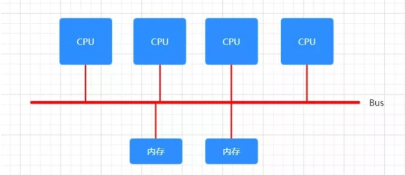
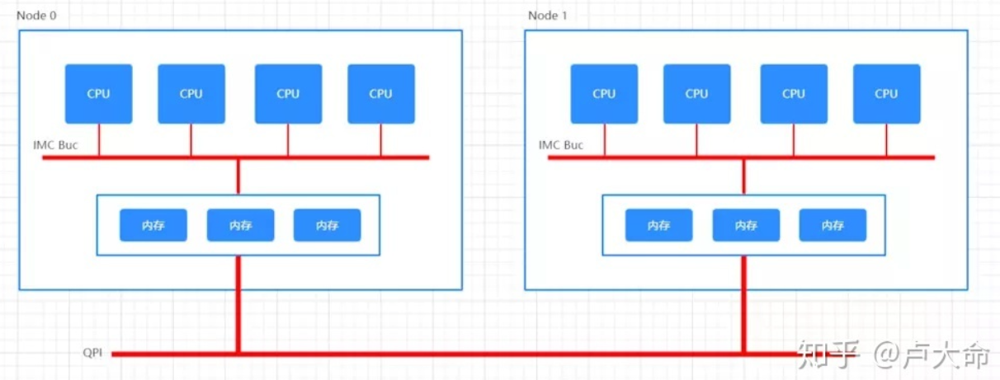
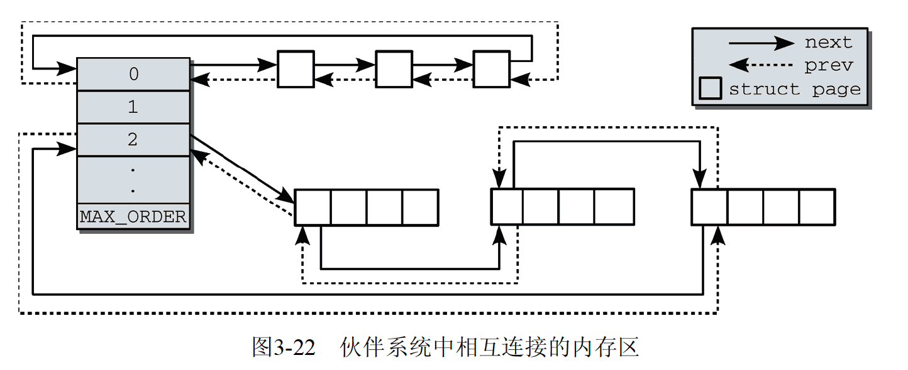
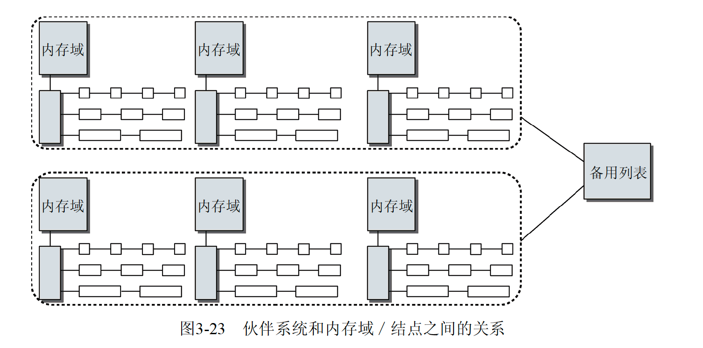
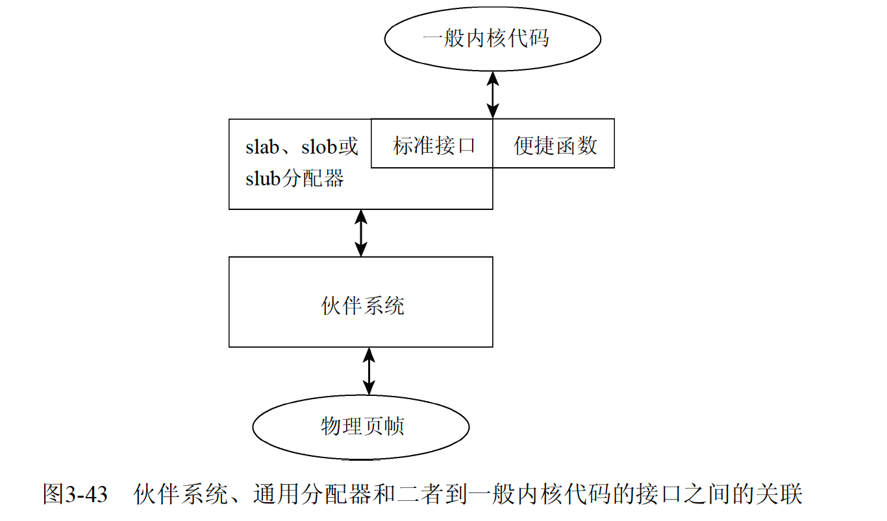

# 概述
在虚拟内存中，底部较大部分用于用户，顶部较小部分用于内核，由于虚拟内存必然大于物理内存，所以要通过内存映射扩大物理内存

# UMA NUMA


早期cpu-内存结构如图，cpu通过北桥总线访问内存，总线模型总是保证所有内存访问是一致的

但随着cpu核心数增加、内存条变多，对总线的吞吐量和一致性提出更高的挑战，为了解决这些问题提出了NUMA架构



将cpu和内存分配为node，node内通过IMC访问，跨node使用QPI，QPI的延迟显著高于IMC，有了远近之分

numactl --hardware  查看node划分

UMA也称为一致内存访问，NUMA称为非一致内存访问

## 内存域
内存又被分为多个内存域，进一步划分帮助内核更高效的管理和使用内存

- ZONE_DMA 直接内存访问的域，一般不会使用，如果用尽则和ISA设备交互会受影响
- ZONE_DMA32 使用32为地址可寻址的内存，只存在64位系统中，最多4g
- ZONE_NORMAL 可直接映射到内核段的普通内存域
- ZONE_HIGHMEM
- ZONE_MOVABLE 


# 物理内存结构表示
## node 节点
```
typedef struct pglist_data {
    // 包含各个内存域的数组
	struct zone node_zones[MAX_NR_ZONES];

    // 备用node及zone的列表
	struct zonelist node_zonelists[MAX_ZONELISTS];

	int nr_zones; // zone数量
	
    struct page *node_mem_map; // node中所有zone的页
	
    struct bootmem_data *bdata; // 初始化时自举内存初始器
	unsigned long node_start_pfn; // 第一个页帧的逻辑编号
	unsigned long node_present_pages; /* total number of physical pages */
	unsigned long node_spanned_pages; /* total size of physical page
					     range, including holes */
	
    int node_id; // 全局nodeid
	wait_queue_head_t kswapd_wait; 
	struct task_struct *kswapd; //出现压力时回收内存的进程
	int kswapd_max_order;
} pg_data_t;
```

## zone 域
node中分为不同的域，通常只关注normal域即可
```
struct zone {
	/* Fields commonly accessed by the page allocator 内存压力点 */ 
	unsigned long		pages_min, pages_low, pages_high;
	// 一些无论如何不能失败的关键性内存分配
	unsigned long		lowmem_reserve[MAX_NR_ZONES];

	// 记录在cpu高速缓存中的内存
	struct per_cpu_pageset	pageset[NR_CPUS];
	
	// 实现伙伴系统
	struct free_area	free_area[MAX_ORDER];

	// 记录活跃内存及锁
	spinlock_t		lru_lock;	
	struct list_head	active_list; //活跃页
} ____cacheline_internodealigned_in_smp;
```

## page 页帧
域中被划分为页帧，是内存的最小管理单位，用page结构标示了各种属性

```
#define MAX_ORDER 11

struct page {
	unsigned long flags;		// 标示当前页的状态属性
	atomic_t _count;		    // 被引用的次数，如果为0代表可以删了
	struct kmem_cache *slab;	/* SLUB: Pointer to slab */
	struct page *first_page;	/* Compound tail pages */
	struct address_space *mapping; //映射物理内存地址
	struct list_head lru; // 页表
	void *virtual;		  // 用于高端内存的页	
};
```

可以把物理内存看作 array[pageisze] 数组，页代表元素下标，pagesize就是页大小


# 伙伴系统
在zone中有一个 free_area数组，代表了伙伴系统的分配

```
struct zone {
	// 实现伙伴系统
	struct free_area	free_area[MAX_ORDER];
};

struct free_area {
	struct list_head	free_list[MIGRATE_TYPES]; //连续空闲页的链表
	unsigned long		nr_free; //空闲页的数目
};
```

free_area数组中以下标代表阶，free_area[1] 代表是有 2^1 个连续页帧的内存，最大是 free_area[10] 2^10个连续页帧内存，在/proc/buddyinfo中可以看到阶分配情况




- 申请内存时，如果申请阶不够用，将高阶分为两个低阶使用
- 释放内存时，如果有两个相同阶层的相邻内存，则合并为高阶



## 避免碎片
可以把内存分为几类

1. 不可移动，具有固定位置不能移动到其他位置，内核代码就是此类型
2. 可回收，不能直接移动，可删除，从源重建，kswapd就根据可回收页访问频率周期性释放该内存
3. 可移动，用户态使用的内存可以通过修改页表移动物理内存

free_area结构中的list_head数组分别记录了这几种内存，通过对不同内存类型的分配策略减少碎片空间

## 分配器api
伙伴系统中一定是按阶分配，通过slab实现更精细化的分配

- alloc_pages_node 所有内存分配函数的底层调用
- __free_pages 内存释放函数的底层调用

# slab分配器
伙伴系统分配的单位太大，slab实现小单位的内存分配且建立缓存

用户alloc申请内存时都是调用slab，slab会向伙伴系统申请大的内存池，由slab在池子中管理程序内存分配，有以下好处

- buddy分配和释放较重，减少对其调用提高性能
- 在一个buddy阶中管理内存，提升cpu cache利用



