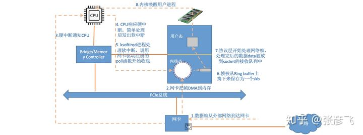
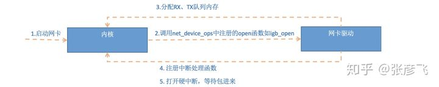
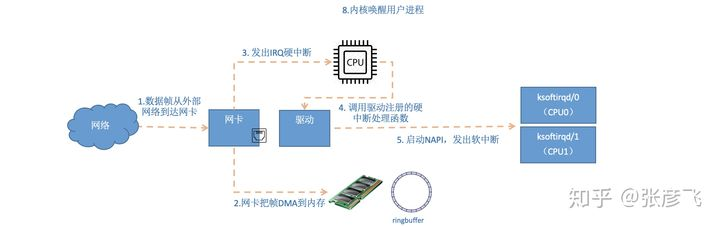

# NIC处理包整体流程
1. NIC收包，通过DMA写入内存缓冲区
2. DMA写入完成后发起硬中断
3. CPU简单处理后发起软中断，负载给 ksoftirqd/n 处理
4. ksoftirqd调用中断函数，使用网络栈处理
5. 网络帧被处理为data并放入socket队列
6. 内核唤醒用户进程处理

## 读取数据到内存

当ksoftirqd处理速度跟不上NIC接受速度时，NIC会堆积数据，超出缓存区RingBuffer则会丢弃，这部分丢包为 rx_fifo_errors，在 /proc/net/dev 中体现为 fifo 字段增长，在 ifconfig 中体现为 overruns 指标增长
