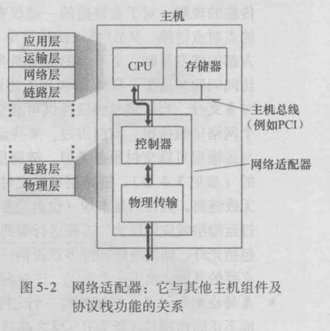

ip提供了动态接入的地址，路由规划了发送的路线，就像去旅游，无论是从出发地到哪个地方，我们都需要一种交通方式，这个交通方式就是接入到各个路由器之间的物理链路。

由于存在太多种链路，有线局域网、卫星网、无线网等等，所以要制定统一的服务接口，并要求每种链路必须提供一些服务

# 链路层服务
链路层的基本功能都是将数据报从一个节点移动到下一个节点，尽管提供服务的细节不同，但是都具有以下特点

- 成帧：每个网络数据报在链路传送之前，都需要用链路层帧封装起来
- 链路接入：及无论何时链路空闲，发送方都能发送帧
- 可靠交付：一些链路层使用确认和重传的机制提供可靠交付，有些链路层觉得应该让上层协议实现该功能，并不提供。如果链路层都提供可靠交付，那么丢包现象主要出现在路由器中，通过改善路由器就可以极大减少丢包，从而改善TCP协议提升性能。QUIC就是默认丢包情况较少而定制的协议
- 差错检验：避免各种物理现象影响到01，提供差错检验和恢复
- 多路访问链路和协议：考虑一下，双方或多方同用一个宽带通讯时，谁先发谁接受，即谁占用宽带，总需要接入和离开协议

由网卡物理传输硬件接收到所有的电子信号，再由适配器解析出链路帧，从而拆帧，所以网卡也是软硬件的结合体，也可以用其他软件模拟链路层功能，在cpu上计算链路帧

# 链路寻址和ARP
除了IP地址外，主机和路由器还有链路层地址，实际上

## MAC
- MAC地址 == LAN地址 == 物理地址，通常称呼MAC地址

- 网卡的适配器具有MAC地址，该地址是网卡被生产出来时就固定的，他是一个唯一的48位地址。一个主机可以有多个网卡或一个网卡具有多个适配器，及多个MAC地址，还可以用软件模拟出虚拟网卡和MAC地址，甚至修改网卡适配器的MAC地址

- 一个路由器可能连接到多个子网，所以每个端口都有自己的IP地址和MAC地址。但交换机不具有MAC地址，他只承接交换数据帧任务，不需要被寻址

- 为什么有了IP地址还需要MAC地址呢？

    - 从本质上来说，他们属于两个层面，承接的任务也不相同，MAC地址标识唯一且标识主机，一般主机上MAC地址是固定的(一班人都不会换网卡或修改MAC)，MAC属于硬件地址
    - IP是接入网络时动态分配的地址，经常动态变化，其目的是为了网络中定位寻址

当适配器要发送一个物理帧时，需要将源MAC地址和目的MAC地址插入帧中。IP报文插入源和目的地址，然后经过路由器动态规划路线，而没有设备能给MAC规划路线，所以目的MAC地址只能是最近的可连接的节点，后面我们会讲解ARP解析MAC地址

主机接收到帧后，会查看MAC地址和自己网卡MAC是否相同，不同则丢弃。如果是广播地址FFFFFFFFFFFF则接收

## ARP
当初制定MAC地址是从物理链路层考虑，并没有对上层做太多设计，这样提供了更大的灵活性。

在网络层中通讯直接能看到的地址是IP，而物理链路通讯需要MAC地址，就需要IP和MAC之间的转换，及ARP协议

### 局域网下

如果222.222.222.220想向222.222.222.222发送IP数据报，且他们在同一子网或内网下

1. 每台主机或路由器内存中都存在一个ARP表，这张表包括IP到MAC的映射，同时具有一个TTL映射被删除的时限，通常是20分钟。这个映射表是自动建立的，断电就自动消亡了

2. 当查表找不到后，就要封装一个ARP报文，包括源MAC地址和查询IP地址，并广播给局域网下所有主机，每个主机收到ARP都会拆包到IP层，如果符合，就回复一个包含自己MAC地址的ARP报文，原主机更新映射表

3. 有了MAC地址就可以封装物理帧通讯了

### 子网以外

路由器具有多个IP端口同时，每个端口都具有适配器、MAC地址和APR模块

如果111.111.111.111想要给222.222.222.222发送数据，那么怎么获取它的MAC地址呢

1. 主机发现目的IP和自己的IP不在同一个网络地址下，就只能APR查询路由器地址，封装成物理帧交给路由器处理

2. 路由器拆解帧，再拆解IP报文，知道了目标IP地址，规划转发路线，并ARP获取转发目的端口MAC地址，一步步走下去到达目的地址

# 以太网

- 互联网、广域网、局域网都是按区域和范围划分，而以太网，ATM网是功能划分，是网络物理链路层的具体技术实现

- 以太网只是链路层传输标准，具体真正传输的还要借助于物理层，就是光纤、5G等

- 目前以太网很普及，基本用网线接入的都是用的以太网，它也在不断的升级

## 报文结构

- 数据字段：46~1500字节，这个字段承接了IP数据报，最大传输单元MTU是1500，最小是46，如果IP数据小于46，则会被填充到46字节
- 目的地址和源地址：目的地址我能理解，源地址有什么作用？
- 类型字段：用于承接上层协议，就像IP报文的类型字段
- CRC：循环检测，用于检查帧中是否有差错
- 前同步码：有点复杂

所有以太网技术都向网络层提供提供无连接服务，即适配器A向适配器B发数据，就直接发送了

以太网技术提供不可靠服务，当适配器B收到帧，检验CRC，无论是否通过都不会发送确认报文，不通过会丢弃

# 物理设备

## 集线器
数据在传输过程中会损耗和衰弱，机线器是一个放大信号的设备，作用于01比特而不是帧，它运行在最底层

集线器无论在哪个端口接收到比特，都会向其他所有端口发送副本

现在已经被交换机替代了

## 交换机
