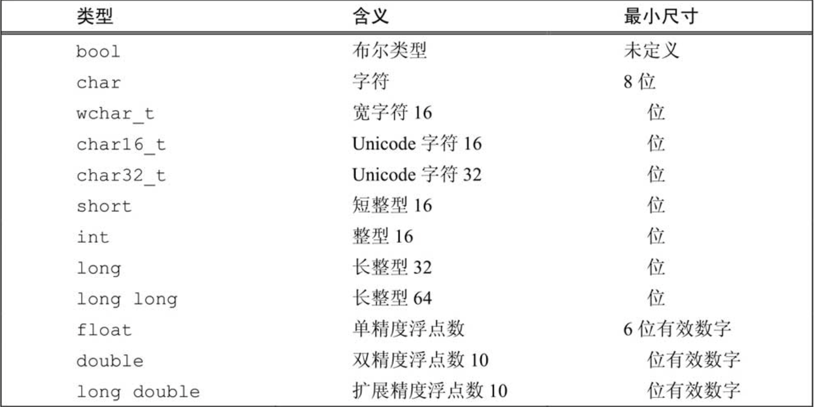

# 基础类型


- 数值类型可用 unsigned、signed 修饰，释放一个符号位
- unsigned char 可以存储 0-255 的值
- bool 可用 true、false 或 0 为false，非0为true

- 避免自动类型转换，例如 int + unsigned int 可能会出现想不到的结果，避免模糊不清的代码
- 未初始化的变量有一个不确定的值，应该总是声明且初始化变量

# 变量


## auto
自动推断变量类型

必须有初始化值或初始化表达式，编译器才能推断

## decltype
用表达式返回的类型作为变量的类型，但是不想用表达式初始化变量

```
decltype(f()) sum = x;

int i = 0;
decltype(i) j = i;
```

## 左值引用
```
int i = 666;
int &i_other = i; 
// i_other成了i的别名
// 声明引用时必须初始化，否则报错

i_other = 777;
// 修改i_other也修改了i
```

## 指针
同c指针用法

c++11引入了nulltpr，可以用作任何类型的指针初始化

## const
const基础用法同c，这里要说的是，const通常在编译阶段计算出值全局替换，所以只在文件内有效，使用extern const int i使全局有效

## 类型别名
typedef 

## struct
同c struct


# 复合类型
## string
```
#include <string>
using std::string;

string str1 = "nb1"; // 拷贝初始化
string str2("nb2");  // 直接初始化
``` 


# using
include从c继承而来，不适合做模块化，c++引入了using作为命名空间
