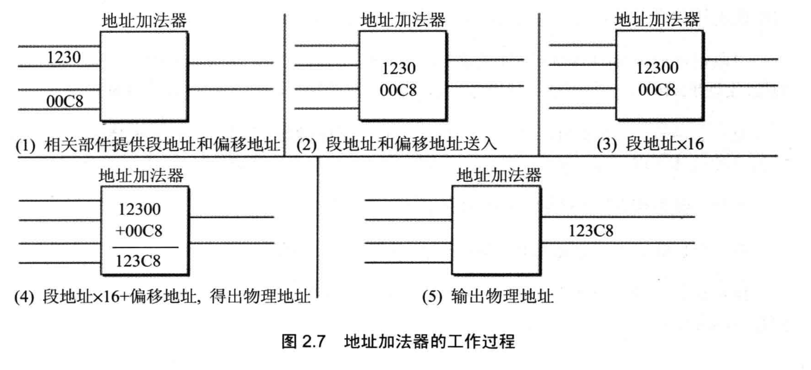

# CPU
x8086是Intel第一款向下兼容的指令集架构，AMD也兼容了x86系列

到64位后，Intel推出新的IA64，不兼容32位的x86架构了，但AMD搞了 x86_64 继续向下兼容，因为一些商业原因，最终 Intel 也只得兼容 x86_64

除了 AMD 和 Intel 使用的 x86 系列指令集，还有一个 ARM 指令集结构，主要由高通生产，用在手机、平板等性能一般功耗低低地方

# 汇编指令
汇编指令的类型

- 汇编指令：机器码的助记符
- 伪指令：机器码的抽象指令，由汇编器翻译成多条机器码
- 其他符号：如+-/*，由汇编器识别翻译，没有对应的机器码
- ；注释

指令一般由三部分组成，指令+地址+数据，由总线 地址线+数据线+控制线 对应访问存储设备，地址线数量决定最大可寻址范围，数据线数量决定每次最大传输数据大小

**为了控制计算机中不同的硬件，需要很多很多的总线，CPU将所有硬件的访问看作连续的内存访问，访问不同的区域以操作不同硬件，具体实现由总线和主板控制**

以8086为例

- 0x00000~0x9FFFF 常规内存地址
- 0xA0000~0xEFFFF 外围设备地址
    - 0xB8000~0xBFFFF 显卡地址
- 0xF0000~0xFFFFF BIOS地址

在汇编的眼里，一切都由CPU和内存组成

注意：最小可寻址单元是字节B

后面的内容都以8086CPU为例，x86结构是向下兼容的，所以这些都能在最新的x86 CPU中找到，只不过多了很多新的东西

CPU大概分为四部分，运算器，控制器，寄存器，内部总线

# 寄存器

8086所有寄存器都是16位的，AX、BX、CX、DX用来放一般性的数据，称为通用寄存器

最早的寄存器是8位的，为了向下兼容，16位寄存器也可以分作俩个8位寄存器使用

现在主流CPU寄存器是64位的，也要用同样的方式向下兼容8位、16位等

可以将寄存器看做CPU的直接数据单元，其他都是缓存，CPU做的事情可以简化为

- 将数据取到寄存器中
- 在寄存器中操作数据
- 将数据写出到外置存储中

寄存器有很多类型，存储指令、储存数据、表示状态等

X位的CPU
- 运算器一次最多可处理X位的数据
- 一个寄存器最大可存储X位的数据
- 寄存器和CPU间数据通路为X位

## 通用寄存器：
AX，BX，CX，DX 称作为数据寄存器，可分为AL,AH使用，以DS作为段前缀：

- AX (Accumulator)：累加寄存器，一般用于中转，不可用于[]寻址；
- BX (Base)：基地址寄存器,用于[]内存寻址
- CX (Count)：计数器寄存器，一般用于loop计数
- DX (Data)：数据寄存器，可用于[]寻址；

SP 和 BP 又称作为指针寄存器，一般用于栈操作：

- SP (Stack Pointer)：堆栈指针寄存器；
- BP (Base Pointer)：基指针寄存器，可用于[]内存寻址，默认段前缀SS；

SI 和 DI 又称作为变址寄存器，可只用[]用于内存寻址，或相加寻址：

- SI (Source Index)：源变址寄存器；
- DI (Destination Index)：目的变址寄存器；

控制寄存器：

- IP (Instruction Pointer)：指令指针寄存器，以CS作为段前缀；
- FLAG：标志寄存器；

段寄存器：
- 不能直接被内存赋值，需要寄存器中转
- 不能用于[]内存寻址，只能作为段前缀

- CS (Code Segment)：代码段寄存器；
- DS (Data Segment)：数据段寄存器；
- SS (Stack Segment)：堆栈段寄存器；
- ES (Extra Segment)：附加段寄存器；

## 指令
8086地址总线20位，CPU通过段合成方式组成20位地址，可访问1M内存

8086中有四个段偏移地址寄存器，CS用来存放指令段地址

- 从CS:IP指向的地址读取指令
- 将IP地址+指令长度
- 执行指令，继续使用CS:IP读取指令

在8086加电启动后，CS=FFFFH,IP=0000H，即第一个指令从FFFF0H中读取执行

将 段地址左移4位+指针地址 就得到了合成地址，指针寄存器是16位，所以每个段空间最大值为64k，但是可能会修改其他段空间，最小段空间是16b，是绝对安全的空间

地址寄存器的值可以用 jmp 指令改变，将某个寄存器的值放入的CS中

# 引导程序
CPU有一个引脚，每当加电启动，就将CS寄存器重置为 0xFFFFH ，其他寄存器重置为 0

0xF0000H~0xFFFFFH 是 BIOS 地址，BIOS 对计算机其他硬件做检测，如果出错就不会启动

检测硬件后，注册一些基本数据和中断处理，如果用户无操作，就跳转到 0x0000:0x7c00 即磁盘引导扇区MBR处执行

# 显卡
- 分辨率：代表一定面积下渲染像素点的个数，面积固定，分辨率越高，画面越清晰
- 帧率：视频是由快速翻动的图片组成，人眼能反应的是 30FPS(秒帧数)，一般情况下，FPS 越高，画面越流畅
- 码率：代表解码的速度，在线视频中可以看作传输数据信息的速度

显卡用于接受数据，并将数据计算转换为电子信号，交与显示屏渲染，GPU功能相较CPU略单一，一般计算性能更强

CPU想要控制显卡，需将要显示的内容预先写入显存，最简单的方式就是每个位对应一个像素点，无论如何CPU只需要把它看作内存即可

