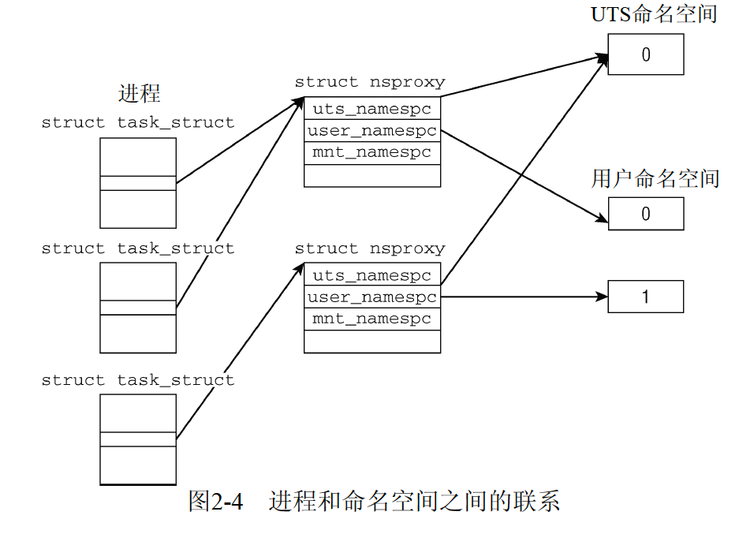
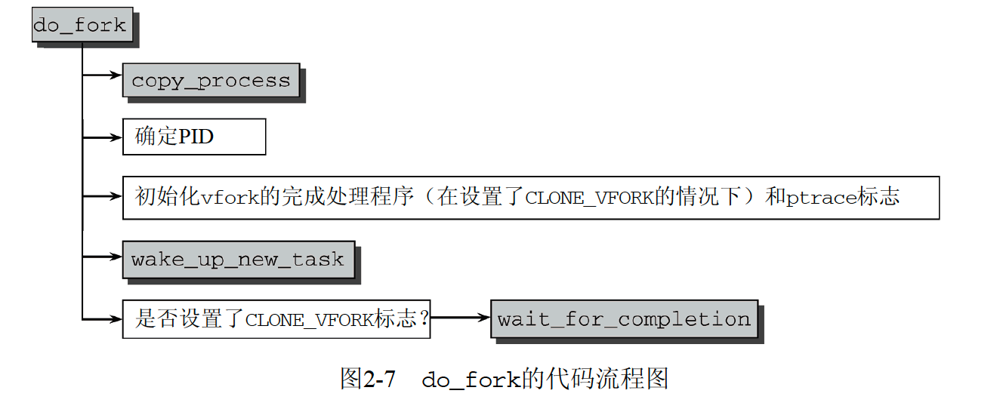
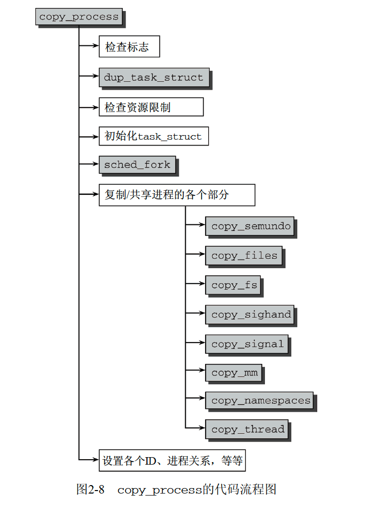

# 结构表示
```
struct task_struct {
    //状态
	volatile long state;	/* -1 unrunnable, 0 runnable, >0 stopped */
	// 程序栈，大小可通过 ulimit -s 查看
	void *stack;       
	atomic_t usage;
	unsigned int flags;	/* per process flags, defined below */

	int lock_depth;		/* BKL lock depth */

	//调度的优先级，static是初始时优先级，可以通过nice修改
	//normal优先级基于prio和static计算出，会被子进程继承
	int prio, static_prio, normal_prio; 
	struct list_head run_list;
	const struct sched_class *sched_class; // 使用的调度类
	struct sched_entity se;

	//调度策略
	unsigned int policy; 
	cpumask_t cpus_allowed;
	unsigned int time_slice;

	struct sched_info sched_info;

	// ptrace跟踪
	struct list_head ptrace_children;
	struct list_head ptrace_list;

	// 内存记录
	struct mm_struct *mm, *active_mm;

	// task信息，退出后给父进程用
	struct linux_binfmt *binfmt;
	int exit_state;
	int exit_code, exit_signal;
	int pdeath_signal;  /*  The signal sent when the parent dies  */
	unsigned int personality;
	unsigned did_exec:1;
	
    // 进程id
	pid_t pid;
	// 线程id，如果没有其他线程则pid==tgid
	pid_t tgid;

	// 进程组
	struct task_struct *real_parent; /* real parent process (when being debugged) */
	struct task_struct *parent;	/* parent process */
	struct list_head children;	/* list of my children */
	struct list_head sibling;	/* linkage in my parent's children list */
    // 主线程
	struct task_struct *group_leader;	/* threadgroup leader */

	/* PID/PID hash table linkage. */
	struct pid_link pids[PIDTYPE_MAX];
	struct list_head thread_group;

	struct completion *vfork_done;		/* for vfork() */
	int __user *set_child_tid;		/* CLONE_CHILD_SETTID */
	int __user *clear_child_tid;		/* CLONE_CHILD_CLEARTID */

	// 调度相关信息
	unsigned int rt_priority;
	cputime_t utime, stime, utimescaled, stimescaled;
	cputime_t gtime;
	cputime_t prev_utime, prev_stime;
	unsigned long nvcsw, nivcsw; /* context switch counts */
	struct timespec start_time; 		/* monotonic time */
	struct timespec real_start_time;	/* boot based time */
/* mm fault and swap info: this can arguably be seen as either mm-specific or thread-specific */
	unsigned long min_flt, maj_flt;

  	cputime_t it_prof_expires, it_virt_expires;
	unsigned long long it_sched_expires;
	struct list_head cpu_timers[3];

	// 进程身份信息
	uid_t uid,euid,suid,fsuid;
	gid_t gid,egid,sgid,fsgid;
	struct group_info *group_info;
	kernel_cap_t   cap_effective, cap_inheritable, cap_permitted;
	unsigned keep_capabilities:1;
	struct user_struct *user;

/* CPU-specific state of this task */
	struct thread_struct thread;
/* filesystem information */
	struct fs_struct *fs;
/* open file information */
	struct files_struct *files;
/* namespaces */
	struct nsproxy *nsproxy;
/* signal handlers */
    // 保存了进程组id和sessionid
	struct signal_struct *signal;
	struct sighand_struct *sighand;

	sigset_t blocked, real_blocked;
	sigset_t saved_sigmask;		/* To be restored with TIF_RESTORE_SIGMASK */
	struct sigpending pending;

	unsigned long sas_ss_sp;
	size_t sas_ss_size;
	int (*notifier)(void *priv);
	void *notifier_data;
	sigset_t *notifier_mask;

	void *security;
	struct audit_context *audit_context;
	seccomp_t seccomp;

/* Thread group tracking */
   	u32 parent_exec_id;
   	u32 self_exec_id;
/* Protection of (de-)allocation: mm, files, fs, tty, keyrings */
	spinlock_t alloc_lock;

	/* Protection of the PI data structures: */
	spinlock_t pi_lock;

// 处理中断相关
#ifdef CONFIG_DEBUG_MUTEXES
	/* mutex deadlock detection */
	struct mutex_waiter *blocked_on;
#endif
#ifdef CONFIG_TRACE_IRQFLAGS
	unsigned int irq_events;
	int hardirqs_enabled;
	unsigned long hardirq_enable_ip;
	unsigned int hardirq_enable_event;
	unsigned long hardirq_disable_ip;
	unsigned int hardirq_disable_event;
	int softirqs_enabled;
	unsigned long softirq_disable_ip;
	unsigned int softirq_disable_event;
	unsigned long softirq_enable_ip;
	unsigned int softirq_enable_event;
	int hardirq_context;
	int softirq_context;
#endif
#ifdef CONFIG_LOCKDEP
# define MAX_LOCK_DEPTH 30UL
	u64 curr_chain_key;
	int lockdep_depth;
	struct held_lock held_locks[MAX_LOCK_DEPTH];
	unsigned int lockdep_recursion;
#endif

// 把进程错误日志输出system里
/* journalling filesystem info */
	void *journal_info;

// 块设备信息
/* stacked block device info */
	struct bio *bio_list, **bio_tail;

// 虚拟内存
/* VM state */
	struct reclaim_state *reclaim_state;

	struct backing_dev_info *backing_dev_info;

	struct io_context *io_context;

	unsigned long ptrace_message;

	...

	// 对进程相关的限制
	struct rlimit rlim[RLIM_NLIMITS];
	...
};
```

进程结构在 include/linux/sched.h中定义

- namespace信息
- 进程信息，如pid、父进程指针、子进程链表、运行状态、使用的二进制文件
- cpu运行时长，调度相关信息
- 进程间通讯有关信息、进程组、session组
- 栈信息、分配虚拟堆内存等相关信息
- 持有文件资源信息
- 身份凭据权限信息，如用户ID、组ID等
- 线程链表

## pid

## 运行状态 state
- #define TASK_RUNNING 0，可运行，不一定实际分配了cpu
- #define TASK_INTERRUPTIBLE 1，等待资源或sleep，内核向其发送信号后恢复RUNNING
- #define TASK_UNINTERRUPTIBLE 2，因内核指示而睡眠，只能由内核唤醒 
- #define TASK_STOPPED 4，特意定制运行
- #define TASK_TRACED 8，被调试
- #define EXIT_ZOMBIE 16
- #define EXIT_DEAD		32

## namespace



在fork时可为进程分配新的命名空间


## 进程限制
```
// 进程限制在 /etc/security/limits.conf 中配置
// cur即soft，max即hard
struct rlimit {
	unsigned long	rlim_cur;
	unsigned long	rlim_max;
};
```
可以在 /proc/[pid]/limits 中查看限制

修改limits.conf后，对已有的进程不生效，需要关闭session，重新登陆创建的ssh session进程生效，之后创建的进程都从session中继承limits

# 进程相关系统调用
## fork
fork会复制父进程完整副本，只修改特有属性和栈，不重置持有资源，为了避免大量复制开销后execve加载其他进程，linux使用了cow(copy on write)

子进程会复制父进程的页表，这些页都被标记只读操作，当某个进程试图写入，就会报缺页异常重新复制到新的内存

fork的系统调用是sys_fork，因为各个处理器传参方式而有不同，以IA32为例，会注册SIGCHLD作为子进程的退出信号

```
// regs 是传递的参数，regs.esp是父进程的栈地址
asmlinkage int sys_fork(struct pt_regs regs) {
	return do_fork(SIGCHLD, regs.esp, &regs, 0, NULL, NULL);
}
```

## clone
clone用于创建线程，和fork区别是新的task共享使用父进程的资源，不会使用COW

## do_fork
```
long do_fork(unsigned long clone_flags,
	      unsigned long stack_start,
	      struct pt_regs *regs,
	      unsigned long stack_size,
	      int __user *parent_tidptr,
	      int __user *child_tidptr)
```


1. 复制父进程到新的task_struct
2. 分配pid，如果在新的namespace中要做额外的处理
3. 将新进程标志为RUNNING



## 内核线程
内核线程是由kthreadadd创建的进程，注册内核函数并发执行，主要执行两类任务

1. 创建后一直等待，收到信号后执行某些动作
2. 周期性的执行某种动作

```
// 创建内核线程的函数
pid_t kernel_thread(int (*fn)(void *), void *arg, unsigned long flags)
{
	struct pt_regs regs;

	memset(&regs, 0, sizeof(regs));

	regs.ARM_r1 = (unsigned long)arg;
	regs.ARM_r2 = (unsigned long)fn;
	regs.ARM_r3 = (unsigned long)do_exit;
	regs.ARM_pc = (unsigned long)kernel_thread_helper;
	regs.ARM_cpsr = SVC_MODE;

	return do_fork(flags|CLONE_VM|CLONE_UNTRACED, 0, &regs, 0, NULL, NULL);
}
```
具有以下特点

1. 在内核态运行，只可以访问虚拟地址的内核部分，不能访问用户空间


# 调度
所有的RUNNING进程在红黑树中组织，以等待CPU时间长度从左到右排序

## 调度相关的属性
task_struct和调度相关的属性

```
	// 调度的优先级，static是初始时优先级，可以通过nice修改
	// normal优先级基于prio和static计算出，会被子进程继承
	int prio, static_prio, normal_prio; 
	struct list_head run_list;
	const struct sched_class *sched_class; // 使用的调度类
	struct sched_entity se;

	unsigned int policy; // 调度策略
	cpumask_t cpus_allowed; // 限制进程可以在哪些进程上运行
	unsigned int time_slice; // 循环实时调度器使用的
```

除了维护进程的调度参数，还需要知道cpu每个核心的调度情况

就绪队列
```
struct rq {
	/* runqueue lock: */
	spinlock_t lock;
	
	unsigned long nr_running; // 队列上可运行进程的数目
	#define CPU_LOAD_IDX_MAX 5
	unsigned long cpu_load[CPU_LOAD_IDX_MAX]; //跟踪此前负载状态

	struct load_weight load; 
	unsigned long nr_load_updates;
	u64 nr_switches;

	struct cfs_rq cfs;
	struct rt_rq rt;

	unsigned long nr_uninterruptible;

	struct task_struct *curr, *idle; // 指向当前运行的进程和idle进程
	unsigned long next_balance;
	struct mm_struct *prev_mm;
};

```

## 优先级
如果处理普通进程，不涉及实时调度，三个优先级的值都是static_prio

## 周期调度
系统会定时触发中断调用该函数，更新调度队列

```
void scheduler_tick(void)
{
	int cpu = smp_processor_id();
	struct rq *rq = cpu_rq(cpu);
	struct task_struct *curr = rq->curr;
	u64 next_tick = rq->tick_timestamp + TICK_NSEC;

	spin_lock(&rq->lock);
	__update_rq_clock(rq);
	/*
	 * Let rq->clock advance by at least TICK_NSEC:
	 */
	if (unlikely(rq->clock < next_tick))
		rq->clock = next_tick;
	rq->tick_timestamp = rq->clock;
	update_cpu_load(rq);
	if (curr != rq->idle) /* FIXME: needed? */
		curr->sched_class->task_tick(rq, curr);
	spin_unlock(&rq->lock);

#ifdef CONFIG_SMP
	rq->idle_at_tick = idle_cpu(cpu);
	trigger_load_balance(rq, cpu);
#endif
}
```

## 核心调度器
调度信息都有了，定时的调度或进程主动放弃cpu或阻塞时，使用 schedule 函数执行调度

## 上下文切换

1. syscall是函数级切换，保存当前cpu寄存器，系统函数执行完后再恢复
2. 硬件中断，cpu保存当前寄存器并调用内核函数，接受硬件的参数，并处理，也是函数级切换
3. 进程切换时，cpu需要从内存中找到进程信息，从而恢复寄存器信息，接着执行ip指向的下一条命令，广义的切换还包括虚拟内存的映射

## 主动放弃cpu或阻塞
