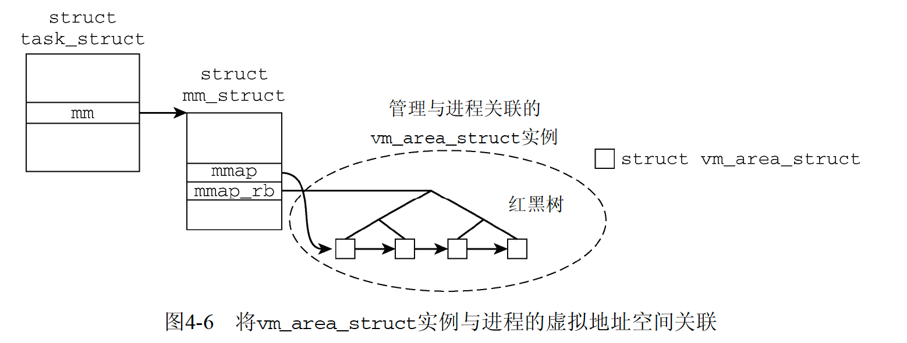

# 内存布局
```
struct mm_struct {
	unsigned long (*get_unmapped_area) (struct file *filp,
				unsigned long addr, unsigned long len,
				unsigned long pgoff, unsigned long flags);
	unsigned long mmap_base;		/* base of mmap area */
	unsigned long task_size;		/* size of task vm space */

    ...

	unsigned long total_vm, locked_vm, shared_vm, exec_vm;
	unsigned long stack_vm, reserved_vm, def_flags, nr_ptes;
	unsigned long start_code, end_code, start_data, end_data; //代码和静态变量开始和结束区域
	unsigned long start_brk, brk, start_stack; //堆、栈地址
	unsigned long arg_start, arg_end, env_start, env_end; //参数列表和环境变量地址
};
```

进程的虚拟内存开始于0，延伸到TASK_SIZE-1，其上是内核空间

# 内存映射
虚拟内存太大，不会全部映射物理内存，如text段，按需加载

- 进程访问用户地址空间的一个地址，使用页表无法确定物理地址，触发缺页中断
- 内核检查缺页进程地址空间数据结构，找到存储器对应位置，或者判定访问异常
- 分配物理内存页，用存储器数据填充
- 通过页表将页帧和虚拟页关联，应用程序恢复执行

## 区域表示
```
struct mm_struct {
	struct vm_area_struct * mmap;		/* 虚拟内存列表 */
	struct rb_root mm_rb;
	struct vm_area_struct * mmap_cache;	/* last find_vma result */
};
```



