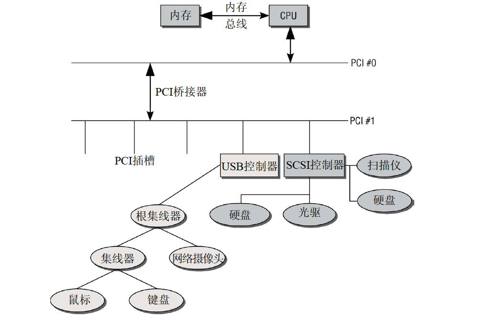
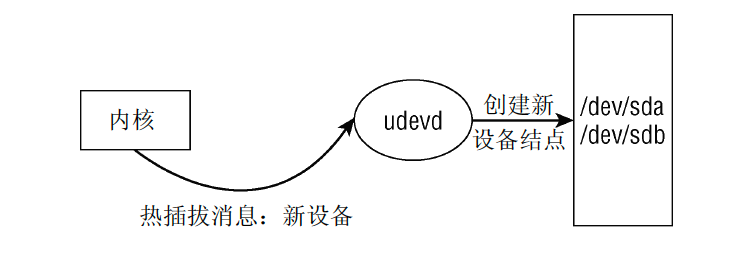
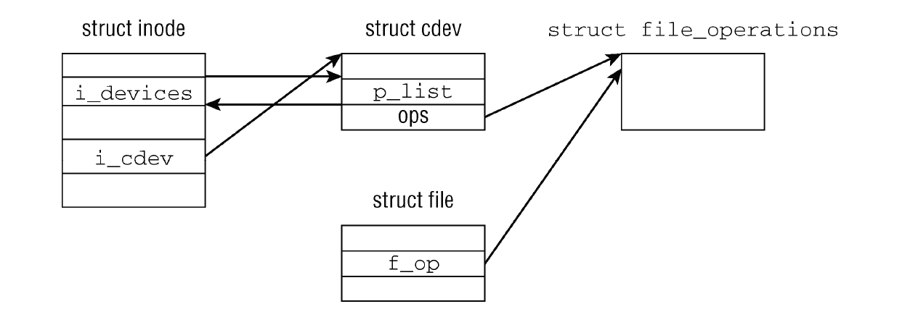
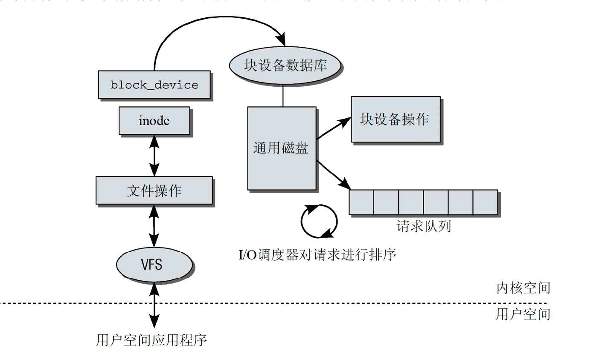

# 硬件结构
```
cpu <- 内存总线 -> 内存

cpu <- 设备总线 -> 其他IO设备
```

通常使用PCI或SCSI总线，设备也并不一定直接接入总线，因为接口的差异可能需要其他中间层



# 设备管理
```
// 字符设备用 
struct cdev {
	struct kobject kobj; // 对象
	struct module *owner; //所属模块
	const struct file_operations *ops; // 要实现的vfs接口
	struct list_head list;
	dev_t dev; // 设备号
	unsigned int count;
};

```

## 设备注册

1. 扫描到设备，申请唯一设备号
```
// b为块设备，c是字符设备
// disk代笔磁盘类型设备
// 252 是主设备号，0 是次设备号，主次确定唯一的驱动
// 一般磁盘挂载以 sd[a-z]，虚拟盘 vd[a-z]
brw-rw---- 1 root disk 252,  0 1月  16 18:57 /dev/vda
brw-rw---- 1 root disk 252,  1 1月  16 18:57 /dev/vda1
brw-rw---- 1 root disk 252, 16 1月  16 18:57 /dev/vdb
brw-rw---- 1 root disk 252, 17 1月  16 18:57 /dev/vdb1
```

2. 创建设备结构体，关联操作实现函数，将设备注册到hashmap中，便于设备的管理

3. 为设备创建inode，实现对应vfs函数，将inode关联到 /dev 下，实现设备文件化操作

对于字符设备只有一个操作可用，即使用设备自定义的操作
```
const struct file_operations def_chr_fops = {
	.open = chrdev_open,
};
```

块设备有众多操作可用
```
const struct file_operations def_blk_fops = {
	.open		= blkdev_open,
	.release	= blkdev_close,
	.llseek		= block_llseek,
	.read		= do_sync_read,
	.write		= do_sync_write,
  	.aio_read	= generic_file_aio_read,
  	.aio_write	= generic_file_aio_write_nolock,
	.mmap		= generic_file_mmap,
	.fsync		= block_fsync,
	.unlocked_ioctl	= block_ioctl,
#ifdef CONFIG_COMPAT
	.compat_ioctl	= compat_blkdev_ioctl,
#endif
	.splice_read	= generic_file_splice_read,
	.splice_write	= generic_file_splice_write,
};
```

除了挂载硬件设备，系统也通过创建inode的方式挂载了些虚拟设备，并为其实现了vfs函数


## 动态管理设备
linux允许热拔插设备，当内核扫描总线发现新设备，会给 udevd 进程发信号，创建新的结点挂载到 /dev 下



除此外 udevd 还有很多其他功能


# 设备交互
内核扫描并创建注册设备后，为其创建了inode，就可以通过vfs操作设备



## 字符设备
字符设备通常是鼠标、键盘等，读写操作严重依赖于设备驱动的实现，且文件系统意义不大

## 块设备
块设备通常较为完整的实现了vfs接口，且严重依赖文件系统，如缓存机制等，整体操作流程如下



```
// 块设备
struct block_device {
	dev_t			bd_dev; // 设备号
	struct inode *		bd_inode; // 设备的inode
	int			bd_openers; //用do_open打开的次数
	struct mutex		bd_mutex;	/* open/close mutex */
	struct semaphore	bd_mount_sem; 
	struct list_head	bd_inodes; //表示该块设备的设备特殊文件的所有inode
	void *			bd_holder; 
	int			bd_holders;
	struct list_head	bd_holder_list;
	struct block_device *	bd_contains;
	unsigned		bd_block_size; 
	struct hd_struct *	bd_part; //设备所有分区
	int			bd_invalidated;
	struct gendisk *	bd_disk; // 另一个抽象层，划分硬盘
	struct list_head	bd_list; // 记录所有可用的block_device
};

// 块磁盘
struct gendisk {
	int major;			/* major number of driver */
	int first_minor;
	int minors;                     /* maximum number of minors, =1 for
                                         * disks that can't be partitioned. */
	char disk_name[32];		/* name of major driver */
	struct hd_struct **part;	/* [indexed by minor] 磁盘分区*/
	int part_uevent_suppress;
	struct block_device_operations *fops; // 指向特定设备，执行底层任务的各个函数
	struct request_queue *queue; // 管理请求队列
	void *private_data; // 指向私有的程序指针数据
	sector_t capacity; // 制定了容量，单位是扇区

	int flags;
	struct device *driverfs_dev; //该磁盘所属的硬件设备
	struct kobject kobj;
	...
	struct work_struct async_notify;
};

// 分区
struct hd_struct {
	sector_t start_sect; // 起始扇区
	sector_t nr_sects; // 长度
	struct kobject kobj;
	...
};
```


## 裸块设备
裸设备是一种特殊的块设备文件，直接对磁盘操作不经过文件系统

```
struct bdev_inode {
	struct block_device bdev;
	struct inode vfs_inode;
};
```

