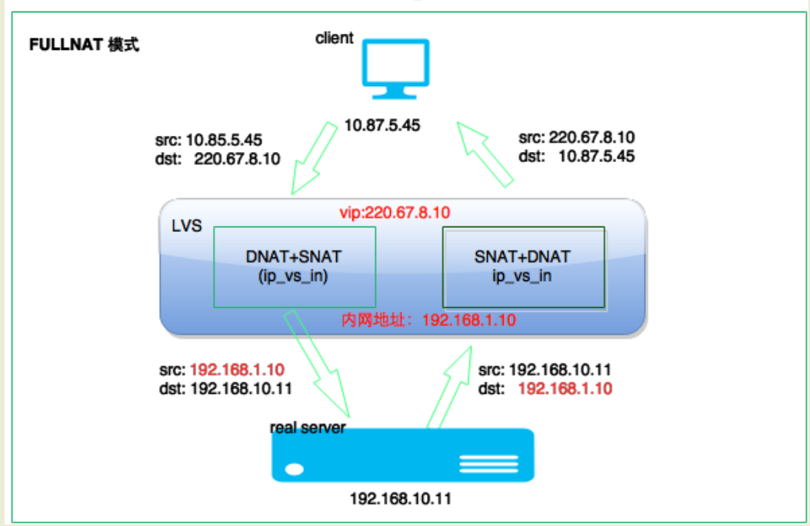

- 静态NAT，内网ip和公网ip一对一的关系
- 动态NAT，内网ip从公网ip池中动态选择一个映射
- NAPT，network address and port translation，内网ip映射到公网ip不同端口上，使得多个内网ip公用一个公网ip

# NAPT
NAPT根据转发方式的不同又分为三类
- SNAT，转化source ip或端口为nat的公网ip或端口，转发给内网机器
- DNAT，转发dst ip或端口为其他ip或端口
- SNAT和DNAT同时使用

## fullnat

