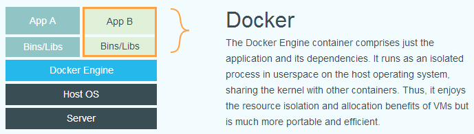
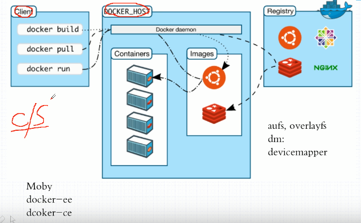
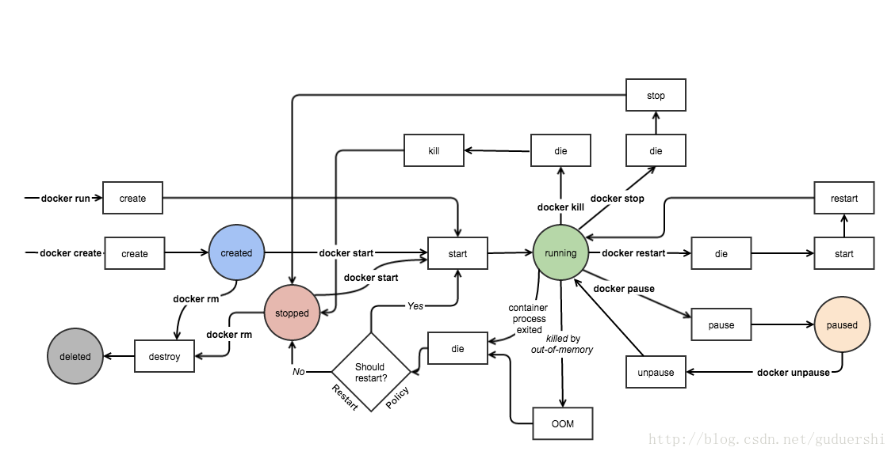

# 简介
Docker使用Go开发，基于 Linux 内核的 cgroup，namespace，以及 AUFS 类的 Union FS 等技术，对单进程做封装隔离，属于 **操作系统层面** 的虚拟化技术。由于**隔离的进程独立于宿主和其它的隔离的进程**，因此也称其为容器。最初实现是基于 LXC，从 0.7 版本以后开始去除 LXC，转而使用自行开发的 libcontainer，从 1.11 开始，则进一步演进为使用 runC 和 containerd。

- lxc是linux的一种虚拟化技术，主要利用了cgroup和namespace

Docker 在容器的基础上，进行了进一步的封装，从文件系统、网络互联到进程隔离等等，极大的简化了容器的创建和维护。使得 Docker 技术比虚拟机技术更为轻巧，易管理

与虚拟技术相比，docker没有模拟os层，直接和系统交互，拥有更好的性能，但隔离性不如vm

## OCI
随着容器概念的火爆，OCI组织开始制定容器标准。主要分为两大标准，runtime spec容器运行时标准、image spec容器镜像标准，两者通过OCI runtime filesytem bundle 的标准格式连接在一起，OCI 镜像可以通过工具转换成 bundle，然后 OCI 容器引擎能够识别这个 bundle 来运行容器。

- runc 是 docker 捐赠给 OCI 的一个符合标准的 runtime 实现，目前 docker 引擎内部也是基于 runc 构建的

# 镜像
镜像将项目所需依赖打包，可以在任何有docker的平台上运行，使环境移植更便利

## 分层存储
镜像采用linux联合挂载系统union FS，由多层文件共同组成

1. 所谓环境或者说可以执行程序本质都是文件，镜像提供基础运行环境，即打包好常用可执行文件的文件夹。
2. dockerfile构建镜像时，每个指令在之前的unionFS基础上创建新的文件夹，即前一层是后一层的基础。
3. 每层构建完就不会再发生改变，后层上的任何改变只发生在自己这层。比如,删除前一层文件的操作,实际不是真的删除前一层的文件,而是仅在当前层标记为该文件已删除。在最终容器运行的时候,虽然不看到这个文件,但是实际上该文件会一直跟随镜像。
4. 因此,在构建镜像的时候,每层应该包含该层需要添加的东西,任何额外的东西应该在该层构建结束前清理掉。
5. 分层的好处是不同镜像可以公用相同层，类似动态链接库

# 容器
镜像和容器的关系就像类和实例，就像程序代码和将程序运行后的进程，容器可以被创建、启动、停止、删除、暂停等。

## namespace、cgroup
容器即进程，但与直接在宿主执行的进程不同，容器进程运行于属于自己的独立的命名空间，linux的namespace将进程的大多数资源和宿主机隔离开，但并不彻底，而cgroup的限制也会带来其他问题

- 如果你的容器中的程序使用 settimeofday(2) 系统调用修改了时间，整个宿主机的时间都会被随之修改，根本原因在于容器使用了宿主机的内核，内核参数改变则会影响宿主机上所有容器
- 如果没有额外配置，容器启动时网络配置如 /etc/resolve.conf、/ect/hostname 等文件默认会从宿主机复制至容器内覆盖原有文件
- 由于容器内的操作可能会更改宿主机，从而影响宿主机上其他容器，目前提供有Seccomp等技术对容器内发出的操作过滤，不仅造成性能损耗，还可能过滤不干净，如果直接将容器暴露在公网上很容易遭受攻击
- 使用cgroup限制容器后，/proc文件并不知道cgroup的限制，使用如top的命令还会读取宿主机的硬件数据

容器很适合用于隔离进程和限制资源，但容器内建议跑底层调用很多操作系统接口的程序，更适用于类似web开发的高层应用程序

## aufs
容器启动后肯定不能用宿主机文件系统，而是选用干净目录使用chroot挂载为 / 目录，然后再创建文件夹，复制宿主机文件，创建了rootfs

如果每次创建容器都这样做就太消耗性能，使用aufs文件联合，基于一个基础目录不断整合

容器存储层的生存周期和容器一样,容器消亡时,容器存储层也随之消亡。因此,任何保存于容器存储层的信息都会随容器删除而丢失。

按照 Docker 最佳实践的要求,容器不应该向其存储层内写入任何数据,容器存储层要保持无状态化。所有的文件写入操作,都应该使用 数据卷(Volume)、或者绑定宿主目录,在这些位置的读写会跳过容器存储层,直接对宿主(或网络存储)发生读写,其性能和稳定性更高。数据卷的生存周期独立于容器,容器消亡,数据卷不会消亡。因此,使用数据卷后,容器删除或者重新运行之后,数据却不会丢失。

## Docker Registry 仓库
docker镜像仓库类似于github，我们可以向上面拉取或推送镜像，一般在开发环境推送镜像，生产环境拉取镜像

最常使用的 Registry 公开服务是官方的 Docker Hub，这也是默认的 Registry，并拥有大量的高质量的官方镜像，但是国内没法访问，可以使用阿里云的加速镜像

# 存储和网络
应用程序的三大核心要素即，计算、存储、网络，容器模型就是计算能力

docker提供了volume和network，使三要素解耦，使得大规模容器调度变为可能

# 架构

整体来说，docker分为Client、daemon、Register三大部分，其中Register是远程仓库，默认使用DockerHub，除非有特殊私密要求搭建自己的私有仓库

client为操作命令行工具，docker daemon才是真正管理镜像运行容器的内核，两者使用socket通讯，支持ipv4、ipv6、unix socket三种方式，C/S架构风格使得我们可以远程调用服务器Docker

类似mysql，当我们运行 docker 命令只是启动 client，dockerd 用于启动docker daemon

# 安装
Docker 分为 CE 和 EE 两大版本。CE 即社区版（免费，支持周期 7 个月），EE 即企业版，强调安全，付费使用，支持周期 24 个月。

Docker CE 分为 stable, test, 和 nightly 三个更新频道。每六个月发布一个 stable 版本 (18.09, 19.03, 19.09...)。

