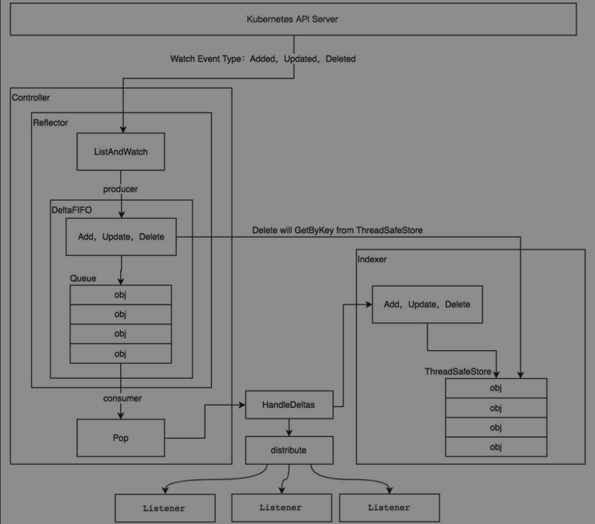

# 工具
## kubebuilder
用于快速生成crd模板

- 创建项目结构 kubebuilder init --domain k8sio.com --license apache2 --owner "dykanggege"
- 创建资源 kubebuilder create api --group kanggege --version v1 --kind KAPP

生成的项目结构

- api/v1/kind_type.go 资源结构
- controller/kind_controller.go 处理逻辑

## kustomize
用于自动生成crd的yaml文件

使用crd需要先编写crd yaml且apply，kustomize可自动生成crd yaml

## code-generator
资源定义中一些接口的实是固定的，用代码生成器自动创造

主要有四种代码的生成

- deepcopy-gen 生成深度拷贝方法,避免性能开销

- client-gen 为资源生成标准的操作方法(get,list,create,update,patch,delete,deleteCollection,watch)

- informer-gen 生成informer,提供事件机制来相应kubernetes的event，使用informer可以添加watch、获取indexer数据

- lister-gen 为get和list方法提供只读缓存层

用法
```
./vendor/k8s.io/code-generator/generate-groups.sh \
all \
github.com/dykanggege/kapp/pkg/client \
github.com/dykanggege/kapp/api v1 \

<generators>        the generators comma separated to run (deepcopy,defaulter,client,lister,informer) or "all".
<output-package>    the output package name (e.g. github.com/example/project/pkg/generated).
<apis-package>      the external types dir (e.g. github.com/example/api or github.com/example/project/pkg/apis).
<groups-versions>   the groups and their versions in the format "groupA:v1,v2 groupB:v1 groupC:v2", relative
                    to <api-package>.

```
要求项目的路径在GOPATH/src下


# crd

## layout
crd没有强制的要求，这里有些项目结构可以参考

- crd: 放置定义crd的 CustomResourceDefinition yaml 文件，非必须
- example: 资源的用法 yaml，非必须
- pkg
    - apis/group/version 资源定义
        - doc: 用来做gogen注释生成
        - types: 资源的定义
        - register: 资源注册
        - 
    - client: code-generator 自动生成的用于client使用的代码
        - clientset 用于k8s编程的client
        - informers 在controller中用于获取事件
        - lists     被informers使用，可以获取到indexer中缓存数据

    
- main.go

## CustomResourceDefinition
声明资源的配置，用于将crd安装到k8s

当你创建新的 CustomResourceDefinition 时，Kubernetes API 服务器会为你所指定的每一个版本生成一个 RESTful 的 资源路径

然后就可以用kubectl管理自己创建的crd了


## informer


crd和k8s集群关联的核心组件，包含 reflector、indexer、delta 三块

- reflector 监控所有事件，更新indexer数据，将事件放入delta队列中，交给 crd controller 处理
- reflector watch事件立即更新indexer，所以indexer代表期望状态，并非k8s集群中资源实际状态。crd中要处理的就是将期望转为实际
- 每隔一定时间同步k8s资源信息到indexer中，crd controller查询的都是indexer，缓存减轻apiserver压力

# 部署
1. 向k8s集群注册crd对应的CustomResourceDefinition资源
2. 启动controller程序
3. kubectl apply 访问
