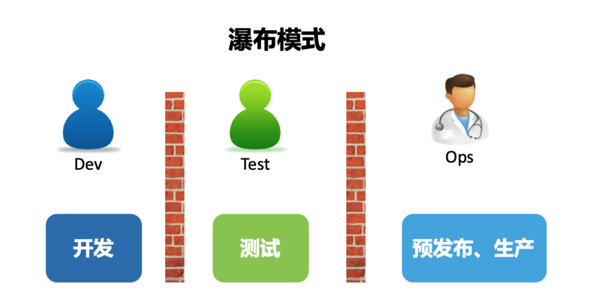

# 瀑布模型
将软件开发分为几个阶段，每个阶段有对应的职业和交付产物、验收标准，以重流程重管控，按计划推进项目的交付

随着用户需求变化加速，市场有确切的软件加速迭代需求，这种按部就班方式存在一些问题

1. 整个流程太长，规范严苛，所以项目开始就清晰的定义项目目标和实现方式，以大需求迭代
2. 多个职位间流程成本、沟通成本，甚至有沟通走流程的时间开发自己就把后面的事情做完了，在微服务架构下尤为明显
3. 现在产品的打法是最小迭代，快速试错，需求反复更改，总之产品对市场要敏感，反应要块，这就和瀑布模型固定而严格的流程所违背

不适合的本质是需求难以预测和把握

# 敏捷模式

既然无法了解真实需求，将大需求拆解小需求，按照每个小需求迭代，减少反工成本，即快速验证试错

同时将开发测试合并，持续迭代和验证节省了大量不必要的浪费和返工

最终的问题在于，无论开发测试有多快，运维从稳定性和可用性考虑，始终抗拒版本发布，白搭

# devops
devops理念诞生在09年，到17年后才开始流行

流行的原因是多方面的，产品需要短平快的打法，微服务架构大行其道，以k8s为代表的部署设施不断成熟，运营自动化工具越来越多，ops被不断发展迭代的工具变得简化，使得dev也具有ops的能力，最终出现devops是多个方面共同成熟的条件

dev和ops合并后，双方利益的关注点也得到了统一，开发自己要对软件整个生命周期负责

开发、测试、运维逐渐的统一，在软件生命周期其他部分也开始积极参与，如安全、需求等，逐步向devops中融合

因此devops不只是做几个工具，搭两套平台，更重要的是理解文化，提出理念，进而落实成可执行的流程

最终给个定义，DevOps 是通过平台（Platform）、流程（Process）和人（People）的有机整合，以 C（协作）A（自动化）L（精益）M（度量）S（共享）文化为指引，旨在建立一种可以快速交付价值并且具有持续改进能力的现代化 IT 组织

通过平台建设降低其他职能的门槛，流程建设梳理统一标准形，成了以开发为核心的对软件生命周期全负责的文化
