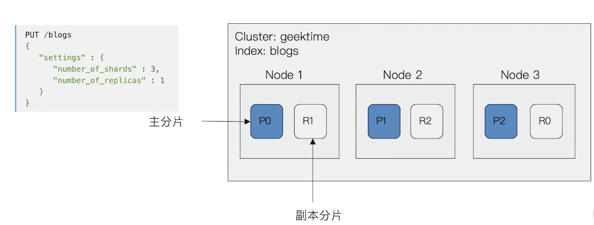

# 安装目录
- bin 二进制程序、脚本、插件
- config 配置文件
- jdk 运行环境
- lib es自己需要的jar文件
- logs 日志文件
- moudles es下各个模块
- plugins 配置插件

# 数据结构
## doc
文档是存储的最小单位，会被序列化为json保存在es中，存储结构如下所示

```
{
    "_index": 索引,类似数据库
    "_type": 文档所属类型，已废除
    "_version": 版本，也是改动次数
    "_id": 唯一标示
    "_score": 相关性打分
    "_source": 原始json数据，列
}
```

## 倒排索引
主键索引是通过id关联记录，倒排索引根据列关键字关联id

# 存储架构
## 节点
- data node：可水平扩展的数据节点
- coordination node：负责接受client请求，将请求分发到合适节点，最终汇聚结果，每个node默认都具有此功能

## 分片和副本

- 主分片在创建索引时指定，后续不允许修改
    - 分片过多
        - 可能在单节点过多分片资源浪费
        - 影响搜索结果的相关性打分？
    - 分片太少
        - 后续增加节点无法实现水平扩展
        - 单个分片数据大，导致数据重分配耗时
- 副本用来保证高可用

