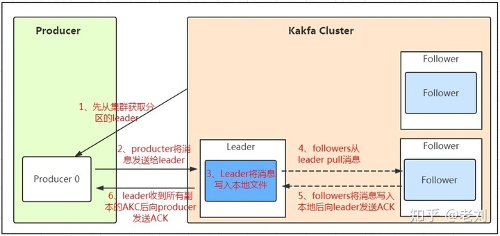
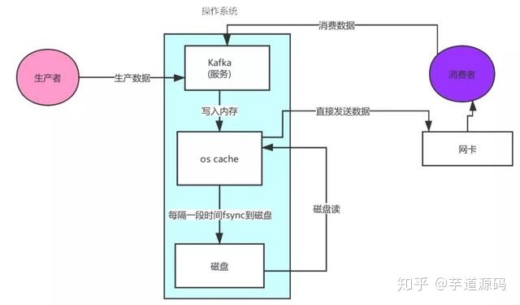

# 概述
消息队列是一种相对安全的异步回调处理方式，通过控制消费速度还具有削峰作用

Kafka是一种高吞吐量的分布式发布订阅消息系统，具有高性能、持久化、多副本备份、横向扩展能力

# 架构

- producer 消息的生产者
- broker   消息管道，可以看作kafka程序
- topic  消息主题，类似于数据库表的namespace概念，topic
- partitions 消息的持久化文件，设计part可分散在多主机横向扩展，消息被负载到多个part上存储或消费，提高存储量、吞吐量
- replication 多副本保证可用性
- group 消费组，如果group1里consumer1消费了topic1里message1，则gourp1下其他comsumer不能重复消费，只能获取到message2，而group2里consumer还可以消费message1，即相同group下不能重复消费，不同group可重复消费，或者说多个group消费相同message

# 写入过程

## part选择
- partition在写入的时候可以指定需要写入的partition，如果有指定，则写入对应的partition
- 如果没有指定partition，但是设置了数据的key，则会根据key的值hash出一个partition
- 如果既没指定partition，又没有设置key，则会轮询选出一个partition。

## 备份机制

在生产者向队列写入数据的时候可以设置参数来确定是否确认kafka接收到数据，这个参数可设置的值为0、1、all
- 0代表producer往集群发送数据不需要等到集群的返回，不确保消息发送成功。安全性最低但是效率最高
- 1代表producer往集群发送数据只要leader应答就可以发送下一条，只确保leader发送成功
- all代表producer往集群发送数据需要所有的follower都完成从leader的同步才会发送下一条，确保leader发送成功和所有的副本都完成备份。安全性最高，但是效率最低。

# 性能

使用sendfile技术实现发送数据0拷贝，提高了消费性能

