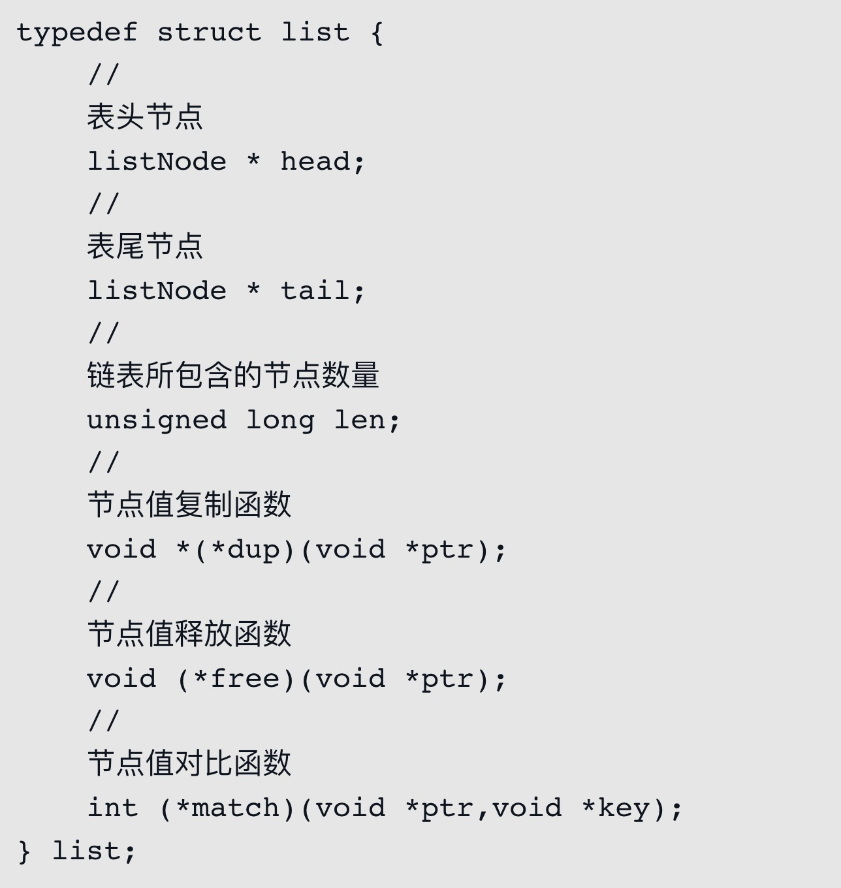
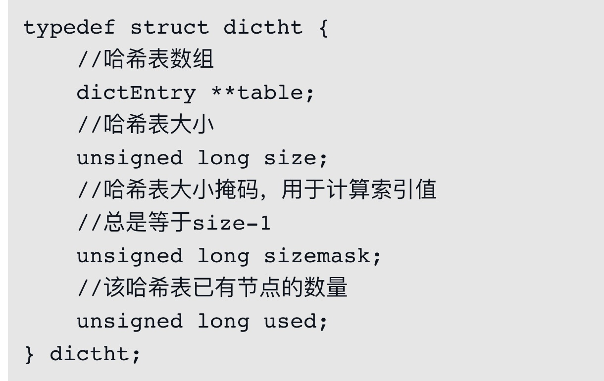
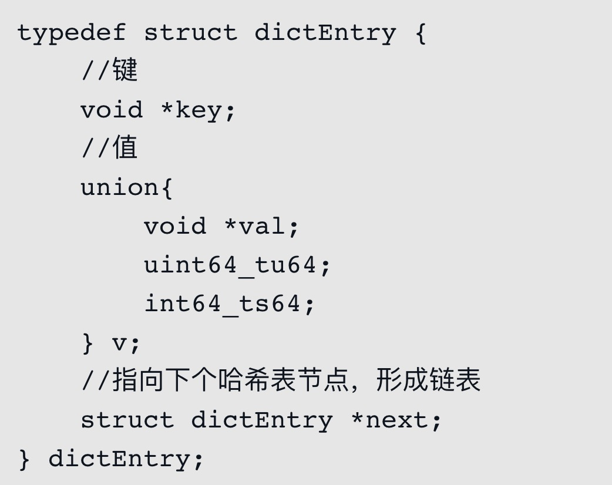

# 字符串
```
struct sdshdr {
    int len; // 已存字符串长度
    int free; // 字符数组中空闲的长度
    char buf[];
}
```

1. 存入时小于1M的字符，申请两倍的空间，多的当buffer，大于1M则多申请1M作为buffer
    - 字符串修改变长时减少再次申请内存
    - 字符串变短也不会释放多余内存，空间换时间
2. 存入时记录长度
    - 获取长度时不需要重新计算
    - c中默认用\0作为字符串结尾，记录长度可避免此限制
    - 字符串中可以有\0字符，二进制安全

# 链表
双向链表，且记录链表长度，对节点中不同的数据类型有对应的操作方法



# 字典



hash冲突后用链表存储

# 集合
set，底层用跳表实现有序set