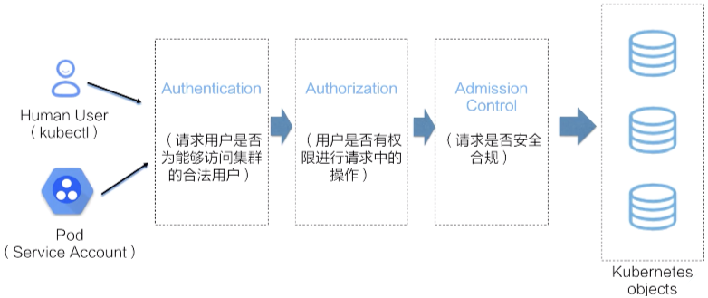

# 认证 Authenticate
简单说是否能登陆，API Server支持多种认证方式
- https 基于CA根证书的双向数字证书认证
- HTTP token
- HTTP base 通过 用户名 + 密码 认证

由一到多个认证插件完成。收到请求后，API Server依次调用为其配置的认证插件来认证客户端身份，直到其中的一个插件可以识别出请求者的身份

# 授权 Authorization
即使登陆成功，是否有权限操作，常用的授权方式有

- AlwaysAllow 允许接受所有请求，即全部授权，也是默认配置
- RBAC 基于角色的访问控制
- Webhook 通过调用外部REST服务对用户授权
- ABAC 基于属性的访问控制
- Node 专用模式，用于对kubelet发出对请求进行访问控制

由一到多个授权插件进行，负责确定那些通过认证的用户是否有权限执行其发出的资源操作请求，如创建、读取、删除或者修改指定对象等

# 准入 Admission Control
即使有权限操作，系统是否能支持这个操作

通过授权检测的用户所请求的修改相关的操作还要经由一到多个准人控制插件的遍历检测，例如是否违反系统资源限制等

