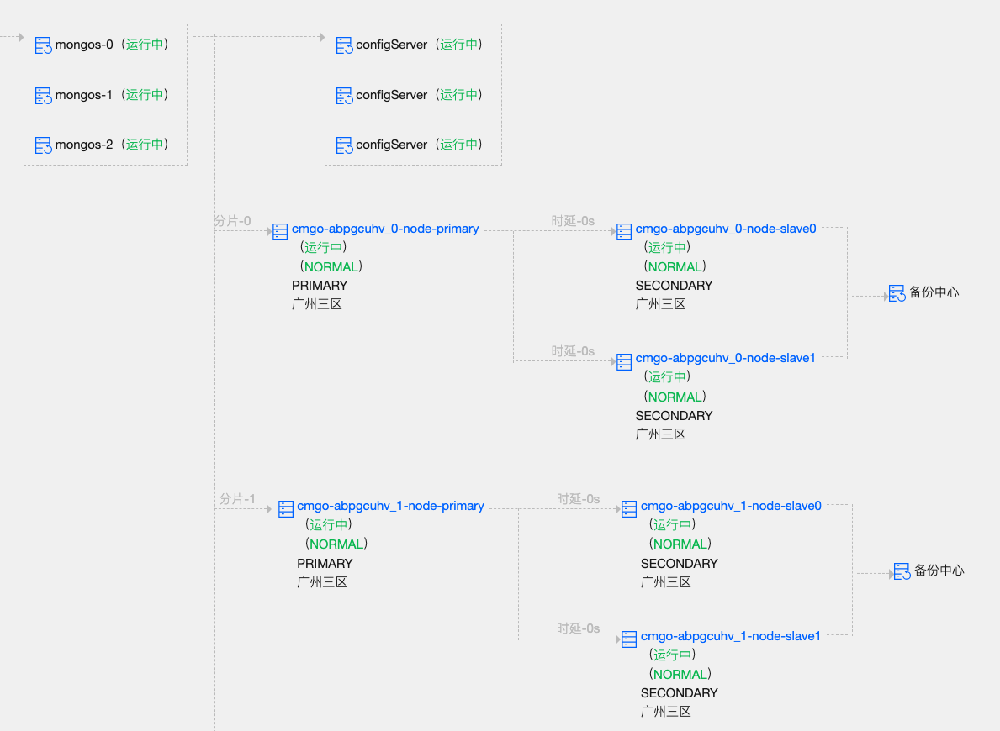

# 何时使用分片技术
- 存储容量需求超出单机磁盘容量
- 活跃的数据集超出单机内存容量，导致很多请求都要从磁盘读取数据，影响性能
- 写IOPS超出单个MongoDB节点的写服务能力

# 分片架构
Sharded cluster由Shard、Mongos和Config server 3个组件构成。

- Mongos是Sharded cluster的访问入口，
- Mongos本身并不持久化数据，Sharded cluster所有的元数据都会存储到Config Server
- 用户的数据则会分散存储到各个shard。Mongos启动后，会从config server加载元数据，开始提供服务，将用户的请求正确路由到对应的Shard。

# 分片算法
## 范围分片
如图，集合是根据字段来进行分片。根据字段的范围不同将一个集合的数据存储在不同的分片中。
- 在同一个Shard上，每个Shard可以存储很多个chunk，chunk存储在哪个shard的信息会存储在Config server种，mongos也会根据各个shard上的chunk的数量来自动做负载均衡。

- 范围分片适合满足在一定范围内的查找，例如查找X的值在【100-200】之间的数据，mongo 路由根据Config server中存储的元数据，可以直接定位到指定的shard的Chunk中

- 缺点 如果shardkey有明显递增（或者递减）趋势，则新插入的文档多会分布到同一个chunk，无法扩展写的能力

## hash分片
- 优点Hash分片与范围分片互补，能将文档随机的分散到各个chunk，充分的扩展写能力，弥补了范围分片的不足，
- 缺点但不能高效的服务范围查询，所有的范围查询要分发到后端所有的Shard才能找出满足条件的文档。

# Mongos
Mongos作为Sharded cluster的访问入口，所有的请求都由mongos来路由、分发、合并，这些动作对客户端driver透明，用户连接mongos就像连接mongod一样使用。

## 查询请求
- 查询请求不包含shard key，则必须将查询分发到所有的shard，然后合并查询结果返回给客户端
- 查询请求包含shard key，则直接根据shard key计算出需要查询的chunk，向对应的shard发送查询请求

## 写请求
- 写操作必须包含shard key，mongos根据shard key算出文档应该存储到哪个chunk，然后将- 写请求发送到chunk所在的shard。

## 更新/删除请求
- 更新、删除请求的查询条件必须包含shard key或者_id，如果是包含shard key，则直接路由到指定的chunk，如果只包含_id，则需将请求发送至所有的shard。
  
# Config Server
- Config server存储Sharded cluster的所有元数据，所有的元数据都存储在config数据库
- Config Server可部署为一个独立的复制集，极大的方便了Sharded cluster的运维管理。
- config.shards集合存储各个Shard的信息，可通过addShard、removeShard命令来动态的从Sharded cluster里增加或移除shard
- config.databases集合存储所有数据库的信息，包括DB是否开启分片，primary shard信息，对于数据库内没有开启分片的集合，所有的数据都会存储在数据库的primary shard上。
- config.colletions 数据分片是针对集合维度的，某个数据库开启分片功能后，如果需要让其中的集合分片存储，则需调用shardCollection命令来针对集合开启分片。
- config.chunks
 集合分片开启后，默认会创建一个新的chunk，shard key取值[minKey, maxKey]内的文档（即所有的文档）都会存储到这个chunk。当使用Hash分片策略时，也可以预先创建多个chunk，以减少chunk的迁移。
- config.settings集合里主要存储sharded cluster的配置信息，比如chunk size，是否开启balancer等