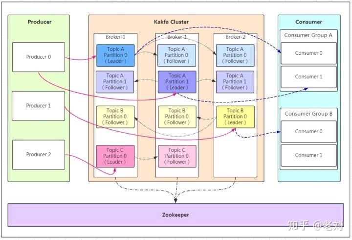
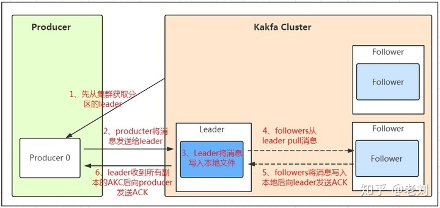
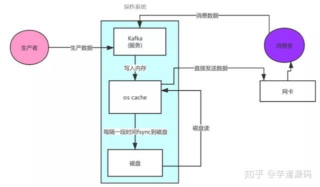

# 概述
消息队列是相对可靠的异步通讯方式，主要解决以下问题

- 削峰，将具有峰值的流量拉平处理，让生产者可以随意，消费者固定频率，并有囤积消息作用
- 可靠，通过多副本写入和ack消费，确保异步事件都被处理

Kafka是一种高吞吐量的分布式发布订阅消息系统，具有高性能、持久化、多副本备份、横向扩展能力

# 基本概念

- producer 消息的生产者
- broker   消息管道，可以看作kafka程序
- topic  消息主题，类似于数据库表的namespace概念
- partitions 消息的持久化文件，设计part可分散在多主机横向扩展，消息被负载到多个part上存储或消费，提高存储量、吞吐量
- replication 多副本保证可用性
- group 消费组，消息可以被多个group重复消费，只能被group下一个节点消费

# producter

## part选择
- partition在写入的时候可以指定需要写入的partition，如果有指定，则写入对应的partition
- 使用hash + key，可以将msg写入到固定part，可以定向消费，或者避免单个product把所有part打满，影响其他msg消费
- 使用random，所有msg随机写入到所有part，实现均衡负载消费

## 消息写入可靠性

从两方面保证消息不会丢

1. 多副本，每个part可以有多个副本，所有副本都分布在不同节点
2. 确认生产，这个参数可设置的值为0、1、all
    - 0代表producer往集群发送数据不需要等到集群的返回，不确保消息发送成功。安全性最低但是效率最高
    - 1代表producer往集群发送数据只要leader应答就可以发送下一条，只确保leader发送成功
    - all代表producer往集群发送数据需要所有的follower都完成从leader的同步才会发送下一条，确保leader发送成功和所有的副本都完成备份。安全性最高，但是效率最低。

# consumer
## 顺序读
顺序读要从product和consumer两方面保证

- 只用一个part，则一定保证读写顺序
- 多个part，可以保证part内有序，不能保证所有part里msg被顺序消费

## commit读
每个part都是不同文件，随着part容量的增长会再分割出小文件，zookpeer中记录了每个part的生产消费偏移量。

如果不指定part，每个consumer会随机分配part消费，有consumer退出时，其他consumer会load balance part

consumer通过控制提交修改offset，实现commit读，如果消费不提交则part消费会被阻塞

# 性能

使用sendfile技术实现发送数据0拷贝，提高了消费性能

