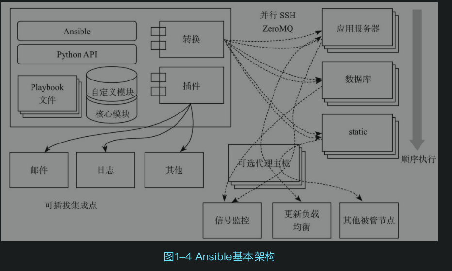
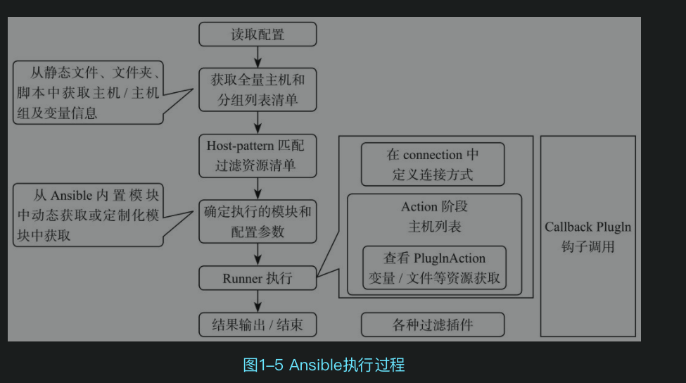

# 简介
ansible通过声明式编排批量执行主机任务，并达到期望状态

## 架构设计


## 执行过程


## 配置文件
运行ansible时候会按顺序查找配置文件

1. ANSIBLE_CONFIG 环境变量指向的环境变量
2. ./ansible.cfg 执行命令目录下
3. ~/.ansible.cfg
4. /etc/ansible/ansible.cfg

常用配置项如下
- .inventory 需要连接管理的主机列表


# 变量
playbook文件内用vars定义变量

还有其他的方式不建议使用 

1. inventory文件定义主机变量
2. 通过/etc/ansible下文件定义主机变量
3. 通过ansible命令行传入变量，ansible-playbook test.yml --extra-vars "hosts=www user=mageedu"


ansible执行产生的结果会存在一些固定变量中
- facts 正在通讯的远程目标主机发回的信息
- register 可以把任务的输出定义为变量，在其他任务中使用

```
---
  - hosts:all         # 目标分组
    remote_user: root # 执行角色
    vars:             # 定义的变量
      key: ansible
    tasks:
    - name: test var           
      value {{key}} # {{}} 访问变量  
    - 
```
