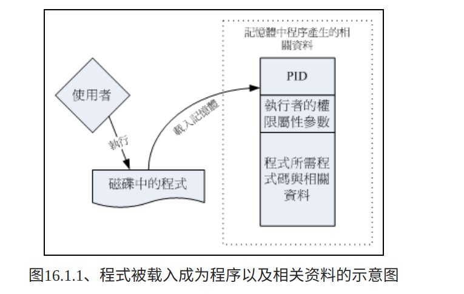
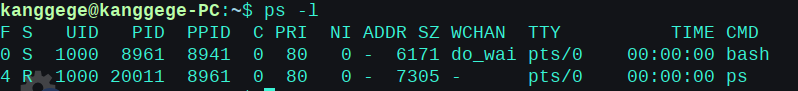
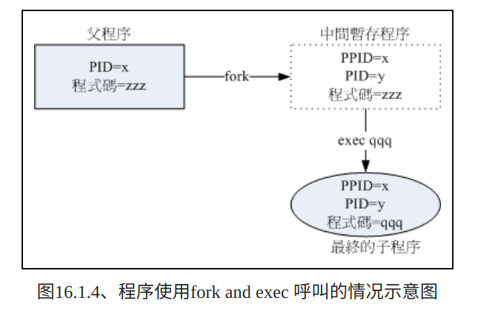
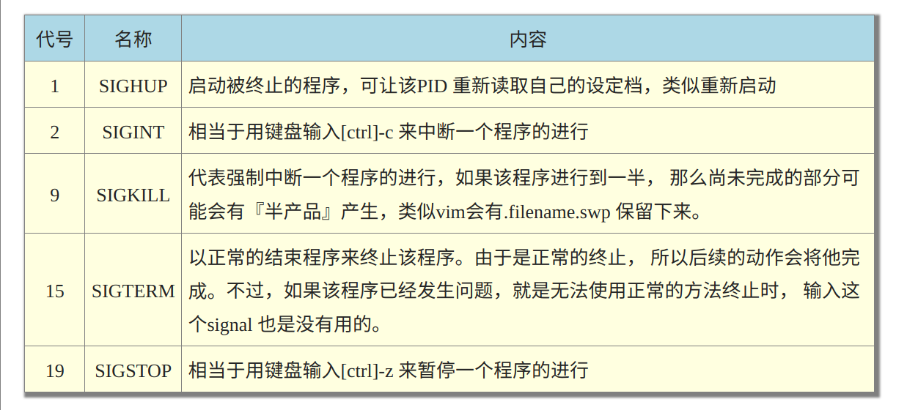

当我们执行一个指令时，就是在运行一个进程，根据发出指令用户的权限和操作文件的权限，会得出一个进程的权限，主要体现在PID上

就像我们作为一个用户，使用bash也是一个进程，可以使用 ps -l 查看当前用户运行进程信息

进程都是由父进程fork出来的，PPID就代表父进程的PID

linux下进程的创建过程一般是 fork-and-exec，即先由父进程fork出一个子进程，再由子进程exec加载实际要执行的程序(或者不加载，就是执行和父进程一样的程序)

一般我们可以用ctrl-c退出正在bash中运行的进程，用ctrl-z暂停

# 后台模式
我们在bash下执行指令，会先将bash挂起，当指令执行完成之后才回到bash，也可以让指令在后台执行 ls -l &

使用 jobs 查看当前用户下后台运行的进程

可以看到工作号码，用 fg %jobnumber 可以将进程取出到前台运行

bg %jobnumber 让进程在后台运行，一般用在暂停中的指令

当我们打开一个bash终端，作为父进程，所有执行的指令都以它为基础，如果我们关闭终端，其子进程也会被结束，所以我们需要一种机制，将进程放在系统背景中，而与终端机无关

    nohup 指令与参数 &(一般都会放在后台执行)

# 进程操作
## kill
如果想要一个进程停止，可是用kill 

    kill -signal %jobnumber 
    -l ：这个是L 的小写，列出目前kill 能够使用的讯号(signal) 有哪些？
    signal ：代表给予后面接的那个工作什么样的指示啰！用man 7 signal 可知：
    -1 ：重新读取一次参数的设定档(类似reload)；
    -2 ：代表与由键盘输入[ctrl]-c 同样的动作；
    -9 ：立刻强制删除一个工作；
    -15：以正常的程序方式终止一项工作。与-9 是不一样的。

kill -l也可以用于查看当前系统支持的信号量

## ps
ps ：将某个时间点的程序运作情况撷取下来

    [root@study ~]# ps aux  <==观察系统所有的程序资料 
    [root@study ~]# ps -lA  <==也是能够观察所有系统的资料 
    [root@study ~]# ps axjf  <==连同部分程序树状态
    选项与参数：
    -A ：所有的process 均显示出来，与-e 具有同样的效用；
    -a ：与terminal 有关的所有process ；
    -u ：有效使用者(effective user) 相关的process ；
    x ：通常与a 这个参数一起使用，可列出较完整资讯。
    输出格式规划：
    l ：较长、较详细的将该PID 的的资讯列出；
    j ：工作的格式(jobs format)
    -f ：做一个更为完整的输出。

ps的用法比较复杂，其中最主要的有两个，一个是只能查阅自己bash程序的『 ps -l 』一个则是可以查阅所有系统运作的程序『 ps aux 』！注意，你没看错，是『 ps aux 』没有那个减号(-) ！

### ps -l
加上 -l 参数会得到进程的很多信息，下面是每个信息的描述

    F：代表这个程序旗标(process flags)，说明这个程序的总结权限，常见号码有：
    若为4 表示此程序的权限为root ；
    若为1则表示此子程序仅进行复制(fork)而没有实际执行(exec)。

    S：代表这个程序的状态(STAT)，主要的状态有：
    R (Running)：该程式正在运作中；
    S (Sleep)：该程式目前正在睡眠状态(idle)，但可以被唤醒(signal)。
    D ：不可被唤醒的睡眠状态，通常这支程式可能在等待I/O 的情况(ex>列印)
    T ：停止状态(stop)，可能是在工作控制(背景暂停)或除错(traced) 状态；
    Z (Zombie)：僵尸状态，程序已经终止但却无法被移除至记忆体外。

    UID/PID/PPID：代表『此程序被该UID 所拥有/程序的PID 号码/此程序的父程序PID 号码』

    C：代表CPU 使用率，单位为百分比；

    PRI/NI：Priority/Nice的缩写，代表此程序被CPU所执行的优先顺序，数值越小代表该程序越快被CPU执行。详细的PRI与NI将在下一小节说明。

    ADDR/SZ/WCHAN：都与记忆体有关，ADDR 是kernel function，指出该程序在记忆体的哪个部分，如果是个running 的程序，一般就会显示『 - 』 / SZ 代表此程序用掉多少记忆体/ WCHAN 表示目前程序是否运作中，同样的， 若为- 表示正在运作中。

    TTY：登入者的终端机位置，若为远端登入则使用动态终端介面(pts/n)；

    TIME：使用掉的CPU 时间，注意，是此程序实际花费CPU 运作的时间，而不是系统时间；

    CMD：就是command 的缩写，造成此程序的触发程式之指令为何。

### ps aux
使用aux查看所有进程时，显示的信息又不同了

    USER：该process 属于那个使用者帐号的？
    PID ：该process 的程序识别码。
    %CPU：该process 使用掉的CPU 资源百分比；
    %MEM：该process 所占用的实体记忆体百分比；
    VSZ ：该process 使用掉的虚拟记忆体量(Kbytes)
    RSS ：该process 占用的固定的记忆体量(Kbytes)
    TTY ：该process 是在那个终端机上面运作，若与终端机无关则显示?，另外， tty1-tty6 是本机上面的登入者程序，若为pts/0 等等的，则表示为由网路连接进主机的程序。
    STAT：该程序目前的状态，状态显示与ps -l 的S 旗标相同(R/S/T/Z)
    START：该process 被触发启动的时间；
    TIME ：该process 实际使用CPU 运作的时间。
    COMMAND：该程序的实际指令为何？

如果你发现在某个程序的CMD 后面还接上<defunct> 时，就代表该程序是僵尸程序啦

## top
相对于ps 是撷取一个时间点的程序状态， top 则可以持续侦测程序运作的状态！使用方式如下：

    top

## pstree

# 进程管理
## 信号量
kill不仅可以通过参数实现对进程的管理，还可以通过信号量传递给进程，从而管理进程

常用的1、9、15

kill -signal PID

由于kill还需要找到PID，可以用killall省事一点

    killall [-iIe] [command name] 
    -i ：interactive 的意思，互动式的，若需要删除时，会出现提示字元给使用者；
    -e ：exact 的意思，表示『后面接的command name 要一致』，但整个完整的指令不能超过15 个字元。
    -I ：指令名称(可能含参数)忽略大小写。
    它也可以使用kill的选项
