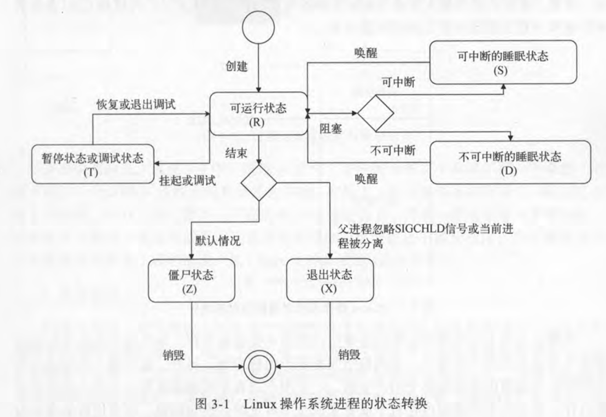

# 多进程编程
在操作系统中，如果多个进程之间需要协作完成任务，那么他们之间的通信就是重点需要考虑的问题。这种通信被叫做IPC，这里针对linux提供的方法进行讨论。

在linux中可以使用的IPC有很多种，从处理机制上来看可以分为三大类。基于通信、基于信号、基于同步

基于通信又分为两种

1. 以数据传输为手段：包括管道、消息队列
    1. 管道可以用来传输字节流
    2. 消息队列可以用来传输结构化消息对象
2. 以共享内存为手段：主要是共享内存区，他是最快的IPC方法

基于信号的IPC就是操作系统的信号(signal)机制、他是唯一一种异步IPC方法。

在基于同步的IPC方法中最重要的就是信号量

GO中支持的是管道、信号、socket

**后面知识都以类unix系统为基准**

# 进程
进程是一段完整程序代码的一次执行，是操作系统进行资源分配的基本单位

## 进程的衍生
进程使用 fork 创建子进程，每个子进程都源于父进程的一个副本，即子进程会复制父进程的数据段、堆和栈的副本，且和父进程共享代码段。每一个副本都是独立的，子进程修改副本的数据对其他进程(父进程、兄弟进程)都不可见

但是全盘复制父进程的数据相当低效，linux采用写时复制(COW)。父进程和子进程共享页面而不是复制页面。然而，只要页面被共享，它们就不能被修改。无论父进程和子进程何时试图写一个共享的页面，就产生一个错误，这时内核就把这个页复制到一个新的页面中并标记为可写。原来的页面仍然是写保护的：当其它进程试图写入时，内核检查写进程是否是这个页面的唯一属主；如果是，它把这个页面标记为对这个进程是可写的。

刚刚创建的子进程可以使用 exec 把一个新的程序加载到自己的内存中，而原先在内存中的数据段、堆、栈以及代码段就会被替换掉

linux下每个进程都有父进程，所有的这些进程构成了一个树状结构。Linux下有三个特殊的进程idle进程（PID=0），init进程（PID=1），和kthreadd（PID=2）
- idle：由系统启动时创建，运行在内核态，是所有进程的祖先
- init：由idle创建，用于管理所有用户态的进程，即所有用户态进程的祖先，在系统启动完成后，init将变成为守护进程监视系统其他进程
- kthreadd：由idle通过kernel_thread创建，并始终运行在内核空间，负责所有内核进程的调度和管理

如果父进程在子进程消亡之前就死了，那么子进程会被init进程收养，成为他的直接子进程，这就是孤儿进程

## 进程的标识
每个进程都会有一个唯一标识符，pid，ppid用于标识他的父进程

内核能通过pid迅速找到进程，并对他做一些操作，go中也支持一些这样的操作

```
    pid := os.Getpid()
	ppid := os.Getppid()
	process, err := os.FindProcess(ppid)
	if err != nil{
		log.Fatal(err)
	}
	process.Wait()
	process.Kill()
```

## 进程的状态
在linux系统中每个进程在每个时刻都是有状态的，可能的状态有6个
- 可运行态：(TASK_RUNNING，R)如果一个进程处于该状态，表示它正在cpu上运行，或者已经就绪等待去运行

- 可中断的睡眠状态：当进程在等待某个事件(比如网络连接、信号量)到来，就会进入此状态。这样的进程会被放入对应的事件等待队列里，一旦事件发生，对应队列中一个或多个进程就会被唤醒

- 不可中断的睡眠：此状态和可中断的睡眠区别在于睡眠状态不会被打断，不会对信号量做出反应。更确切的说，发给此状态下进程的信号量会在该进程复苏只会才会被发出。处于此状态的进程通常是在等待一个特殊事件，比如等待I/O完成

- 暂停状态或跟踪状态：向进程发SIGSTOP信号，除非进程是不可中断的睡眠，否则就会进入暂停状态。向正处于暂停状态的进程发送SIGCONT信号，会使该进程转向可运行状态，处于该状态的进程会暂停，等待另一个进程的对他进程操作，就像我们用调试工具去调试代码，只有调试工具进行了相应的系统调用或者退出之后，他才能恢复

- 僵尸状态：处于该状态的进程即将结束，绝大部分的资源也已经被回收，但是还有一些信息未被删除，比如退出码以及一些统计信息。之所以保留这些信息是因为父进程可能需要这些信息。由于进程主体信息已经被删除只剩下一个空壳，所以被称为僵尸状态

- 退出状态：在进程退出过程中，可能连信息码都不需要保留。造成这种情况的原因可能是让进程的父进程忽略SINCHLD信号。也可能是进程已经被分离，分离后的子进程不在使用父进程的数据和指令，而是加载并运行另一个全新的程序。该进程在退出的时候就不会进入僵尸状态，而是直接处于退出状态，会立即被干净利落地结束掉，它占用的资源会被系统回收。




# 管道
