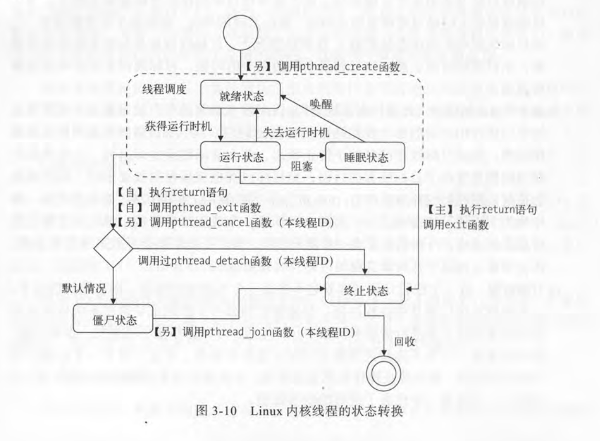

# 线程
## 线程标识
每个线程也有自己的ID，一般称为ID或TID。与进程不同，线程的ID在系统范围内可以不唯一，而只在属于他的进程内唯一。不过linux也确保了TID的唯一。当线程不存在时，其ID可以被其他线程复用

## 线程控制
与进程家族树的关系不同，一个进程下任意的线程间关系是平等的，所以两个线程之间的管理是有限的。

- 创建线程：调用 pthread_create 传入要执行的函数和参数，就创建了一个线程，这个函数是可以有返回值的，通过下面的连接线程获取他的返回值

- 终止线程：pthread_cancel 传入要终止线程的ID，但是收到终止请求的线程并不一定会真的停止，他可以自己选择如何处理这个终止请求

- 连接已终止的线程：pthread_join 该函数会一直等待传入ID代表的线程的终止，获取其函数调用的返回值。相当于在一个线程结束后，获取它返回的值，再执行其他的代码。如果一个线程可以被连接，那么它终
止之后必须被连接，否则就变成了僵尸线程。

- 分离线程：pthread_detach 一个线程默认都是可连接状态。分离线程可以告诉内核，在这个线程调用结束完成后，自动做清理和销毁的工作，不再等待连接了。注意这个状态是不可逆的。

除了一个线程对另一个线程的管理，线程自身也可以终止可分离。

当一个线程执行return或是调用了系统调用exit就代表了退出。需要注意的是：！

1. 每个进程都有一个主线程，主线程退出后就代表了进程的退出，会销毁进程所有信息，依赖于该进程的线程都会被销毁，但是可以调用pthread_exit退出主线程，且不影响其他线程。
2. 在任意线程中使用exit都会让进程退出

线程自认分离也是通过调用pthread_detach，和其他线程让它分离的不同就是传入id的不同

