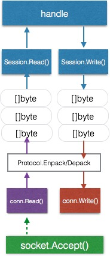

Go的Socket编程在底层使用了epoll，所以一个os线程

```
    listener, _ := net.Listen("tcp", ":1234")
	for {
		conn, err := listener.Accept()
		if err != nil {continue}

		go func(conn net.Conn) {
			bf := make([]byte,100)
			defer conn.Close()
			//读取到的字节数，可能 n != 100
			for {
				n, err := conn.Read(bf)
				if err != nil{
					if err == io.EOF{
						fmt.Println("读取结束")
					}else{
						log.Println("读取错误：",err)
					}
					break
				}
				if n > 0{
					//处理数据
					fmt.Println(bf[:n])
				}
			}
			//一般只有全部写入才会完成，除非发生错误，则返回已经写入的字节数
			wf := []byte("我是服务器！再次声明，我是服务器！")
			n, err := conn.Write(wf)
			if err != nil{
				conn.Write(wf[n-1:])
			}
		}(conn)
	}
```

使用read从内核中读取数据也是非阻塞的，调用系统read函数后，读取不到则切换goroutine。

如果读取到了，但是没有读取满，即使只有一个字节，也会返回给应用程序处理，这一特性称为部分读

write操作也是异步非阻塞的，如果发现内核缓冲区填满了，系统层面返回错误，go调取器处理错误并切换goroutine

如果只有部分缓存，写入一部分数据，会等下一次调度再次写入，但是只有等全部写入完成后才会返回给应用层继续处理



- 绿色goroutine依然是接受TCP链接
- 当完成握手accept返回conn对象后，使用一个单独的goroutine来阻塞读（紫色），使用一个单独的goroutine来阻塞写（红色）
- 读到的数据通过解码后放入读channel，并由蓝色的goroutine来处理
需要写数据时，蓝色的goroutine将数据写入写channel，从而触发红色的goroutine编码并写入conn

可以看到，针对一个客户端，服务端至少有3个goroutine在单独为这个客户端服务。如果从线程的角度来看，简直是浪费啊，然而这就是协程的好处。

这个模型很容易理解，因为跟人们的正常思维方式是一致的。并且在应用层面都是阻塞调用(底层是异步非阻塞)，所以无需维护状态