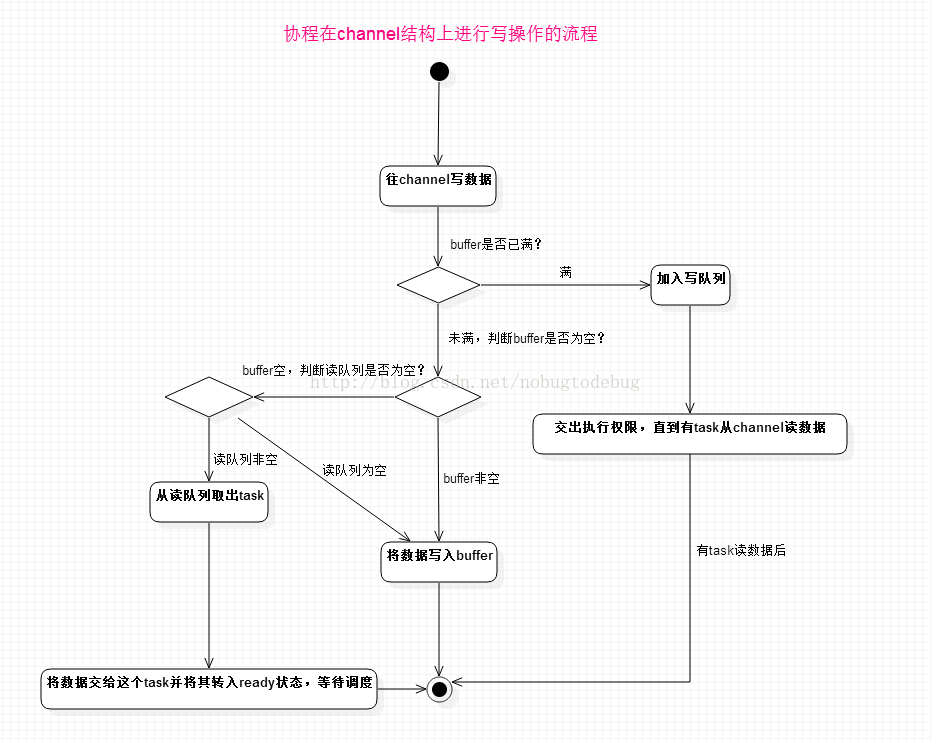
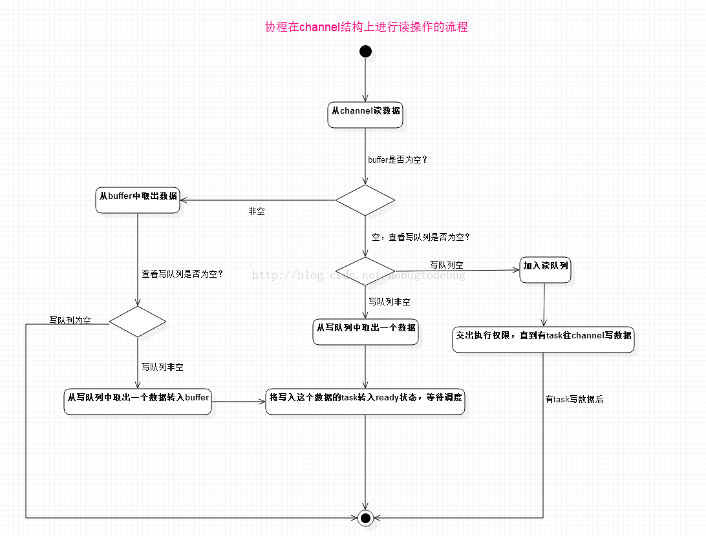

channel的本质还是通过共享内存实现数据传输

他的底层主要有四个数据结构，buffer、send、receive、lock

buffer就是共享的内存缓存区域，在make时设置，如果为0，则buffer为空

当goroutine向channel发送数据时，先查看buffer是否为空

1. 不为空，查看buffer是否已满，如果未满，将数据存入buffer，继续执行。如果满了，将自己放入send，goroutine挂起
2. 为空，查看receive，将自己的数据传给receive

