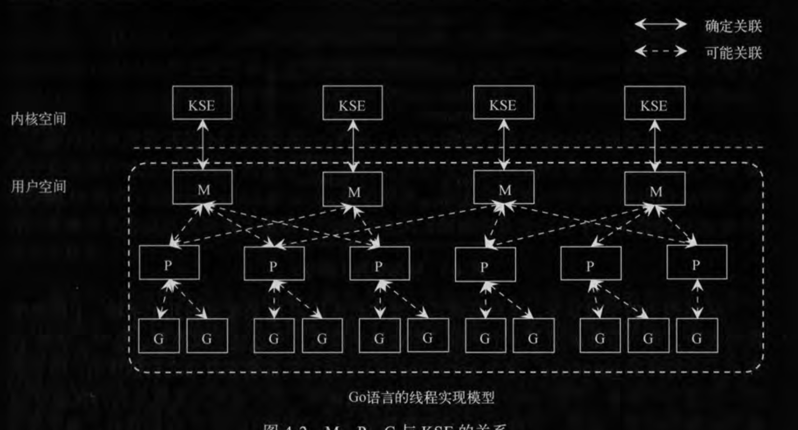
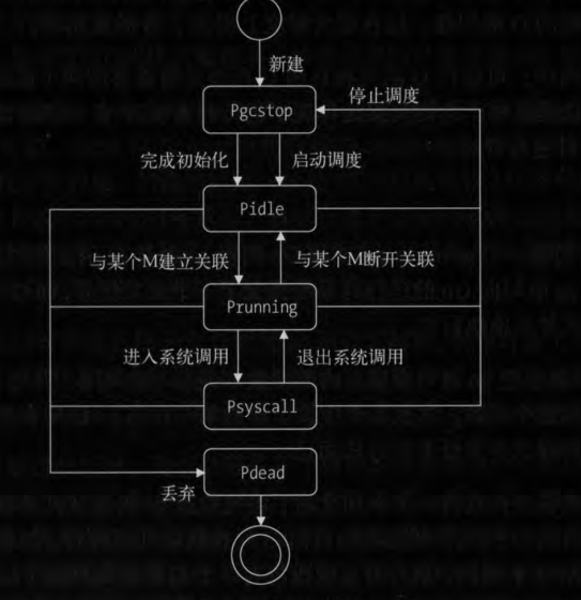

Go的线程实现模型，有三个必知的元素，他们支撑起来这个模型的主框架

- M:machine，一个M代表一个内核线程上运行的程序，或称工作线程
- P：processor，一个p代表一个Go代码片段所必须的资源，或者称为上下文
- G：groutine，一个G代表Go代码片段
- kse：内核调度线程



M和kse总是一对一的关系，而且由程序自己创建。M用来调度P，每个P代表一些G的上下文，并用来调度G，因为最终还是G在M上运行。所以是两层调度模型

# M
一个M代表了一个内核线程。大多数情况下，创建M都是因为已有的M因为系统调用阻塞，没有足够的M来关联P并运行其中的G，或者是启动系统监控或GC的时候才会创建新的M。


M的部分字段
```
type m struct{
    //一个特殊的goroutine，go运行系统在启动之初创建的，执行运行时任务
    g0       *g
    //M的起始函数，等同于我们用 go func() 的函数一样
    mstartfn func()
    //M正在运行的G的指针
    curg     *g
    //当前和M相关联的P
    p        puintptr
    //与当前M有潜在关联的p
    nextp    puintptr
    //M是否正在寻找可运行的G，寻找过程中，M会处于自旋状态
    spinning bool
    //与当前M锁定的那个G
    lockedg  *g
}

```

M在创建之初，会被加入到全局M列表(runtime.allm)中，他的起始函数和预关联的P也会被设置。最后，系统会给M创建一个内核线程并关联。这样M就为运行G做好了准备。

一般情况下，起始函数只有当运行系统需要M执行垃圾回收或监控任务的时候才会被设置。

在M被创建后，Go运行系统会对他做初始化，包括运行时栈空间以及信号处理等，然后如果M的起始函数存在，会调用起始函数。注意：如果这个起始函数是监控或GC，那么就没有后面的调度了。否则，在起始函数执行完成之后，当前M会和预设的P完成关联，并寻找可执行的G运行

M也可能会被停止，比如在执行GC过程中。运行时系统停止M时会把他放在调度器空闲的M列表中。在需要一个未被使用的M时，会从列表中再取出。

单个Go程序所使用的最大M数是有限制的，这个初始值是1000，一般不会用到这么多系统线程，我们暂且不关心如何去改变他。

# P
P是G能够在M中运行的关键，M和os线程总是一对一不变的关系，而P在不同的M上调度，就先内核线程在cpu上调度一样

go中默认使用逻辑核心数作为P的创建数量，	runtime.GOMAXPROCS(runtime.NumCPU())，我们可以自己改变，一般情况，在linux机器上如果进程不多，使用默认的P数量就够，如果有一定的进程，可以略微比核心数多几个，它最大值限制是256(可能以后更新还会改变)

注意：如果我们在运行后重新设置P，他会让所有的P都停下，重新设置好后再运行。要设置P应该放在最前面，不要在程序中间改变P

与M空闲列表类似，P也有空闲列表，当运行时系统需要某个P关联M时，就从列表中取出一个，注意，只有P中的G全部运行完成之后才会进入空闲列表

与M不同，P是有状态的

- Pidle：表示未和任何M关联
- Pruning：正在和某个M关联运行
- Psyscall：P中当前运行的G正在进行系统调用
- Pgcstop：运行时系统需要终止调度，比如GC
- Pdead：当前P不再使用，如果运行过程改变P的数量，多余的P就处于此状态



每个P除了一个可运行G队列外，都还包含一个自由的G列表。这个列表中包含了已经完成了的G，随着完成了的G变多，这个G列表可能会很长。如果它增长到一定程度，运行时系统就会把部分G转移到调度器的自由G列表中。当使用go语句创建启动一个G时，运行时系统会优先从P中使用一个已完成的G来封装go函数，这样提高了G的复用率。

对P来说，最重要的就是可运行G队列和空闲G队列，他们才是真正要运行在M上的程序

# G
Go编译器会把go语句变成内部函数newproc的调用，并把go运行的函数和参数都作为参数传递

调度器会先去P中查询空闲的G，如果查不到则去全局G空闲列表查，再查不到就创建一个新的G。与M和P类似，G也有一个全局列表，新建的G在第一时间放入该列表。这个列表的作用是，存放当前运行时系统的所有G指针，，无论封装当前这个go函数的G是否是新的，运行时系统都会对他进行初始化，包括关联go函数以及设置该G的状态和ID。

在初始化完成之后，这个G会被存到本地的P的runnext字段中，这个字段用于存放新鲜出炉的G，以便早点运行它，原来这个字段中的G被踢到队列末尾了。如果该队列已满，那么这个G就只能追加到调度器可运行的G队列中了

每个G都都会根据运行情况有不同的状态
- Gidle：刚被分配，还未初始化
- Grunnable：正在可运行队列中等待运行
- Grunning：正在运行
- Gsyscall：正在执行系统调用
- Gwaiting：正在阻塞
- Gdead：正闲置
- Gcopystack：当前G的栈正在被移动，可能是扩展或收缩

