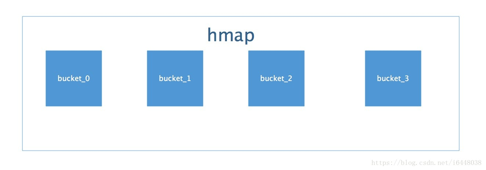
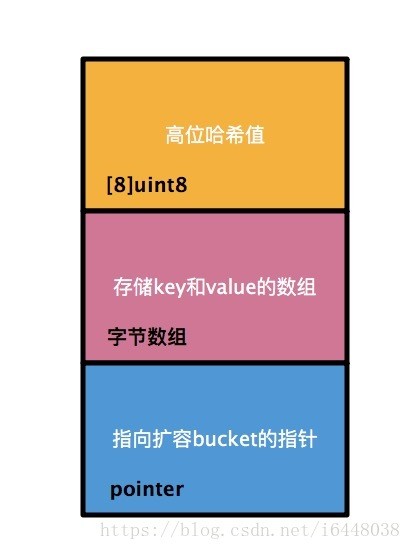
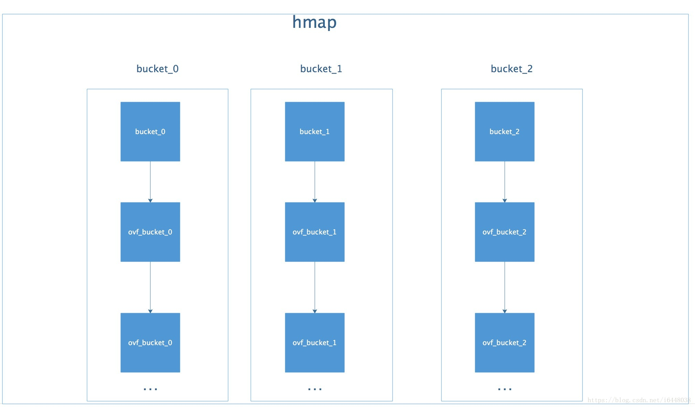
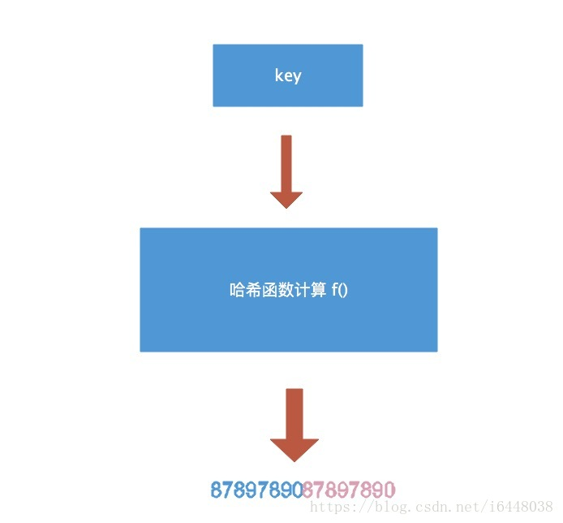
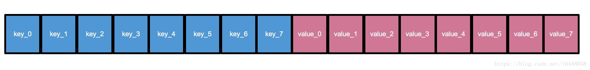

go中的map操作起来太方便了，使得我大量情况无脑的就用上了map，但有map的查找性能不一定总是强过arr的，如果小范围遍历情况，还是用数组

这篇文章尝试着简析map的源码，在$GOROOT/src/runtime/map.go可以看到map的源码

# 使用
先复习一下map的基本用法
```
var m map[string]string //声明后并不能使用，它是一个空指针，还需要初始化
m = make(map[string]string,100) //可以设置起始容量，尽可能减少扩容操，或不设置 make(map[string]string)
l := len(m) //获取填充元素的个数，len(slice)返回的是len长度，而len(map)返回的不是分配的空间，而是已填充的个数，所以尽量设置分配容量
//m := map[string]string{"key":"val"} 也可以这样初始化

val,ok := m["key"] //如果值不存在，则是其类型的零值，ok代表键值对是否存在
//不能用slice、map、func作为key类型，他们本身就是指针，没有比较的意义，struct可以作为key
//golang为string、uint32、uint64做了优化，使用这些类型作为key可以提高访问速度 【runtime/hashmap_fast.go】

//m和slice不同在于，slice是保存arr信息的结构体，作为参数传递是赋值传递，如果函数内扩容则导致原来的slice和函数内的slice不同，而m是一个指针，不存在这样的问题
```

# 结构
```
type hmap struct {
    count        int  //元素个数
    flags        uint8   
    B            uint8 //扩容常量，map真正的容量是2^B
    noverflow    uint16 //溢出 bucket 个数
    hash0        uint32 //hash 种子

    buckets      unsafe.Pointer //bucket 数组指针，数组长度是2^B
    oldbuckets   unsafe.Pointer //扩容时旧的buckets 数组指针
    nevacuate    uintptr  //扩容搬迁进度
    extra        *mapextra //记录溢出相关
}

// A bucket for a Go map.
type bmap struct {
    tophash        [bucketCnt]uint8  //bucketCnt是存储元素数量，8个
    // Followed by bucketCnt keys 
    //and then bucketan Cnt values  
    // Followed by overflow pointer
}

```

每个map的底层结构都是hmap，hmap的buckets指向一个由若干个bmap组成的数组(每个bmap相当于bucket)



bucket就是bmap及其他结构的组合，比较复杂，我们简化为下面的图



由bmap的结构可以看出，它默认存放8个指针，即存放了8个key-val键值对，如果满了，则再生成一个bmap挂载在它后面



这是整个map的结构

# 挂载
golang为每个类型定义了类型描述器_type，并实现了hashable类型的_type.alg.hash和_type.alg.equal，实现key的计算和比较

```
type typeAlg struct {
    // function for hashing objects of this type
    // (ptr to object, seed) -> hash
    hash func(unsafe.Pointer, uintptr) uintptr
    // function for comparing objects of this type
    // (ptr to object A, ptr to object B) -> ==?
    equal func(unsafe.Pointer, unsafe.Pointer) bool
```

计算完key的hash值以后，是一个16位的值



如图所示，蓝色为高位，红色为低位。
然后低位用于寻找当前key属于hmap中的哪个bucket，而高位用于寻找bucket中的哪个key。上文中提到：bucket中有个属性字段是“高位哈希值”数组，这里存的就是蓝色的高位值，用来声明当前bucket中有哪些“key”，便于搜索查找。
需要特别指出的一点是：我们map中的key/value值都是存到同一个数组中的。数组中的顺序是这样的:



字节对齐减少padding空间浪费

现在我们得到了整个map的结构图


# 扩容
桶的数量一定是 2^n ，这样可以通过获取key的高n位，判断放在哪个桶里，和mod相比性能更好

map的容量因子是6.5，当空间使用率超过6.5时，就开始扩容，下次扩容则是 2^(n+1)，每次扩容，容量翻一番

但这个迁移并没有在扩容之后一次性完成，而是逐步完成的，每一次insert或remove时迁移1到2个pair，即增量扩容。增量扩容的原因 主要是缩短map容器的响应时间。若hashmap很大扩容时很容易导致系统停顿无响应。增量扩容本质上就是将总的扩容时间分摊到了每一次hash操作上。

由于这个工作是逐渐完成的，导致数据一部分在old table中一部分在new table中。old的bucket不会删除，只是加上一个已删除的标记。只有当所有的bucket都从old table里迁移后才会将其释放掉。如果我们想要这个数据被GC，应该先将他设置为nil，然后再delete

如果需要进行扩容的时候，上一次扩容后的迁移还没结束，怎么办？在代码中我们可以看到很多”again”标记，会不断进行迁移，知道迁移完成后才会进行下一次扩容

