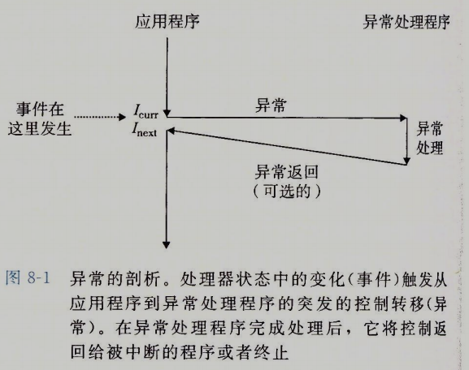
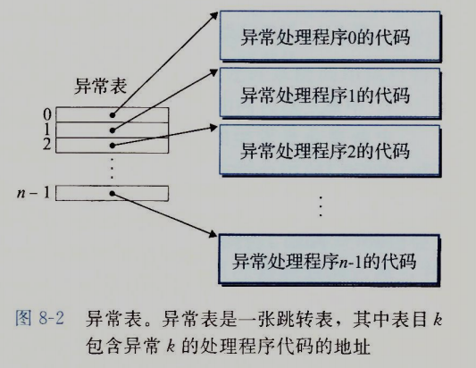
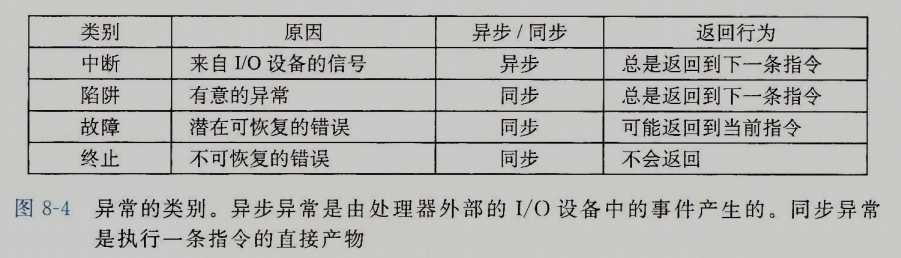
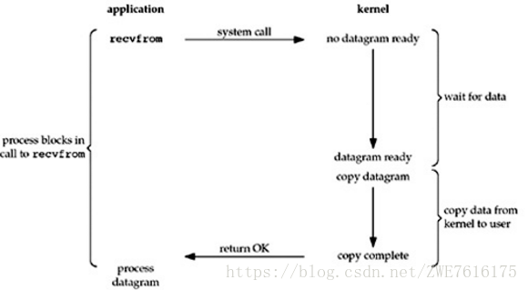
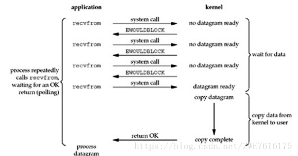
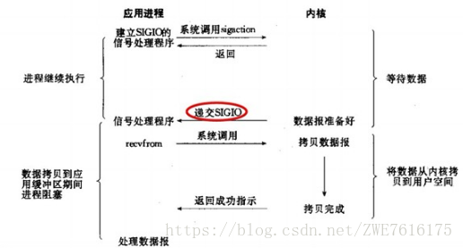
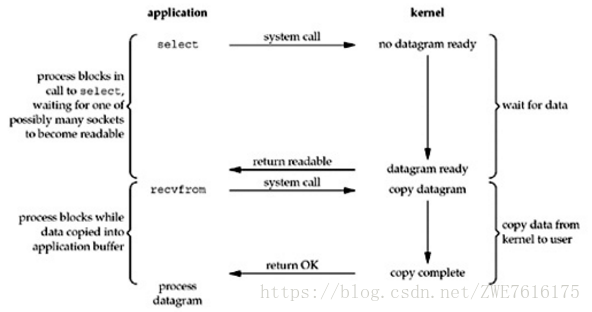
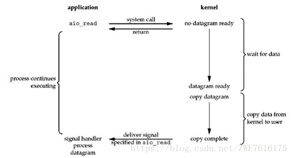

系统必须对系统状态的变化做出反应，现代系统使用控制流发生突变来对这些情况做出反应，一般来说，我们把这些突变称为异常控制流（ECF）。异常控制流发生在系统的各个层次，无论是由用户态进入内存态，还是IO操作的完成，虚拟内存页的切换，理解异常控制流是理解操作系统的基础。

**如果程序只有顺序调用流程，那将是一场灾难，其根本机制是为了满足顺序执行过程中遇到的突发情况**

# 异常
异常是ECF的一种形式，它一部分由硬件实现，一部分是操作系统实现

在处理器中，状态被编码为不同的位和信号，状态的变化称为事件（event）。

事件可能和正在执行的指令直接相关（内存缺页等），也可能和当前指令无关（一个系统定时器产生的信号或者IO请求完成）

**在任何情况下，当处理器检测到有事件发生时，就查询异常表并转跳，进行一个间接的过程调用（异常），调用异常处理程序，再根据异常的事件类型决定返回继续执行指令或者终止执行**

# 异常处理

系统中可能的每类异常都分配了唯一的非负数异常号。一些是处理器设计者分配的，一些是操作系统中规定的，系统启动后，操作系统分配和初始化一张称为异常表的转跳表

当程序执行过程中，处理器检测到异常并获取到异常号K，就会查找异常表中对应的异常处理程序执行，**异常处理程序运行在内核下**

# 异常类别
异常可以分为四类，中断、陷阱、故障、终止

## 中断
中断是异步发生的。程序和IO设备并行运行，当IO设备准备好后才会发送中断给程序

发出中断钱两者同时进行，程序并没有因为等待IO中断而停止，所以是异步的

接受到中断后，CPU运行中断处理程序，而后返回到下一条指令继续执行

## 陷阱和系统调用

陷阱是有意的异常，是执行一条指令的结果。就像处理中断一样，陷阱处理程序将控制返回到下一条指令。陷阱最重要的作用是在用户程序和内核之间提供系统调用

比如读一个文件，调用系统读取文件的接口，会导致一个到异常处理程序的陷阱，系统切换到内核态，并执行任务，返回给用户程序

## 故障

故障由错误情况引起，发生故障后，先交给故障处理程序修正，比如缺页故障，把需要的页置换出来，修正成功返回刚刚的语句重新执行，否则终止故障程序

## 终止

终止是不可恢复的致命错误造成的，通常是硬件错误，abort例程会终止这个应用程序

## Linux/x86-64
x86定义了高达256种异常，0~31是CPU定义的异常，其他事系统定义的异常

Linux提供了几百种系统调用，每个系统调用都有一个唯一的整数号，对应内核中跳转表的偏移量，系统调用是通过一个叫 syscall 的陷阱指令提供的

# 进程

## 用户模式和内核模式

处理器通常用某个控制寄存器中的一个模式位来描述进程当前享有的特权。

当设置了模式位之后，进程就在内核模式中，可以执行指令集中的任何指令，访问内存中的任何位置

没有设置模式位时，进程运行在用户模式中，不允许执行特权指令（停止处理器，改变模式位，或发起一个IO操作），也不允许直接引用地址空间中内核区的代码和数据。任何这样的尝试都会导致知名的保护故障，反之，用户必须通过系统调用接口间接访问内核代码和数据

要注意的是：用户态和内核态之间的转换比较昂贵（消耗cpu），应该尽量减少他们的切换（一个进程本来分配的时间都不多，切换几次内核就没了）

## 上下文切换
内核使用一种称为上下文切换的异常控制流实现多任务。

内核为每个进程维持一个上下文。上下文就是内核重新启动一个被强占的进程所需的状态。它由一些对象组成，包括目的寄存器，浮点寄存器，程序计数器，用户栈，内核栈，描述地址空间的页表，包含进程信息的进程表，以及打开文件的信息的文件表。

内核中有调度器，用来调度进程执行，保存老进程上下文，并恢复新进程上下文，再将控制权交给新进程。

如果一个进程等待事件发生而阻塞时，内核就可以调度挂起该进程，切换到另一个进程，即使进程没有阻塞，内核也可以切换进程。或者进程自己调用sleep把自己挂起来，一般是给进程分配的运行时间到了，时钟给内核发送中断，切换到内核态，内核再选择一个运行的进程。

来看一个IO事件

进程A发起一个IO事件，不得不阻塞等待事件完成，CPU就从进程A切换到进程B继续执行，待IO完成后，向CPU发送中断，CPU判断B已经运行足够时间了，再接受中断，执行进程A的下一条指令

## fork
linux中父进程创建子进程使用 fork 函数，父进程和子进程的代码和数据完全相同，拥有相同但是独立的地址空间，并且共享父进程打开的文件（资源），但 fork 会返回两次

在父进程中，fork返回子进程的pid（进程号），在子进程中返回0，因为所有的进程号都不是0，所以可是通过判断是否为0来确认是否是子进程

子进程执行完成之后会释放自己的资源，但保留部分信息和返回状态交给父进程使用，如果父进程忽略处理这些信息，则这些信息将一直存在于内存中不会被释放，子进程就处于了**僵尸进程**状态

如果父进程死了子进程还没销毁，子进程就变成了**孤儿进程**，这些进程会被init统一回收

长时间运行的程序，父进程总是应该使用wait回收子进程，避免他们浪费系统资源

# 信号
linux的信号，它允许进程和内核中断其他进程

每种信号类型都对应于某种系统事件，底层的硬件异常是由内核异常处理程序处理的，正常情况下，对用户进程是不可见的，信号提供一种机制，通知用户进程发生了这些异常

## 信号术语
传送一个信号到目的进程分为两个步骤
1. 发送信号：内核通过更新进程上下文的某个状态，发送一个信号给目的进程。一个进程可以发送信号给自己
2. 接收信号：进程可以忽略或通过信号处理程序的用户层函数捕获这个信号

一个发出而没有被接收的信号叫做待处理信号，在任何时刻，一种类型至多只会有一个待处理信号，其他同类型的待处理信号都会被丢弃（没有排队）。一个进程可以有选择的阻塞某种信号，当一种信号被阻塞时，它仍可以被发送，但是产生的待处理信号不会被接收。

## 发送信号
Unix系统提供了大量信号机制，这些信号会直接被发给整个进程组

父进程及其创建的子进程同属于一个进程组，如果向父进程发送信号，则其子进程也会受到信号

## 接受信号

# IO模型
异常对于编程语言很有帮助，尤其是在IO上，简单介绍OS系统调用的五种IO模型

内核管理了所有设备，因此对设备的IO必须要通过内核调用，内核要对调用做检查，读取，再将读取数据从内核复制到用户内存，这种内核态的切换和复制有很大的开销，为什么不让程序自己来呢？所以说内核只做了三件事，安全、安全、还他妈的是安全

## 阻塞IO（blocking IO）
A拿着一支鱼竿在河边钓鱼，并且一直在鱼竿前等，在等的时候不做其他的事情，十分专心。只有鱼上钩的时，才结束掉等的动作，把鱼钓上来。

用户进程发出读取信号后，语言层面调用系统阻塞IO（blocking io），在系内核（其实是IO控制器）将数据放入内存前，程序阻塞不往下执行，内核完成之后，发一个信号给程序，程序接着执行

为了方便下面说，我们将语言层面调用的IO称为客户

## 非阻塞IO（no blocking IO）
B也在河边钓鱼，但是B不想将自己的所有时间都花费在钓鱼上，在等鱼上钩这个时间段中，B也在做其他的事情（一会看看书，一会读读报纸，一会又去看其他人的钓鱼等），但B在做这些事情的时候，每隔一个固定的时间检查鱼是否上钩。一旦检查到有鱼上钩，就停下手中的事情，把鱼钓上来。 

客户向内核发起IO请求，但是并不阻塞自己，每隔一段时间就询问内核，如果文件描述符缓冲区就绪，内核就会拷贝数据，并返回成功的信号，否则返回未准备好的信号，等待下一次轮询

轮询比较消耗CPU，一般在特定场合下才使用

## 信号驱动IO（signal blocking IO）
C也在河边钓鱼，但与A、B不同的是，C比较聪明，他给鱼竿上挂一个铃铛，当有鱼上钩的时候，这个铃铛就会被碰响，C就会将鱼钓上来。

客户告诉内核，如果数据报准备完成后，你给我发个信号，对SIGIO信号进行捕捉，并且调用客户信号处理的函数来获取数据报

本质上是注册异常事件，当触发了该异常事件后调用注册函数，就像系统调用一样

## IO多路转接（I/O multiplexing）
D同样也在河边钓鱼，但是D生活水平比较好，D拿了很多的鱼竿，一次性有很多鱼竿在等，D不断的查看每个鱼竿是否有鱼上钩。增加了效率，减少了等待的时间。

IO多路转接是多了一个select函数，select函数有一个参数是文件描述符集合，对这些文件描述符进行循环监听，当某个文件描述符就绪时，就对这个文件描述符进行处理。

其中，select只负责等，recvfrom只负责拷贝。 
IO多路转接是属于阻塞IO，但可以对多个文件描述符进行阻塞监听，所以效率较阻塞IO的高。

## 异步IO（asynchronous I/O）

同步和异步是针对内核而言，调用内核方法读取数据，成功读取完再返回是同步，立即返回是异步。阻塞和非阻塞是针对线程而言，阻塞方式下读取或者写入线程一直等待，而非阻塞方式下，读取或者写入线程立即返回一个状态值。 

# 各语言IO模型
## js（nodejs）
js 是异步非阻塞模型，发起一个文件请后内核立即将控制权还给线程，线程继续执行，当文件数据准备好后，IO控制器给内核发送中断，内核再通知线程，线程再调用处理函数（回调函数被压入栈中，根据内核给的信息找到对应回调函数并执行）

需要说的是，js 是单线程模型，也就是说，一个js进程中之运行了一个线程并执行，由于该线程不会阻塞（如果你没有故意调用一些函数让他阻塞，那么任何IO都是异步非阻塞的）且没有线程切换，所以cpu的利用率非常高。但由于js动态解释性语言和底下的性能，所以更适合做一个中间件

## go
介绍go的IO时就不得不先说说go的线程模型。首先要说明的是每个进程霸占整个CPU，如果CPU是多核心，则进程内多线程并行执行（node用c改变了js线程模型，它也是多核并行）

go使用的是单进程多线程（线程数和核心数，或者逻辑核心数相同），每个核心上运行一个线程，没有线程调度（在核心数和线程数相同，即默认情况下），且每个线程都是异步非阻塞的（和js一样）。

一个进程中一定有一个主线程（其他线程都是主线程fork出来的），go在语言层面模拟用户级线程模型（协程，go语言自己模拟的线程模型，并不是fork出来的），每个核心上的线程都有自己的调度器管理创建的协程。因为协程更轻量化，所以协程的创建销毁和调度的代价远远小于线程。

我们可以将go看作 m:n 的线程模型，这种模型有点缺陷，一旦有一个协程做系统调用，底层线程可能陷入内核，甚至阻塞，则上层协程全部阻塞。幸好go使用的是异步非阻塞的线程模型，一旦有一个协程做IO操作，线程执行系统调用并且将该协程挂起，切换到其他协程，等到内核告诉线程数据已经存在内存中了，调度器才将该协程就绪等待。

从IO的角度来看，因为线程从未阻塞，所以这种模型对CPU的资源利用率非常高，唯一的浪费就是协程的调度切换，但这个浪费非常小，使用这种模型，用同步的方式书写异步的代码，这点微不足道的浪费是值得的。

从线程的角度来看，go的协程栈起始大小是2kb，而后可以逐渐扩充，所以go的协程可以随便创建随便玩

go并没有什么新的语言特性，所有特性都能用java调试出来，比如你可以用NIO实现异步IO，调试虚拟机更改线程大小，还是那句话，java的任何功能都能用c语言实现，你怎么不用c去写应用呢（无意中又做了一波go吹）