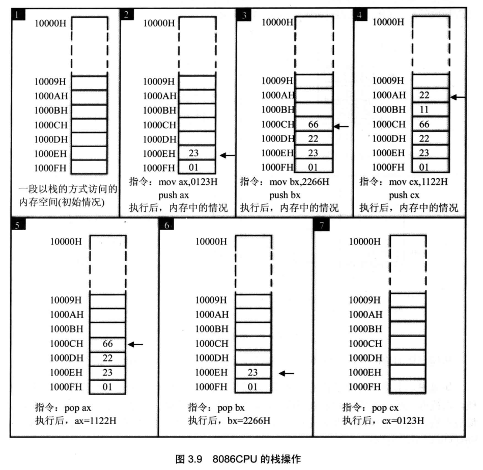
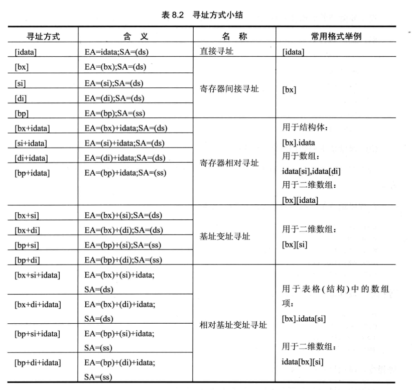
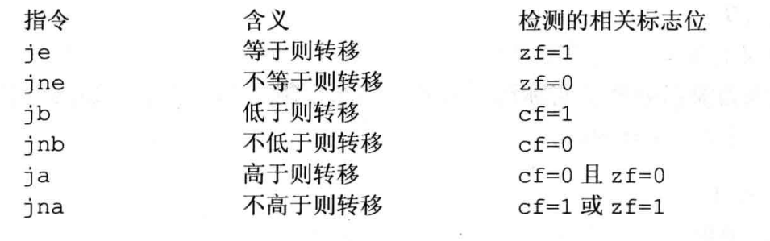
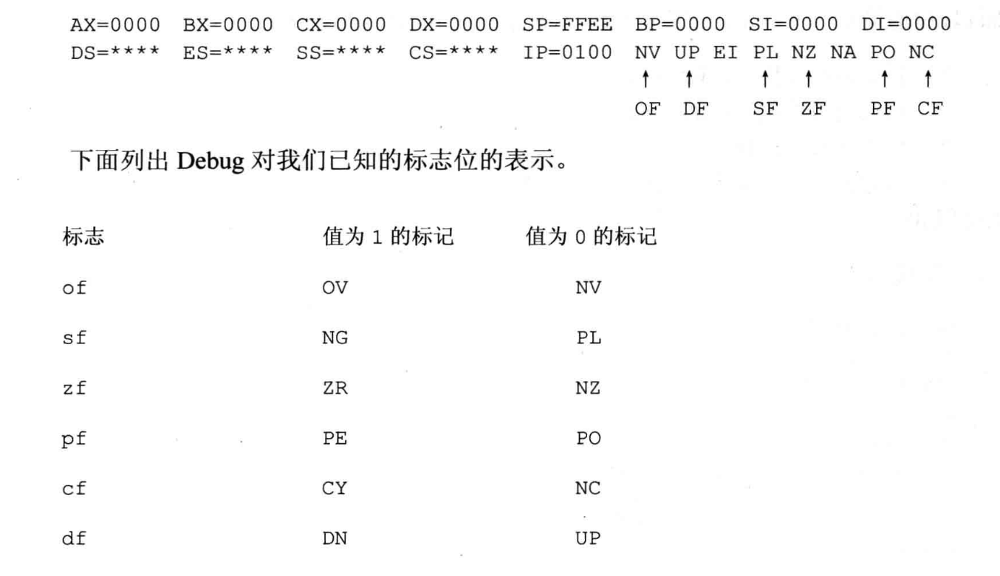
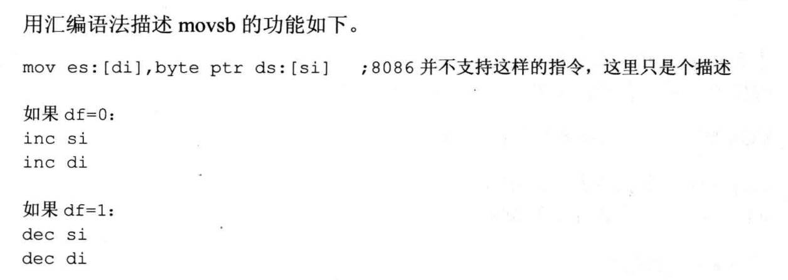

# 指令

## 数据指令 db,dw,dd
- db define byte
- dw define word
- dd double word

dup是协助他们的语法糖，db 重复次数 dup(要重复的值，要重复的值)

```
assume cs:codesg

codesg segment

    dw 0123h,0456h,0789h,0defh,0fedh,0cbah,0987h 从ip=0开始放置了7个常量

    要跳转到ip=07
    start:  mov bx,0
            mov ax,0

            mov cx,8
        s:  add ax,cs:[bx]
            add bx,2
            loop s
            
            mov ax,4c00h
            int 21h
codesg ends

end start
```

### 栈
CPU从指令层面提供了栈操作



SS代表栈的段寄存器，SP代表栈顶偏移量，SS:SP始终指向栈顶

要尤其注意的是，CPU提供了栈操作，但没有记录栈顶上限和栈底，所以无法检测栈是否越界，只能通过我们自己检测

注意栈低是在高地址，走向低地址，push=>sp-2，pop=>sp+2

push 只能操作寄存器的值，不能放入直接量

## 传输指令 mov
注意，内存之间不能直接做交换，必须通过寄存器，内存值不能直接放置到段寄存器中，要通过通用寄存器中转



一般会根据寄存器的大小判断访问的是字节或字，或用明确的指令

mov word ptr ax,1
mov byte ptr al,1

- push、pop 操作对象为字

## 运算指令
- inc +1
- add ax,bx 将bx值加到ax中
- and 与运算
- or  或运算
- shl 逻辑左移，如果超过1位，要借助cl，移出最后一位会放在CF中
- shr 逻辑右移，移出最后一位会放在CF中


### div、mul
- div 除法，被除数默认放在ax或ax+dx中，结果放在al、ah或ax、dx中

两个相乘的数都为8位或都为16位

都为8位，al + 另一个8-reg或内存，结果放在ax中

都为16位，ax + 16-reg或内存字，结果高位放在dx、地位ax


## segment
```
assume cs:code,ds:data,ss:stack 只是在这里声明，并没有实际作用

data代码段，一般都会为每个代码段分配一个段地址
data segment
    dw 0123h,0456h,0789h,0defh,0fedh,0cbah,0987h
data ends

stack segment
    dw 0,0,0,0,0,0,0
stack ends


code segment
    start:  mov ax,stack stack代表代码段的段地址，
            mov ss,ax 放在ss中，正如assume声明的
            mov sp,20h

            mov ax,data
            mov ds,ax

            mov bx,0

            mov cx,8
        s:  push [bx]
            add bx,2
            loop s
            
            mov bx,0

            mov cx,8
        s0: pop [bx]
            add bx,2
            loop s0

            mov ax,4c00h
            int 21h
code ends

end start
```

## 转移指令

### offset
相对偏移指令

    start: mov ax,offset start
    s:     mov ax,offset s

等同于

    start: mov ax,0
    s:     mov ax,3

offset start是相对于start的位置，即0，s前有三条指令了，所以offset s就是偏移3

```
把s出的指令复制到s0出
s:  mov ax,bx
    mov si,offset s
    mov bi,offset s0
    mov ax,cs:[si]
    mov cs:[di],ax
s0: nop
    nop
```

### jmp
无条件跳转指令

使用标号

段内转移，通过计算出指令和标号之间的距离，使用偏移量做转移，因为最大是16位，所以跑不出段外

    jmp short 标号 8字节地址范围内偏移
    jmp near ptr 标号 16字节范围内偏移

段间转移

    jmp far ptr s 段间转义，使用的目的地址

使用寄存器

    jmp reg == ip=reg


使用内存值做转移

    jmp word ptr ds:[0] 段内
    jmp dword ptr ds:[0] ip=[0],cs=[0+2]


只有jmp near ptr可以随意跳转，其他的由于读取的都是16位值，所以只能做段内跳转(也有可能跳到其他段空间内)

### jcxz
jcxz 标号 if cx=0 jmp 标号，通过位移实现跳转，短转移

### loop
loop使用cx作为状态位，当cx!=0时继续循环，段转义，范围在-128～127

```
s:  add ax,ax 执行add、cx-1、检测cx是否为0
    loop s 回到s标志位
```

```
assume cs:codesg

codesg segment

    mov ax,0ffffH 在汇编中数值不能以字母开头，所以在前面加0
    mov ds,ax
    mov bx,0006H
    mov al,[bx]
    mov ah,0
    mov dx,0
    mov cx,3
    s:add dx,ax
    loop s

    mov ax,4c00h
    int 21h
codesg ends

end
```

### ret
ret和retf借助栈跳转

ret => pop ip
retf => pop ip, pop cs

```
assume cs:code

stack segment
    db 16 dup (0)
stack ends

code segment
    mov ax,4c00h
    int 21h

    start:  mov ax,stack
            mov ss,ax
            mov sp,16
            mov ax,0
            push cs
            push ax
            mov bx,0
            retf
code ends

end start
```

### call

    call 标号

等同于

    push ip
    jmp near ptr 标号

所以只能做段内偏移，也因为是段内，所以不用保存cs reg

    call far ptr 标号

段间转移，等同于

    push cs
    push ip
    jmp far ptr 标号

可以使用寄存器或内存，其本质都是push+jmp的语法糖，且做的都是段内跳转

    call 16-reg
    ==
    push ip
    jmp 16-reg

    call word ptr 内存地址
    ==
    push ip
    jmp word ptr 内存地址 => word代表16位，所以是段内跳转

```
assume cs:code

code segment
    start:  mov ax,1
            mov cx,3
            call s
            mov bx,ax
            mov ax,4c00h
            int 21h
        s:  add ax,ax
            loop s
            ret
code ends

end start

```

## 子程序
有了前面的汇编，已经可以设计出C的基本类型、数组、控制流、子程序，基本上C就是对汇编的高度抽象，这里展示下怎么设计子程序

```
    ;ds:[si] 第一个字符位置
    exch:   mov cl,[si]
            mov ch,0
            jcxz ok
            and byte ptr [si],1101111b
            inc si
            jmp short exch
        ok: ret
```

上面的子程序用到了cx和si两个寄存器，如果主程序在调用子程序时也在使用这两个寄存器，那么他们就冲突的

- 将要传入的参数放在寄存器或内存或栈中，主要看子程序的要求
- 调用子程序
- 子程序将要使用的寄存器入栈
- 执行程序
- 将使用到的寄存器恢复
- 返回主程序


## 标志位
电路取出数据加以运算，我们需要一个告知运算结果或状态的寄存器，就是flag标志位

用编程语言的概念来说，运算指令就像函数，一个抽象计算过程，执行之后需要有一个反馈结果，而设计者总结发现在已有的计算指令中反馈结果无外乎这几项，可以用几个标志位表现这些反馈结果

- CF 进位标志：当指令执行结果的最高位向前有进位时，CF=1，否则CF=0
- PF 奇偶标志：当指令执行结果中1的个数为偶数个时，PF=1，否则PF=0
- AF 辅助进位标志：当指令执行结果的第3位（半字节）向前有进位时，AF=1，否则AF=0
- ZF 零标志：当指令执行结果为0时，ZF=1，结果不为0时，ZF=0
- SF 符号标志：当指令执行结果的最高位（符号位）为负时，SF=1，否则SF=0,CPU将操作数据看做有符号数给出结果
- OF 溢出标志：当指令执行结果有溢出（超出了数的表示范围）时，OF=1，否则OF=0
- DF 串处理指令标志位

- adc，借助cf做加法，adc ax,bx == (ax) = (ax) + (bx) + cf
- sbb，借助cf做减法，sbb ax,bx == (ax) = (ax) - (bx) - cf
- cmp，cmp ax,ax 做(ax) - (ax)运算，但不保留运算结果，只把状态保留到标志位中
- pushf、popf 将标志寄存器的值压入栈、栈中值弹出寄存器中

### 条件转移指令


其实就是对运算和跳转指令做了封装

debug



###　DF


rep用来配合movsb做循环传输，movsw用来传输字

- cld 将df设置为0
- std 将df设置为1


