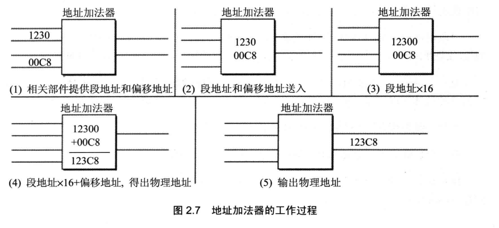
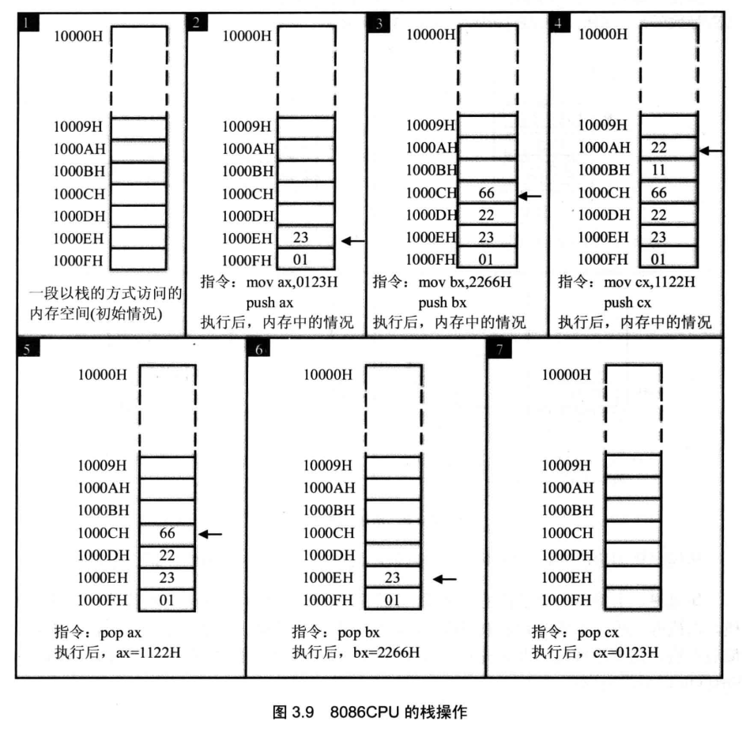

# 前置知识
汇编指令的类型
- 汇编指令：机器码的助记符
- 伪指令：机器码的抽象指令，由汇编器翻译成多条机器码
- 其他符号：如+-/*，由汇编器识别翻译，没有对应的机器码

指令一般由三部分组成，指令+地址+数据，由总线 地址线+数据线+控制线 对应访问存储设备，地址线数量决定最大可寻址范围，数据线数量决定每次最大传输数据大小

为了控制计算机中不同的硬件，需要很多很多的总线，但CPU操纵他们时都当做内存对待，或通过内存间接访问

注意：最小可寻址单元是字节B

通过不同的地址段访问不同的存储器

后面的内容都以8086CPU为例，x86结构是向下兼容的，所以这些都能在最新的x86 CPU中找到，只不过多了很多新的东西

CPU大概分为四部分，运算器，控制器，寄存器，内部总线

- 运算器：信息处理
- 寄存器：信息存储
- 控制器：CPU中的CPU

# 寄存器

8086所有寄存器都是16位的，AX、BX、CX、DX用来放一般性的数据，称为通用寄存器

最早的寄存器是8位的，为了向下兼容，16位寄存器也可以分作俩个8位寄存器使用

现在主流CPU寄存器是64位的，也要用同样的方式向下兼容8位、16位等

可以将寄存器看做CPU的直接数据单元，其他都是缓存，CPU做的事情可以简化为

- 将数据取到寄存器中
- 在寄存器中操作数据
- 将数据写出到外置存储中

寄存器有很多类型，存储指令、储存数据、表示状态等

X位的CPU
- 运算器一次最多可处理X位的数据
- 一个寄存器最大可存储X位的数据
- 寄存器和CPU间数据通路为X位

## 指令
8086地址总线20位，CPU通过段合成方式组成20位地址，可访问1M内存

8086中有四个段偏移地址寄存器，CS用来存放指令段地址

- 从CS:IP指向的地址读取指令
- 将IP地址+指令长度
- 执行指令，继续使用CS:IP读取指令

在8086加电启动后，CS=FFFFH,IP=0000H，即第一个指令从FFFF0H中读取执行

地址寄存器的值可以用 jmp 指令改变，将某个寄存器的值放入的CS中

## 数据
8086中有一个DS寄存器，用来存放访问数据的段地址

mov指令可完成两种传送，将内存数据传送到寄存器，将寄存器数据传输到另一个寄存器

## 栈
CPU从指令层面提供了栈操作

SS代表栈的段寄存器，SP代表栈顶偏移量，SS:SP始终指向栈顶

要尤其注意的是，CPU提供了栈操作，但没有记录栈顶上限和栈底，所以无法检测栈是否越界，只能通过我们自己检测

# 指令
前面大致了解了mov,add,sub,inc 下面再详细介绍一些指令

## loop
for的指令实现
