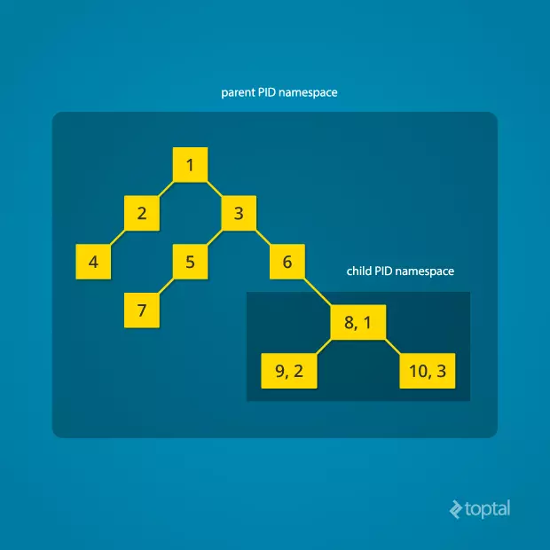
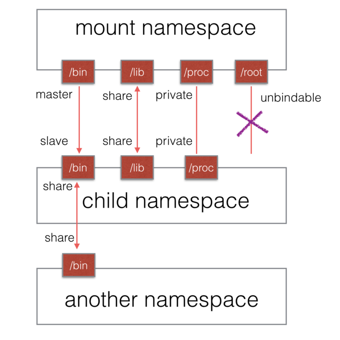

docker结合了container和ufs的技术，而Namespace和Cgroup是container的基石

主流的虚拟技术有Hypervisor和container两大类，Hypervisor主要是通过硬件层面的支持，虚拟出多个相互隔离的操作系统，而其目的大多是为了实现进程的隔离

通过虚拟操作系统实现进程隔离会产生大量冗余，最好的方式是直接隔离进程，linux的Namespace提供了这种功能

# 概念
namespace 是 Linux 内核用来隔离内核资源的方式。通过 namespace 可以让一些进程只能看到与自己相关的一部分资源，而另外一些进程也只能看到与它们自己相关的资源，这两拨进程根本就感觉不到对方的存在。具体的实现方式是把一个或多个进程的相关资源指定在同一个 namespace 中。

namespace提供了以下的隔离级别


## 系统调用

我们可以通过 clone() 在创建新进程的同时创建 namespace，setns() 函数将当前进程加入到已有的 namespace 中，通过 unshare 函数可以在原进程上进行 namespace 隔离

    int clone(int (*fn)(void *), void *child_stack, int flags, void *arg);

1. fn：指定一个由新进程执行的函数。当这个函数返回时，子进程终止。该函数返回一个整数，表示子进程的退出代码。
2. child_stack：传入子进程使用的栈空间，也就是把用户态堆栈指针赋给子进程的 esp 寄存器。调用进程(指调用 clone() 的进程)应该总是为子进程分配新的堆栈。
3. flags：表示使用哪些 CLONE_ 开头的标志位，与 namespace 相关的有CLONE_NEWIPC、CLONE_NEWNET、CLONE_NEWNS、CLONE_NEWPID、CLONE_NEWUSER、CLONE_NEWUTS 和 CLONE_NEWCGROUP。
4. arg：指向传递给 fn() 函数的参数。

    int setns(int fd, int nstype);

1. fd：表示要加入 namespace 的文件描述符。它是一个指向 /proc/[pid]/ns 目录中文件的文件描述符，可以通过直接打开该目录下的链接文件或者打开一个挂载了该目录下链接文件的文件得到。
2. nstype：参数 nstype 让调用者可以检查 fd 指向的 namespace 类型是否符合实际要求。若把该参数设置为 0 表示不检查。

    int unshare(int flags); //可以直接调用unshare命令

当一个namespace里面的所有进程都退出时，namespace也会被销毁，所以抛开进程谈namespace没有意义


下面逐一讲解各个flag

# flags
## UTS
UTS是用来隔离主机名和NIS(network information service)域名

```
    cmd := exec.Command("bash",)
	cmd.SysProcAttr = &syscall.SysProcAttr{
		Cloneflags:syscall.CLONE_NEWUTS,
	}
	cmd.Stdin = os.Stdin
	cmd.Stdout = os.Stdout
	cmd.Stderr = os.Stderr
	cmd.Dir = "/"
	log.Fatal(cmd.Run())
```
在隔离的进程中重新设置hostname
```
root@kanggege-PC:/# hostname nba
root@kanggege-PC:/# hostname
nba
```
在原来的命名环境中查看，发现被没有受到影响
```
kanggege@kanggege-PC:~$ hostname
kanggege-PC
```
## Mount
Mount namespace用来隔离文件系统的挂载点, 使得不同的mount namespace拥有自己独立的挂载点信息，不同的namespace之间不会相互影响，这对于构建用户或者容器自己的文件系统目录非常有用。

Mount namespaces是第一个被加入Linux的namespace，由于当时没想到还会引入其它的namespace，所以取名为CLONE_NEWNS，而没有叫CLONE_NEWMOUNT。

所有的挂载信息可以在 /proc/mount 下看到，当前进程所在mount namespace里的所有挂载信息可以在/proc/[pid]/mounts、/proc/[pid]/mountinfo和/proc/[pid]/mountstats里面找到。

每个mount namespace都拥有一份自己的挂载点列表，当用clone或者unshare函数创建新的mount namespace时，新创建的namespace将拷贝一份老namespace里的挂载点列表，但从这之后，他们就没有关系了，通过mount和umount增加和删除各自namespace里面的挂载点都不会相互影响。

在最初的 NS Namespace 版本中，挂载点是完全隔离的。初始状态下，新namespace看到的挂载点与父namespace是一样的。在新的 Namespace 中，子进程可以随意 mount/umount 任何目录，而不会影响到父 Namespace。使用 NS Namespace完全隔离挂载点初衷很好，但是也带来了某些情况下不方便，比如我们新加了一块磁盘，如果完全隔离则需要在所有的 Namespace 中都挂载一遍。为此，Linux 在2.6.15版本中加入了一个 shared subtree 特性，通过指定 Propagation 来确定挂载事件如何传播。比如通过指定 MS_SHARED 来允许在一个 peer group (子 namespace 和父 namespace 就属于同一个组)共享挂载点，mount/umount 事件会传播到 peer group 成员中。使用 MS_PRIVATE 不共享挂载点和传播挂载事件。其他还有 MS_SLAVE 和 NS_UNBINDABLE 等选项。可以通过查看 cat /proc/self/mountinfo 来看挂载点信息，若没有传播参数则为 MS_PRIVATE 的选项。

我们把Mount的更具体的说明和使用放在下面PID里一起讲解


## PID
PID用于进程ID隔离，隔离后的进程在其ns/pid下将成为1进程，而在宿主机中查到的仍是其分配的id
```
    func main() {
        cmd := exec.Command("bash",)
        cmd.SysProcAttr = &syscall.SysProcAttr{
            Cloneflags:syscall.CLONE_NEWPID,
        }
        cmd.Stdin = os.Stdin
        cmd.Stdout = os.Stdout
        cmd.Stderr = os.Stderr
        cmd.Dir = "/"
        log.Fatal(cmd.Run())
    }
```
运行命令会进入一个新的bash下的 /，
```
root@kanggege-PC:/# echo $$
1
root@kanggege-PC:/# ls -al /proc/self/ns/
总用量 0
dr-x--x--x 2 root root 0 6月  15 16:54 .
dr-xr-xr-x 9 root root 0 6月  15 16:54 ..
lrwxrwxrwx 1 root root 0 6月  15 16:54 pid -> 'pid:[4026532806]'
lrwxrwxrwx 1 root root 0 6月  15 17:21 pid_for_children -> 'pid:[4026532806]'

```
在宿主机中查询
```
kanggege@kanggege-PC:~$ ps aux | grep 'go run main.go'
root      9618  0.0  0.1 1079532 16980 pts/0   Sl   17:16   0:00 go run main.go
kanggege 10133  0.0  0.0  14664  1072 pts/2    S+   17:20   0:00 grep go run main.go
kanggege@kanggege-PC:~$ ls -al /proc/self/ns
总用量 0
dr-x--x--x 2 kanggege kanggege 0 6月  15 17:19 .
dr-xr-xr-x 9 kanggege kanggege 0 6月  15 17:19 ..
lrwxrwxrwx 1 kanggege kanggege 0 6月  15 17:22 pid -> 'pid:[4026531836]'
lrwxrwxrwx 1 kanggege kanggege 0 6月  15 17:22 pid_for_children -> 'pid:[4026531836]'
```



要注意的是，在新的namespace中使用ps或top，仍会得到所有进程，这是因为这两个命令会使用/proc的内容，而/proc挂载点是从原来的namespace中继承来的，记录的是原来命名空间的进程信息，所以需要重新挂载/proc

使用 $$ 时能打印出当前命名空间内的进程号，但 /proc/$$/ == /proc/1 访问的是父命名空间外的进程信息，即init进程，所以要使用 /proc/self/访问命名隔离进程的信息

可以使用mount隔离，重新挂载proc
```
    cmd := exec.Command("bash",)
	cmd.SysProcAttr = &syscall.SysProcAttr{
		Cloneflags:syscall.CLONE_NEWUTS | syscall.CLONE_NEWPID,
	}
	cmd.Stdin = os.Stdin
	cmd.Stdout = os.Stdout
	cmd.Stderr = os.Stderr
	cmd.Dir = "/"
	if err := cmd.Run(); err != nil{
		log.Fatal(err)
	}

```
重新挂载proc到当前命名空间后，再查看进程信息，可以看到bash变为1进程
```
root@kanggege-PC:/# mount -t proc none /proc
root@kanggege-PC:/# ps aux
USER       PID %CPU %MEM    VSZ   RSS TTY      STAT START   TIME COMMAND
root         1  0.0  0.0  24344  6332 pts/0    S    20:12   0:00 bash
root        56  0.0  0.0  37660  3100 pts/0    R+   20:22   0:00 ps aux
```

注意，这时在宿主机查看进程信息，可以看到proc被umount
```
root@kanggege-PC:/home/kanggege# ps aux
Error, do this: mount -t proc proc /proc
```

    unshare --pid --fork --mount-proc bash




## IPC
接下来不再用代码示例，直接用两个命令创建新的namespace

    nsenter：加入指定进程的指定类型的namespace，然后执行参数中指定的命令
    unshare：离开当前的namespace，创建并加入新的namespace，然后执行参数中的指令

同时会用到几个ipc的命令做进程通讯

    ipcmk
