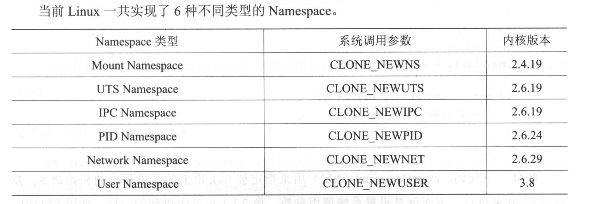

docker是一个利用了 Linux Namespace 和 Cgroups 的虚拟化工具，下面会简单介绍这两个概念

# Namespace
linux认为只给用户分配不同的权限还不够，要让他们彻底隔离开，让他们运行在相互不受影响的空间内，所以才有了Namespace

Namespace从字面意义来看就是命名空间，即隔离，实际上他就是用来隔离一系列的系统资源，比如 PIO ( Process ID )、 User ID 、 Network 等。

就像chroot隔离目录一样，Namespace可以隔离进程、网络资源、挂载树等资源

它并没有一刀切直接完全隔离开，而是可以选择分类隔离，按需求调用，更加灵活

Namespace 的 API 主要使用如下 3 个系统调用 
- clone()：创建一个新的子进程，然后让子进程加入新的namespace，该进程的后台进程也在此命名空间下。根据系统调用参数来判断创建哪种类型的namespace，使用 | 选择多个Namespace
- unshare()将进程移出某个 Namespaceo
- setns()将进程加入到 Namespace 中

当一个namespace里面的所有进程都退出时，namespace也会被销毁，所以抛开进程谈namespace没有意义

##　UTS
进程命名空间，用来隔离hostname和domainname，他的本质就是把全局共享的资源拆解成一组一组进程共享的资源

UTS namespace就是进程的一个属性，属性值相同的一组进程就属于同一个namespace，跟这组进程之间有没有亲戚关系无关

## IPC
linux下有六大IPC方式，这里只能

# Cgroups