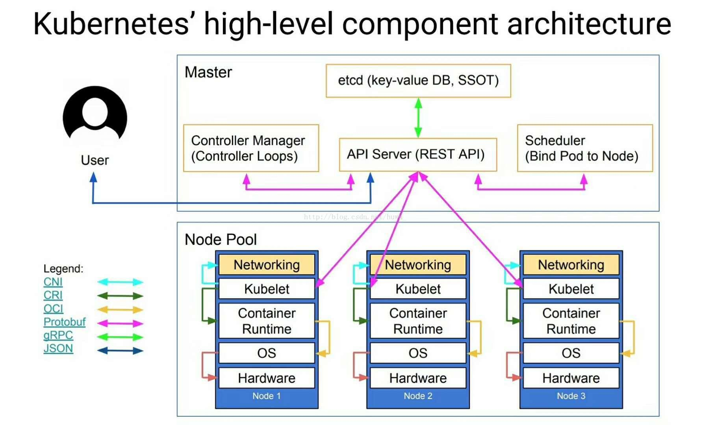

- DevOps：开发运维一体化，缩进两者的代沟
- CI：持续集成，自动build、测试
- CD：持续交付，自动打包并发送到类似github的平台等待部署
- CD：持续部署，自动部署

使用docker再加上可以自动执行的部署脚本、测试脚本，就能实现持续集成，再加上自动上传github就是持续交付，通过借助k8s这样的工具，就能简单的管理集群，彻底的开发运维一体化

k8s实现的就是运维中分布式部署要实现的问题，通过抽象管理非常简单的控制部署，主要实现了一下功能

1. 自动装箱、自我修复、水平扩展、服务发现和负载均衡、自动发布和回滚
2. 密钥和配置管理、存储编排、批量处理执行

k8s最终要实现的目的是将多台主机看做一台主机管理，是面向集群的操作系统

# k8s架构

k8s从整体上分为master和node节点，它采用master控制node的方式，避免节点故障，master通常会部署在三个节点以上，用冗余避免故障

# master
- API Server：用于承接用户的请求，并调取全系统
- etcd：存放key-val键值对，用于做配置中心，服务发现等需要存储系统信息的功能
- Scheduler：调度器，当请求部署节点时，调度器分析请求资源、查看节点状态和资源，分配节点。它会做两级调度，首先分析有哪些节点符合请求资源，再从中选择一个最优的
- Controller Manager：loop发送心跳包，检测节点状态，维护节点存活，查看节点维护容器的健康状态

# node

## Pod
容器的特点就是封装进程，所以在集群中可以将容器看做进程，但最小运行的单元不是容器，而是pod，k8s并不直接调度容器运行，而是调度pod

pod是个虚拟概念，将共享网络、主机名和存储卷的几个容器看做一个pod，其中有一个是主容器，其他的做辅助，他们可以看做一个虚拟机，pod就像集群中的一个节点，他是容器的外壳

pod需要有一个标签 label 作为它的唯一标识，他是一个key=val键值对，val中存储了其他信息，这样就可以用 label selector 对 pod 做筛选

pod通过操作划分有两种创建方式

### 自主式pod
由用户自己创建，然后交给kubelet管理，kubelet访问scheduler请求调度

如果有pod故障，由kubelet重启pod，但是有node故障，则pod就消失了

### 控制器管理的pod
ReplicationController 在这里面定义运行的pod，自动调度，维持pod的数量和运行

并支持滚动更新，先创建新服务，再停掉旧服务，保持服务不中断

还有各种各样的用于管理不同pod声明周期的控制器

## kubelet
master通过API server调用节点，而kubelet就是接收调用并做出回复的节点，用来创建调度pod，回复心跳包等等

# 配置中心
pod或者node都可能会宕机，被重启，或重新分配，但是重分配以后一些数据会改变

如果node重分配，则mac、ip都会改变，pod也是如此，即提供服务的访问信息或者服务的配置信息都可能随时改变

所以需要服务发现功能，客户端并不直接访问服务，而是从服务发现里查找服务，再去访问服务

k8s在客户端和