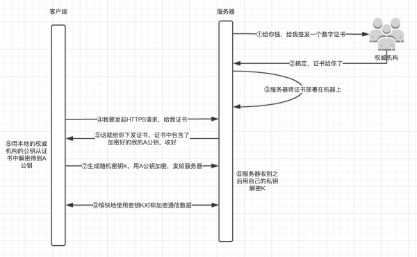

HTTPS 并非是应用层的一种新协议。只是 HTTP 通信接口部分用SSL(Secure Socket Layer)或 TLS(Transport Layer Security)协议代替而已。

HTTP协议提供了信息有效传输，能够完整表达请求者的意图，但是存在信息被泄露的缺陷，所有衍生了HTTPS。

通过对原有的HTTP信息进行加密，即使在中转过程中被抓包或代理截取泄露信息，他们也无法解密推测出原来的信息，这样就保证了HTTP信息传输的安全性

HTTPS就是提供了一个网关，拦截原有的请求，将请求解密后发给处理程序，处理程序给出响应之后，网关再进行加密返回给客户端，该网关实质也是HTTP处理程序，默认监听443端口，与原有的HTTP处理程序使用进程间通讯。当使用HTTPS时，默认访问的端口是443，由该网关程序把控安全，并与真正的HTTP处理程序交互

# SSL
## 对称加密与非对称加密
- 对称加密：通信双方（或多方）都使用一个秘钥，通过秘钥对信息加密，一旦秘钥被泄露，统统完蛋
- 非对称加密：随机生成一串无意义的数字作为秘钥，通过秘钥生成公钥，使用公钥对信息加密，则私钥可以解密，使用私钥对信息加密，则公钥可以解密这样就可以公布公钥做加密，而保留私钥做解密，但是非对称加密性能底下

## SSL加密

SSL采用公钥加密的方法，由上面的知识，我们很容易想到加密办法，使用非对称加密，在服务器端（S）和客户端（C）都分别有一份公钥(sp,cp)和私钥(sk,ck)。

1. 客户端和服务器互相发送对方的公钥
2. 双方使用对方的公钥进行加密，使用自己的私钥解密

实际上，上面存在几个问题

1. 公钥在传输过程中也可能被换掉，服务器发给客户端的公钥，可能是中间代理伪造的，当客户端使用该公钥加密后，代理就可以使用自己伪造的私钥解密，信息依然泄露
2. 客户端发给服务器公钥时，代理拦截后使用该公钥伪造服务器信息
3. 非对称加密消耗CPU资源远远多于对称加密
4. 非对称加密对待加密的数据的长度有比较严格的要求，不能太长，但是实际中消息可能会很长（比如你给你女朋友发情书），因此非对称加密就满足不了

但是我们可以用非对称加密传递对称加密的秘钥，双方保存秘钥做对称加密

那么上面的问题就变成了一个：保证公钥来源的安全性。于是有了数字证书厂商，他们的实现思路具体如下

1. 当服务器想为该HTTP服务提供HTTPS时，先向安全证书厂商申请一个数字证书，该证书包含了一个加密的公钥和数字签名
    - 厂商先生成一对公钥私钥，并用自己的私钥对生成的公钥进行加密，添加其他信息，并生成数字签名。私钥给服务器用，加密的公钥和其他新奇以及数字签名作为证书发送到客户端
2. 客户端向服务器发出请求时，服务器返回证书
3. 浏览器已经内置好了各个厂商的公钥，并使用证书对应的公钥对签名进行解密，得到服务器的公钥
4. 浏览器生成一组随机数，并使用服务器公钥加密，发送给服务器
5. 服务器使用私钥解密，并使用客户端传来的随机数对要发送的数据做对称加密
6. 客户端接受到数据后，使用前面生成的随机数解密
7. 两者就这样没羞没臊的开始了对称加密

既然服务器可以向厂商申请证书，中间代理也可以啊，他也申请证书，然后返回给客户端，与客户端进行对称加密传输，这里就又产生了两个需求

1. 证明证书没有被人篡改
2. 证明证书是服务器下发的

这两个问题证书已经解决了

1. 使用权威机构的公钥解密数字证书，得到证书内容（服务器的公钥）以及证书的其他信息，首先一定是证书对应的机构，否则无法解密得到证书的实际内容，再解密后，通过解密的内容进行对照(请求的域名信息等)，确定证书来自服务器而非其他中间路由器
2. 再考虑证书被掉包的情况：中间人同样可以向权威机构申请一份证书，然后在服务器给客户端下发证书的时候劫持原证书，将自己的假证书下发给客户端，客户端收到之后依然能够使用权威机构的公钥解密证书，并且证书签名也没问题。但是这个时候客户端还需要检查证书中的域名和当前访问的域名是否一致。如果不一致，会发出警告！

# 四次握手
- 客户端请求建立SSL链接，并向服务端发送一个随机数–Client random和客户端支持的加密方法，比如RSA公钥加密，此时是明文传输。

- 服务端回复一种客户端支持的加密方法、一个随机数–Server random、授信的服务器证书和非对称加密的公钥。

- 客户端收到服务端的回复后利用服务端的公钥，加上新的随机数–Premaster secret 通过服务端下发的公钥及加密方法进行加密，发送给服务器。
- 服务端收到客户端的回复，利用已知的加解密方式进行解密，同时利用Client random、Server random和Premaster secret通过一定的算法生成HTTP链接数据传输的对称加密key – session key。

# 加密算法
## 对称加密算法
DES、3DES
## 非对称加密算法
ECC 椭圆加密算法
## 单向加密算法
md5、base64、sha256