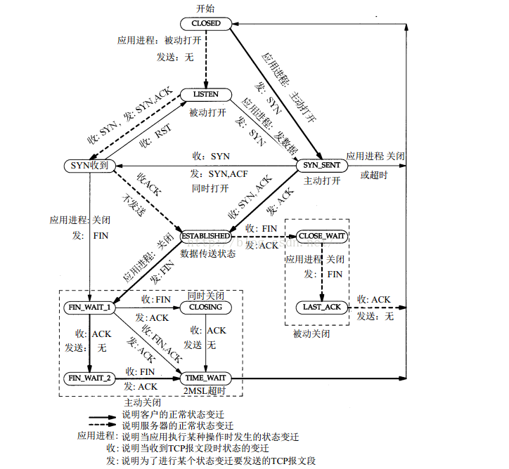

# 拆除连接

请求的拆除可以由通讯双方任意一方提出，这里以客户端先提出拆除为例

1. 客户端发送FIN报文(SYN=1,seq=x，可能会带有ACK和确认序号，表示对上一个接受报文的确认)，表示关闭连接，即客户端不再发送数据，但还能接受数据
2. 服务器发送ACK报文表示收到了客户端的FIN报文
3. 服务器发送FIN报文关闭连接
4. 客户端回复ACK报文表示收到

为什么建立连接时的2、3次可以合并，但是这里必须是4次放手呢？因为客户端发送FIN报文只表示客户端不再发送信息，但可以接受信息，即服务器还可以发送信息，所以接下来服务器可能再发送一些信息后再关闭，但是通常一方拆除后双方就都关闭连接了

## 状态转换图

当放手时（以服务器为假设），服务器发送FIN报文，进入FIN_WAIT_1 状态，等待ACK

收到ACK后，进入FIN_WAIT_2 状态，表示自己已经成功放手，等待客户端发送FIN

收到客户端的FIN后，服务器发送ACK，并进入TIME_WAIT状态，因为服务器发送的ACK可能会在传输过程中丢包，这时客户端就会再次发送FIN报文，所以需要服务器等待2个MSL时间，大概是1~4分钟

IP数据包有一个TTL字段，表示最大生存时间，每在路由器上一跳，则减一，为0时被路由器丢弃，并发送ICMP报文给主机

MSL是对IP报文最大生命周期的预测，一般大于TTL时间。等待2MSL还有一个原因是，一些包可能在路由器中迷失了，然后客户端发重发，这些旧包还在迷失。如果关闭过快，则可能会被新的TCP连接接收到，可能造成了巧合（来自同一个客户端同一端口，且序号也相同），所以等待2MSL，直到旧包的MSL消耗完

## TIME_WAIT出现太多

作为服务器，每一个TCP连接最后都会出现TIME_WAIT状态，会持续1~3分钟，高并发会让服务器短时间内占用大量端口(拢共就65536个端口)，最终可能因为大量端口都在TIME_WAIT状态而无法完成新的连接

TIME_WAIT存在还是有其意义，可以采用负载均衡去解决，最好不要改变它

编辑内核文件/etc/sysctl.conf，加入以下内容：

- net.ipv4.tcp_syncookies = 1 表示开启SYN Cookies。当出现SYN等待队列溢出时，启用cookies来处理，可防范少量SYN攻击，默认为0，表示关闭；
- net.ipv4.tcp_tw_reuse = 1 表示开启重用。允许将TIME-WAIT sockets重新用于新的TCP连接，默认为0，表示关闭；
- net.ipv4.tcp_tw_recycle = 1 表示开启TCP连接中TIME-WAIT sockets的快速回收，默认为0，表示关闭。
- net.ipv4.tcp_fin_timeout 修改系默认的 TIMEOUT 时间

然后执行 /sbin/sysctl -p 让参数生效.

/etc/sysctl.conf是一个允许改变正在运行中的Linux系统的接口，它包含一些TCP/IP堆栈和虚拟内存系统的高级选项，修改内核参数永久生效。
