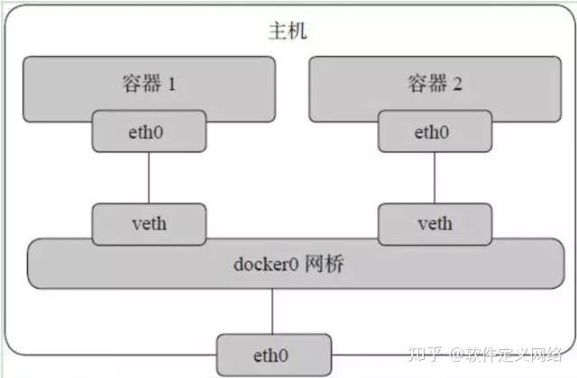

无论是容器网络还是虚拟机网络，其本质是相同的，来源于软件可模拟网卡、交换机、路由器等等，所以我们可以在物理机内模拟出一个局域网，通过交换机、NAT等基础技术，实现虚拟网落模拟

# docker网络
docker下原生支持三种网络连接方式，可以使用docker network ls查看

## bridge
即linux的桥接模式，docker安装完成后默认创建一个交换机docker0，并为其分配一个子网，通常是172.17.0.x 一般这个子网不会被使用

    docker0: flags=4099<UP,BROADCAST,MULTICAST>  mtu 1500
            inet 172.17.0.1  netmask 255.255.0.0  broadcast 172.17.255.255
            inet6 fe80::42:44ff:feb0:5c67  prefixlen 64  scopeid 0x20<link>
            ether 02:42:44:b0:5c:67  txqueuelen 0  (Ethernet)
            RX packets 11  bytes 756 (756.0 B)
            RX errors 0  dropped 0  overruns 0  frame 0
            TX packets 157  bytes 28679 (28.0 KiB)
            TX errors 0  dropped 0 overruns 0  carrier 0  collisions 0

docker创建的每一个容器，借助 bridge-utils 这个工具，为其创建一个虚拟网卡(veth peer)。其中一端关联到网桥上，另一端映射到容器类的网络空间中。然后从这个虚拟网段中分配一个IP地址给这个接口。 其网络模型如下:

而docker0和宿主机网络连接，实现和宿主机的互通

可以使用 docker network create -d bridge 新net 创建一个新的路由器，并和宿主机互通，但和其他的容器网络并不互通

## host

Host模式，即共用主机的网络，它的网络命名空间和主机是同一个，不隔离UTS、NET、IPC，使用宿主机Namespace、IP和端口。

同样可以使用此类方式，将多个容器放在一个NET namespace下，就实现了多个容器的局部通讯

## None
在容器创建时，不指定任何网络模式。由用户自己在适当的时候去指定，但是也无法连通到外部了

# 容器连接外部
即使每个容器都有自己的网络栈，由于他们是本机的私有地址，外部仍不能访问，所以要使用主机的端口做映射，即本机充当一个NAT身份帮助容器和外部互联

可以通过 -P 或 -p 参数来指定端口映射。

当使用 -P 标记时，Docker 会随机映射一个 49000~49900 的端口到内部容器开放的网络端口。

使用 docker container ls 可以看到，本地主机的 49155 被映射到了容器的 5000 端口。此时访问本机的 49155 端口即可访问容器内 web 应用提供的界面。

$ docker run -d -P training/webapp python app.py

$ docker container ls -l
CONTAINER ID  IMAGE                   COMMAND       CREATED        STATUS        PORTS                    NAMES
bc533791f3f5  training/webapp:latest  python app.py 5 seconds ago  Up 2 seconds  0.0.0.0:49155->5000/tcp  nostalgic_morse

同样的，可以通过 docker logs 命令来查看应用的信息。

$ docker logs -f nostalgic_morse
* Running on http://0.0.0.0:5000/
10.0.2.2 - - [23/May/2014 20:16:31] "GET / HTTP/1.1" 200 -
10.0.2.2 - - [23/May/2014 20:16:31] "GET /favicon.ico HTTP/1.1" 404 -

-p 则可以指定要映射的端口，并且，在一个指定端口上只可以绑定一个容器。支持的格式有 ip:hostPort:containerPort | ip::containerPort | hostPort:containerPort。

## 映射所有接口地址
使用 hostPort:containerPort 格式本地的 5000 端口映射到容器的 5000 端口，可以执行

$ docker run -d -p 5000:5000 training/webapp python app.py
此时默认会绑定本地所有接口上的所有地址。

## 映射到指定地址的指定端口
可以使用 ip:hostPort:containerPort 格式指定映射使用一个特定地址，比如 localhost 地址 127.0.0.1

$ docker run -d -p 127.0.0.1:5000:5000 training/webapp python app.py

## 映射到指定地址的任意端口
使用 ip::containerPort 绑定 localhost 的任意端口到容器的 5000 端口，本地主机会自动分配一个端口。

$ docker run -d -p 127.0.0.1::5000 training/webapp python app.py
还可以使用 udp 标记来指定 udp 端口

$ docker run -d -p 127.0.0.1:5000:5000/udp training/webapp python app.py

## 查看映射端口配置
使用 docker port 来查看当前映射的端口配置，也可以查看到绑定的地址

$ docker port nostalgic_morse 5000
127.0.0.1:49155.
注意：

容器有自己的内部网络和 ip 地址（使用 docker inspect 可以获取所有的变量，Docker 还可以有一个可变的网络配置。）

-p 标记可以多次使用来绑定多个端口

例如

$ docker run -d \
    -p 5000:5000 \
    -p 3000:80 \
    training/webapp \
    python app.py

# 容器互联

我们可以让多个容器存在一个网络空间内，便于他们的通讯，例如安装好docker后就创建了docker0网络空间，所有容器默认都在此网络空间下

创建一个网络空间

    docker network create -d bridge my-net
    
创建后使用ifconfig会发现多了一个交换机

    br-c49cc6528f98: flags=4163<UP,BROADCAST,RUNNING,MULTICAST>  mtu 1500
        inet 172.18.0.1  netmask 255.255.0.0  broadcast 172.18.255.255
        inet6 fe80::42:6eff:fe0c:cd1b  prefixlen 64  scopeid 0x20<link>
        ether 02:42:6e:0c:cd:1b  txqueuelen 0  (Ethernet)
        RX packets 6  bytes 336 (336.0 B)
        RX errors 0  dropped 0  overruns 0  frame 0
        TX packets 255  bytes 44605 (43.5 KiB)
        TX errors 0  dropped 0 overruns 0  carrier 0  collisions 0

    //启动一个容器并加入该网络
    docker run -it --rm --network my-net busybox sh
    //查看ip地址
    eth0    Link encap:Ethernet  HWaddr 02:42:AC:12:00:02  
            inet addr:172.18.0.2  Bcast:172.18.255.255  Mask:255.255.0.0 //分配的虚拟网卡
            UP BROADCAST RUNNING MULTICAST  MTU:1500  Metric:1
            RX packets:269 errors:0 dropped:0 overruns:0 frame:0
            TX packets:0 errors:0 dropped:0 overruns:0 carrier:0
            collisions:0 txqueuelen:0 
            RX bytes:46242 (45.1 KiB)  TX bytes:0 (0.0 B)

    lo      Link encap:Local Loopback  
            inet addr:127.0.0.1  Mask:255.0.0.0
            UP LOOPBACK RUNNING  MTU:65536  Metric:1
            RX packets:8 errors:0 dropped:0 overruns:0 frame:0
            TX packets:8 errors:0 dropped:0 overruns:0 carrier:0
            collisions:0 txqueuelen:1000 
            RX bytes:672 (672.0 B)  TX bytes:672 (672.0 B)
    
    
    
    //再启动一个
    docker run -it --rm --network my-net busybox sh
    eth0    Link encap:Ethernet  HWaddr 02:42:AC:12:00:03  
            inet addr:172.18.0.3  Bcast:172.18.255.255  Mask:255.255.0.0
            UP BROADCAST RUNNING MULTICAST  MTU:1500  Metric:1
            RX packets:11 errors:0 dropped:0 overruns:0 frame:0
            TX packets:0 errors:0 dropped:0 overruns:0 carrier:0
            collisions:0 txqueuelen:0 
            RX bytes:1415 (1.3 KiB)  TX bytes:0 (0.0 B)

    lo      Link encap:Local Loopback  
            inet addr:127.0.0.1  Mask:255.0.0.0
            UP LOOPBACK RUNNING  MTU:65536  Metric:1
            RX packets:0 errors:0 dropped:0 overruns:0 frame:0
            TX packets:0 errors:0 dropped:0 overruns:0 carrier:0
            collisions:0 txqueuelen:1000 
            RX bytes:0 (0.0 B)  TX bytes:0 (0.0 B)
    
同一网络下可以互相ping通

    / # ping 172.18.0.2 //互相可以ping通
    PING 172.18.0.2 (172.18.0.2): 56 data bytes
    64 bytes from 172.18.0.2: seq=0 ttl=64 time=0.080 ms

如果再创建一个容器(默认加入了docker0网络)，则不能ping通my-net网络，但是本机可以ping通这两个网络，即这两个网络互相隔离但连接了主机