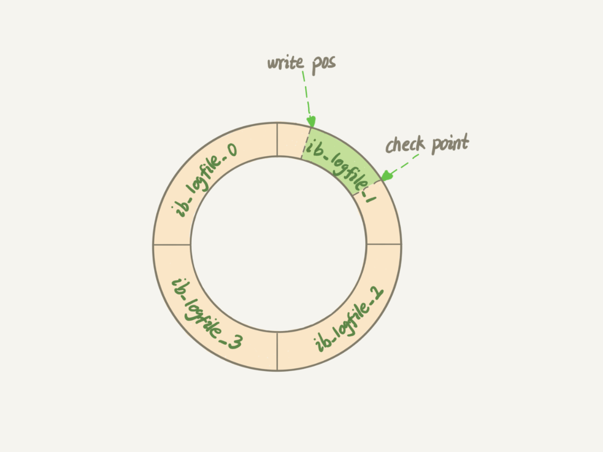

# user表
启动后mysql有几个已有的数据库，其中比较关键的是mysql

    show databases;
    use mysql;
    show tables;

这里面我们比较常用的是user表，用来管理用户及权限

    desc user; //查看表结构
    select * from user\G;

- Host：代表可连接的主机
    - localhost 或 127.0.0.1 只能在本机连接mysql
    - ip：1.1.1.1限制了用户必须在这个ip才能连接，或 1.1.%.% %是通配符，可以直接%。代表任何地址都可以连接
- User：用户，可以为用一个用户添加多条记录
- Password：密码
- 对不同库、表的权限和配置信息


## 创建用户

    grant all privileges on *.* to kanggege@'localhost' identified by "kanggegepwd" with grant option;
    flush privileges;

- ALL PRIVILEGES： 表示所有权限，你也可以使用select、update等权限。
- \*.\*： 中前面的\*号用来指定数据库名，后面的\*号用来指定表名。
- kanggege@'localhost' 表示kanggege用户，@后面接限制的主机，可以是IP、IP段、域名以及%，%表示任何地方。注意：这里%有的版本不包括本地，以前碰到过给某个用户设置了%允许任何地方登录，但是在本地登录不了，这个和版本有关系，遇到这个问题再加一个localhost的用户就可以了
- IDENTIFIED BY: 后面指定用户的登录密码
- WITH GRANT OPTION 这个选项表示该用户可以将自己拥有的权限授权给别人。注意：经常有人在创建操作用户的时候不指定WITH GRANT OPTION选项导致后来该用户不能使用GRANT命令创建用户或者给其它用户授权。
- 备注：可以使用GRANT重复给用户添加权限，权限叠加，比如你先给用户添加一个select权限，然后又给用户添加一个insert权限，那么该用户就同时拥有了select和insert权限。
- flush privileges; 刷新权限使其立即生效
- 添加权限和撤销权限语法相同，添加用 to，撤销用 from
- 如果有 user 表的修改权限，可以直接操作 user 表做权限控制
## 一些原则
1、只授予能满足需要的最小权限，防止用户干坏事。比如用户只是需要查询，那就只给select权限就可以了，不要给用户赋予update、insert或者delete权限。
2、创建用户的时候限制用户的登录主机，一般是限制成指定IP或者内网IP段。
3、初始化数据库的时候删除没有密码的用户。安装完数据库的时候会自动创建一些用户，这些用户默认没有密码。
4、为每个用户设置满足密码复杂度的密码。
5、定期清理不需要的用户。回收权限或者删除用户。

# 连接器
用于管理连接，权限验证，mysql 使用 tcp 作为连接协议

    mysql -h$ip -P$port -u$user -p

用户名密码通过后会查你的权限，而后你的所有执行都依赖于查到的权限，这意味这你连接后再改你的权限并不能在当前连接中生效

可以每过一段时间断开一次长连接，或5.7以后执行mysql_reset_connection重新初始化连接资源

连接后如果没有动作就是空闲连接，默认8小时没有动作自动断开，由 wait_timeout 参数控制

创建连接后不关闭，多次复用，则是长连接。每次连接，执行完后关闭，则为短连接

如果全部使用长连接，可能会发现Mysql占用内存增长特别快，因为mysql在执行过程中临时使用的内存是管理在连接对象中的，连接断开后才会释放。

维持多个长连接，当客户端执行sql时从中拿出一个使用，用完就放回去，简称连接池，和线程池甚至云计算都一个原理

并发量小情况下维持过多长连接只会浪费 mysql 宿主机的内存资源。而瞬时并发过高，如秒杀，长连接也救不了mysql，并发量相对稳定情况下最适合长连接

## 缓存
连接建立后就可以执行select语句了，他会先查询缓存，之前执行的语句值会以 key-val 的形式存在内存中，但是发生update语句后就会被清除

如果频繁插入这样就会很耗费性能，除非这个表经常查询，很少更新，否则建议将参数 query_cache_type 设置成 DEMAN 关闭缓存查询

缓存查询这种事可以交给redis做，所以msyql8中直接将这一块删掉了
 
## 分析器、优化器
分析器是编译sql，其实这步可以在程序中做，少用动态sql，多用已经编译好的sql，提高性能

就像编译原理一样，优化器是不可靠的，尽量把sql写好，别指望优化器做什么

## 执行器
前面都做完了就开始执行，首先要判断一下有没有执行权限，然后调用引擎，返回执行的结果

# 存储层
存储层借助于存储引擎实现，mysql采用插件的方式使用存储引擎，主流的引擎有 InnerDB、MyISAM、Memory等，5.5.5版本以后使用InnerDB作为默认的存储引擎，后面也主讲解 InnerDB 

# log
mysql 运行中产生的 log 可氛围三种

## error
错误日志会记录如下信息

- mysql执行过程中的错误信息
- mysql执行过程中的告警信息
- event scheduler运行时所产生信息
- mysq启动和停止过程中产生的信息
- 主从复制结构中，重从服务器IO复杂线程的启动信息

默认存放在 /var/log/mysqld.log 可在 my.cnf 用 log_error 配置
```
MariaDB [(none)]> show variables where
    -> variable_name="log_error" or
    -> variable_name="log_warnings";
+---------------+------------------------------------------------------+
| Variable_name | Value                                                |
+---------------+------------------------------------------------------+
| log_error     | /var/log/mysqld.log                                  |
| log_warnings  | 2                                                    |
+---------------+------------------------------------------------------+
2 rows in set (0.001 sec)
```

log_warnings：表示是否记录告警信息到错误日志，0表示不记录告警信息，1表示记录告警信息，大于1表示各类告警信息，例如有关网络故障的信息和重新连接信息写入错误日志


select好说，就是上面server执行的那些步骤，但是update可不一般

我们对update的期望不仅仅是更新，还要记录下日志便于出错回滚

    update T set c=c+1 where ID=2;

这个语句一旦执行，和T表相关的缓存全部失效，所以不建议使用缓存

同时还要记录两个日志，redo log 和 binlog 

## redo log
当更新时，要先查找B+树(如果你用到索引的话)，再查找磁盘位置，更新磁盘，这是非常耗时的，如果在一个时间内并发量特别大，就崩了


linux写入文件时，可能会先放在内存中，等时机到了再写入磁盘，mysql也用了这个思路，先记录redo log，再更新在内存中，等不忙了再写入磁盘，即WAL技术，Write-Ahead Logging，分布式系统中也可以利用WAL实现宽松一致性

InnerDB的redo log是固定大小的，如果配置一组为4个文件，每个文件大小是1G，总共就可以记录4G的操作



write pos指向已经写入磁盘的操作，check point是最新的操作，两者之间的绿色就是已经更新但还没写入磁盘

有了redo log，对内存的操作都不会丢失，就算服务挂了，内存cache数据全部丢失，还能用redo log恢复写入

## binlog
redo log是InnerDB的功能，而MySQL server层有一个binlog功能，redo log是将高并发的更新变成批处理作业，而binlog是用于记录日志，做记录回滚，在分布式系统中，也可以用binlog远程备份实现mastr节点容错

因为最早只有MySQL server，InnerDB是插件形式存在，所以各自提供log，否则可以把两种log整合在一起

binlog是逻辑日志，记录每个语句的原始逻辑，并且使用追加写，不会覆盖以前的日志

通常数据库会一周一备份或者每天备份，如果想回退到某个时间点A的状态，可以先找到A之前的备份，再执行备份到A之间的binlog

## 总结

一个update执行的完整流程如下
 


整个过程分为prepare和commit两个阶段，因为无论redo log还是binlog先完成，中间宕机，重新启动服务后都会有错误，他们必须是一个事务操作

redo log 用于保证 crash-safe 能力。innodb_flush_log_at_trx_commit 这个参数设置成 1 的时候，表示每次事务的 redo log 都直接持久化到磁盘。这个参数我建议你设置成 1，这样可以保证 MySQL 异常重启之后数据不丢失

sync_binlog 这个参数设置成 1 的时候，表示每次事务的 binlog 都持久化到磁盘。这个参数我也建议你设置成 1，这样可以保证 MySQL 异常重启之后 binlog 不丢失。

