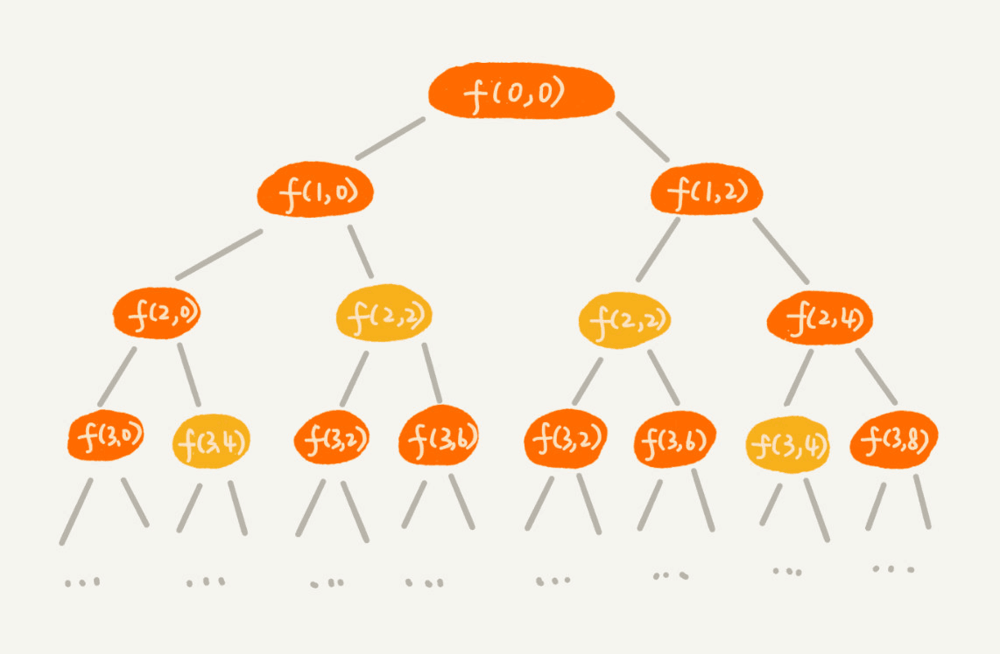
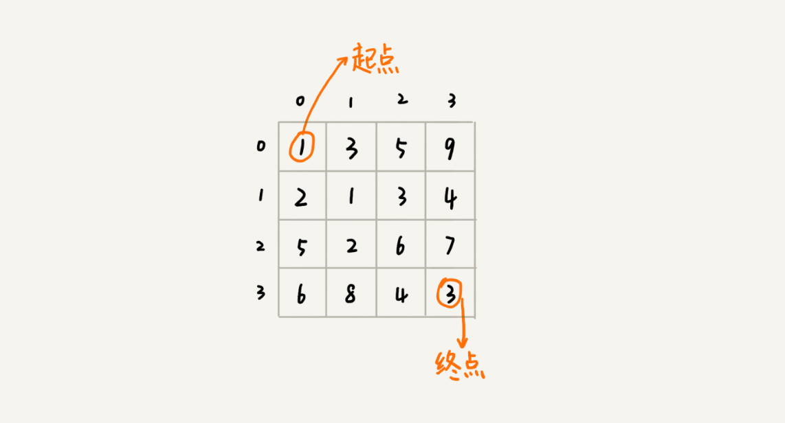

前面比如排序、递归等算法我们都有意无意的用到了很多分治思想，除了分治还有三大思想，也是相比较更难理解的，这里一次讲清楚

# 贪心
贪心算法总是选择当前最优解，一旦确定前面的选择则不回退，再次找下一个选择的最优解

但是当前最优的并不一定是全局最优的，但是在有些情况下比较适合，比如分配会议室问题，区间长度匹配问题，注意贪心解决的并不是全局最优解，而是当前最好的选择


# 回溯与动态规划
## 回溯
如果你的人生可以无限重来，让你回到每一个选择点将所有选择全部尝试一遍，你一定能得到最好的路，这就是回溯，将出发到目标之间的所有选择全部列举一次，变成一个树状结构，全部试一遍就能得到最好的选择，



回溯的本质就是枚举所有情况，一般通过递归实现，可以缓存递归值优化性能，或剪枝，减掉确定走错的路，优化性能

```
// weis每个物品重量，vals价值，maxW最大重量
//bag(weis,vals,10,0,0,0)
func bag(weis,vals []int,maxW,curw,curv,n int) int {
	//到达树的底部，或者重量已经超出直接剪枝
	if curw == maxW || n == len(weis){
		return curv
	}
	var res1 int
	if weis[n] + curw <= maxW{
		res1 = sub(weis,vals,maxW,curw+weis[n],curv+vals[n],n+1)
	}
	res2 := sub(weis,vals,maxW,curw,curv,n+1)
	return max(res1,res2)
}
```

这是最简单直观的回溯模型，通过备忘录再优化性能，基本可以达到和动态规划一样的性能

在这个模型中，本质就是对一层一层做决策，并将决策结果剪枝，本质和下面的代码相同

## 动态规划
回溯中的剪枝就是预先将肯定超出预期情况的分支提前结束，就可以减少很多分支的递归演进，动态规划的本质就是回溯+剪枝

例如背包问题


将预期最大情况限定为数组最大长度，将每层的结果表现在数组中，如果超出了数组的最大长度就可以任务超出最大情况，被看做剪去的分支

```
func guihua()  {
	weis := []int{2,2,4,6,3}
	vals := []int{1,5,7,1,3}
	maxW := 10

	limitArr := make([]int,maxW+1) //将数组的长度设置为maxW，相当于剪枝了
	for i,w := range weis{
		//每次决策都在上层的最优子结构上
		for j := 0; j < maxW+1; j ++{
			if limitArr[j] > 0 && w+j <= maxW{
				if (limitArr[j] + vals[w]) > limitArr[w+j] {
					limitArr[w+j] = limitArr[j] + vals[w]
				}
			}else{
				break
			}
		}
		if w <= maxW && vals[i] > limitArr[w]{
			limitArr[w] = vals[i]
		}
	}
}
```

回溯是遍历所有情况，剪去已经超出限制的分支，最后选择最优解，复杂度为 2^n(n为需要做决策的元素个数)

动态规划依靠上层子结构最优解，再做出这层最优解给下层使用，但是需要遍历数组增加了复杂度，复杂度为 n*m(m为限制)

总的来说，回溯能解决的问题动态规划一般都能解决，回溯较简单但性能不好，动态规划性能好但写起来难

整体来说动态规划具有一下三种特点，和两个思路

1. 最优子结构：当前层做的决策是前面所有的最优解之和
2. 无后效性：一层一层向下决策，不会回退
3. 重复子问题：每个问题的解决思路相同，数据集不同，类似递归


## 状态转移表法




```
func mini(arr [][]int) int {
	status := make([][]int,len(arr))
	for i := 0; i < len(status); i ++{
		status[i] = make([]int,len(arr[0]))
	}
	
	//初始化边界条件
	for i,sum := 0,0; i < len(status); i++{
		sum += status[i][0]
		status[i][0] = sum
	}
	for i,sum := 0,0; i < len(status[0]); i ++{
		sum += status[0][i]
		status[0][i] = sum
	}

	for i := 1; i < len(status); i++{
		for j := 1; j < len(status[0]); j++{
			status[i][j] += min(status[i-1][j],status[i][j-1])
		}
	}
	return status[len(status)][len(status[0])]
}
```

占用了额外一倍的空间，但是只需要遍历一遍数组，性能非常好，编码也更简单

## 状态转移方程
```
//此处省略备忘录
func sub(arr [][]int,sum,n,i,j int) int {
	if i == n || j == n {
		return math.MaxInt64
	}
	if i == n-1 && j == n-1 {
		return sum + arr[i][j]
	}
	return min(sub(arr,sum+arr[i][j],n,i+1,j),sub(arr,sum+arr[i][j],n,i,j+1))
}
```
状态转移方程也很简单，加上备忘录后性能和状态转移表相似

两者都很好，根据具体情况使用更直观的方法